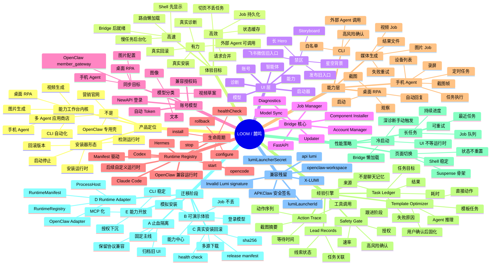
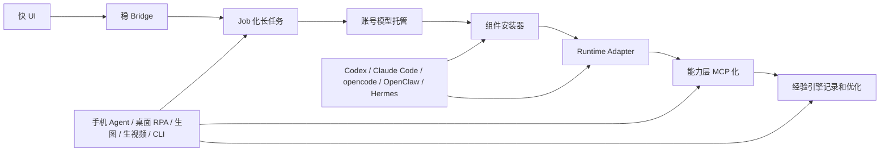

# LOOM / 麓鸣架构思维导图

日期：2026-06-28

这份图用于快速校准迁移方向。详细说明见 [LOOM_CORE_ARCHITECTURE.md](LOOM_CORE_ARCHITECTURE.md)。

```mermaid
mindmap
  root((LOOM / 麓鸣))
    产品定位
      安装器形态
        安装运行时
        检测运行时
        启动停止
        回滚版本
      能力工作台内核
        手机 Agent
        桌面 RPA
        图片生成
        视频生成
        CLI 自动化
      不是
        OpenClaw 专用壳
        多 Agent 应用商店
        营销官网
    体验目标
      高速
        Shell 先显示
        Bridge 后就绪
        路由懒加载
        慢任务后台化
      高效
        状态缓存
        请求合并
        Job 持久化
        切页不丢任务
      有力
        真实安装
        真实诊断
        真实回滚
        外部 Agent 可调用
    UI 层
      启动器
      智能体
      能力
      账号
      模型
      诊断
      禁区
        星空背景
        长 Hero
        飞书微信旧入口
        发布旧入口
        Storyboard
    Bridge 核心
      FastAPI
      Job Manager
      Account Manager
      Model Sync
      Component Installer
      Diagnostics
      Updater
    账号模型
      NewAPI 登录
      兼容授权码
      自动 Token
      模型分类
        文本
        图像
        视频草案
      同步目标
        OpenClaw member_gateway
        图片配置
        桌面 RPA
        手机 Agent
    Runtime Registry
      Manifest 驱动
      Codex
      Claude Code
      opencode
      OpenClaw 兼容运行时
      Hermes
      后续自定义运行时
      生命周期
        install
        configure
        healthCheck
        start
        stop
        rollback
    能力层
      手机 Agent
        截图帧
        任务执行
        录屏
        设备列表
        定时任务
      桌面 RPA
        启动
        截图
        观察
        自动回复
      媒体生成
        图片 Job
        视频 Job
        结果文件
        失败重试
      CLI
        白名单
        高风险确认
        外部 Agent 调用
    经验引擎
      不是聊天记忆
      Task Ledger
        任务目标
        来源
        结果
        耗时
        失败原因
      Action Trace
        截图摘要
        动作序列
        工具调用
        等待时间
      Template Optimizer
        直接动作
        模板任务
        Agent 推理
        用户确认后固化
      Lead Records
        线索状态
        跟进阶段
        任务关联
      Safety Gate
        授权
        速率
        高风险确认
    性能策略
      冷启动
        UI 不等运行时
        Bridge 懒加载
        深诊断手动触发
      页面切换
        Suspense 骨架
        Shell 稳定
        状态不重置
      长任务
        Job 队列
        持续进度
        最近任务
        可重试
    迁移阶段
      A 止血隔离
        固定主线
        归档旧 UI
        保留协议兼容
      B 可演示体验
        登录模型
        模拟安装
        能力中心
        Job 不丢
      C 真实安装回滚
        release manifest
        多源下载
        sha256
        health check
      D Runtime Adapter
        ProcessHost
        RuntimeManifest
        RuntimeRegistry
        OpenClaw Adapter
      E 能力开放
        CLI 稳定
        MCP 化
        授权下沉
    兼容残留
      api lumi
      X-LUMI
      lumiLauncherId
      lumiLauncherSecret
      Invalid Lumi signature
      openclaw-workspace
      APKClaw 安全签名
```

## 一屏版结论

LOOM 的正确迁移方向是：

```mermaid
flowchart LR
  A["快 UI"] --> B["稳 Bridge"]
  B --> C["Job 化长任务"]
  C --> D["账号模型托管"]
  D --> E["组件安装器"]
  E --> F["Runtime Adapter"]
  F --> G["能力层 MCP 化"]
  G --> J["经验引擎记录和优化"]

  H["手机 Agent / 桌面 RPA / 生图 / 生视频 / CLI"] --> C
  H --> G
  H --> J

  I["Codex / Claude Code / opencode / OpenClaw / Hermes"] --> E
  I --> F
```

先让用户觉得顺，再让底层彻底抽象。不要反过来。
