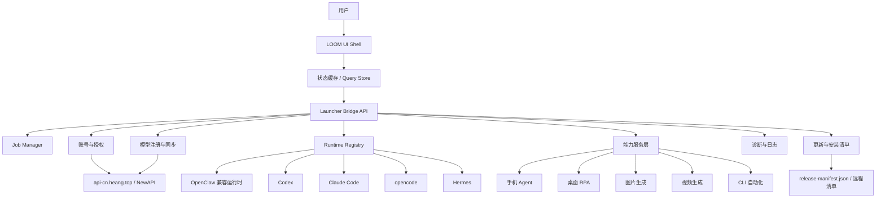
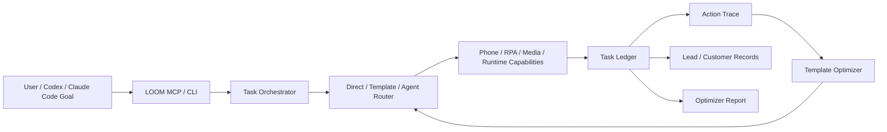
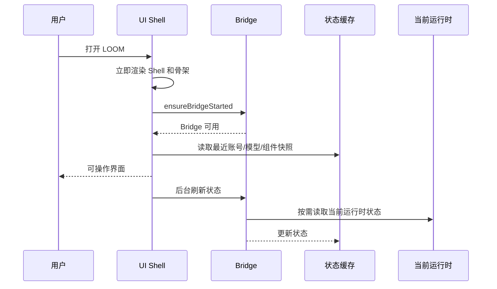
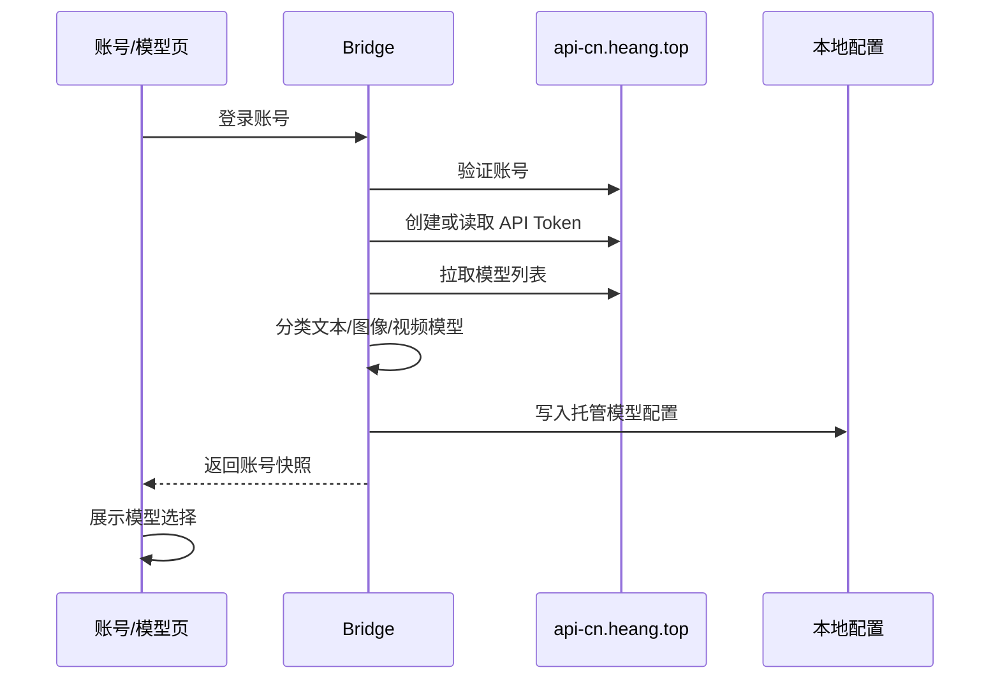
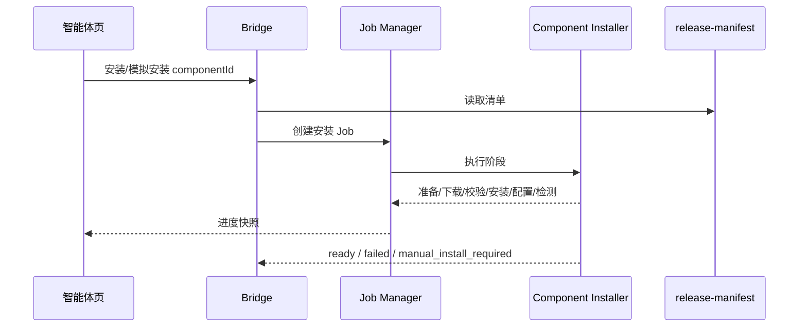
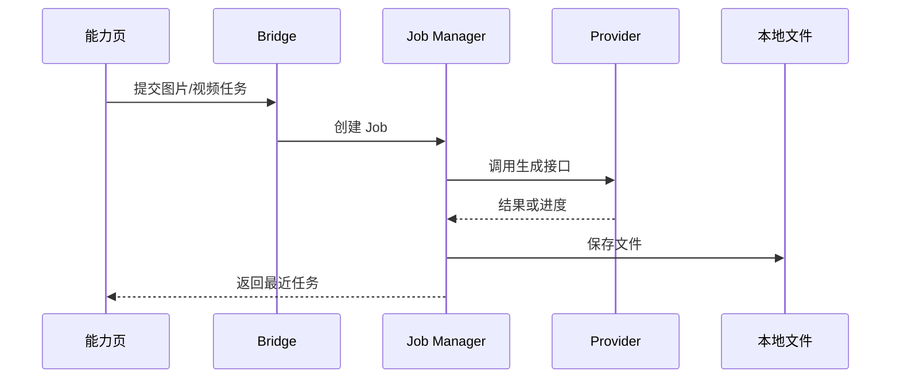

# LOOM / 麓鸣核心架构文档

日期：2026-06-28

适用范围：`D:\Axiangmu\AUSTART` 当前 LOOM / 麓鸣迁移分支。

## 1. 一句话定位

LOOM / 麓鸣不是 OpenClaw 专用启动器，也不是多 Agent 应用商店。

LOOM 是一套“安装器形态 + 本地 AI 能力工作台内核”的桌面系统：

- 安装器形态负责把 Codex、Claude Code、opencode、OpenClaw、Hermes 等运行时安装、检测、启动、停止、回滚。
- 能力工作台内核负责账号登录、模型同步、手机 Agent、桌面 RPA、生图、生视频、CLI 自动化、任务队列和诊断。
- OpenClaw 是兼容运行时之一，不再是产品中心。
- 手机 Agent、桌面 RPA、媒体生成和 CLI 才是 LOOM 自己的能力层。

目标不是“功能堆得多”，而是让用户打开后觉得它快、清楚、可靠、有掌控感。

## 2. 架构目标

### 2.1 高速

用户打开应用时，第一感受必须是“已经能操作”，而不是“程序在加载什么东西”。

要求：

- UI Shell 优先渲染，不等待 Bridge、OpenClaw、手机状态、桌面 RPA 或模型列表。
- 路由页面懒加载，首屏只加载总览需要的数据。
- 重任务全部走后台 Job，不阻塞页面切换。
- Bridge 依赖懒加载，避免启动时一次性 import 所有重模块。
- 所有慢请求必须有状态：排队中、执行中、成功、失败、可重试。

### 2.2 高效

系统必须减少重复工作，避免“同一状态被多个页面反复请求”。

要求：

- 账号、模型、组件、任务、进程状态都进入统一状态缓存。
- 高频面板做 single-flight 请求合并，同一时刻相同请求只飞一次。
- 切换页面不销毁长任务状态。
- 生图、生视频、CLI、安装器、手机任务、桌面 RPA 都用 Job Manager 持久化最近任务。
- 能异步的不要同步，能缓存的不要每次重算。

### 2.3 有力

LOOM 必须能真正控制本地能力，而不是只做一层 UI 包装。

要求：

- 安装器能管理运行时生命周期：安装、配置、健康检查、启动、停止、回滚。
- 账号体系能把 NewAPI 模型同步到文本、图片、桌面、手机和后续运行时。
- 能力层能通过 CLI / MCP / Bridge API 被外部 Agent 调用。
- 错误可诊断、可恢复、可回滚，不把英文堆栈直接扔给用户。

## 3. 总体分层

## 4. 核心模块

### 4.1 UI Shell

职责：

- 快速渲染窗口、侧边栏、顶部状态、当前页面骨架。
- 只展示必要入口：启动器、智能体、能力、账号、模型、诊断。
- 所有长说明放到详情、诊断、日志或文档，不放在主 UI。
- 所有按钮有明确动作，不能存在“点了没反应”的入口。

不负责：

- 不直接拼复杂安装逻辑。
- 不直接管理 OpenClaw 进程细节。
- 不直接轮询多个底层接口组成巨型页面快照。

关键规则：

- 页面标题只保留一个清楚名词。
- 错误提示翻译成用户能理解的下一步。
- 高级路径、端口、token、installPath 默认折叠。

### 4.2 状态缓存层

职责：

- 保存账号快照、模型快照、组件快照、任务列表、进程状态、诊断摘要。
- 合并重复请求，避免页面切换造成请求风暴。
- 页面卸载后仍保留任务进度。
- 断网或 Bridge 短暂不可用时展示上一次有效快照。

推荐状态域：

| 状态域 | 内容 | 刷新策略 |
| --- | --- | --- |
| `account` | 登录状态、用户、订阅、模型数量 | 手动刷新 + 登录/退出后刷新 |
| `models` | 文本、图像、视频草案选择 | 登录后同步 + 手动同步 |
| `components` | 智能体安装状态、版本、回滚状态 | 打开页面刷新 + Job 完成后刷新 |
| `jobs` | 生图、生视频、CLI、安装任务 | 后台轮询，页面共享 |
| `process` | 当前激活运行时启动状态 | 启停时短轮询 |
| `diagnostics` | 环境和依赖检查 | 手动触发，避免开屏重扫 |

### 4.3 Launcher Bridge API

Bridge 是本地核心服务，负责把 UI 请求转成稳定的本地动作。

职责：

- 提供统一 FastAPI 接口。
- 持有 Job Manager。
- 管理账号、模型、运行时、能力、诊断、更新。
- 对 UI 隐藏本地路径和敏感密钥。
- 把底层错误转成产品级错误。

性能原则：

- Bridge 启动要瘦，重模块按需初始化。
- OpenClaw、桌面 RPA、视频 SDK、手机深度探测不能在 Bridge 冷启动时全部加载。
- Bridge 可用不等于运行时可用；UI 应先进入，再逐步显示运行时状态。

### 4.4 Job Manager

Job Manager 是顺滑体验的中枢。

所有超过 1 秒的动作都应走 Job：

- 智能体安装和模拟安装。
- 图片生成。
- 视频生成。
- CLI 自动化。
- 手机任务。
- 桌面 RPA 启动、截图、观察。
- 远程 manifest 拉取和更新。

Job 必须包含：

| 字段 | 说明 |
| --- | --- |
| `id` | 稳定任务 ID |
| `kind` | `image`、`video`、`cli`、`component.install` 等 |
| `status` | `queued`、`running`、`succeeded`、`failed`、`cancelled` |
| `progress` | 阶段、消息、百分比或最近日志 |
| `result` | 生成文件、安装状态、命令输出摘要 |
| `error` | 产品级错误，不直接暴露堆栈 |
| `createdAt` / `updatedAt` | 用于最近任务和恢复 |

体验要求：

- 切换页面后任务不丢。
- 失败后保留上下文和重试入口。
- 最近任务必须能看到进行中动画和结果文件。

### 4.5 账号与模型层

账号体系主路径是中转站登录，兼容授权码作为回滚路径。

职责：

- 用户登录 `api-cn.heang.top`；旧域名仅作受控兼容回退。
- 自动创建或读取 API Token。
- 拉取模型列表和分组权限。
- 分类文本、图像、视频模型。
- 默认文本模型优先 `qwen3.7-plus`。
- 手机 Agent 默认同步 `agnes-2.0-flash`。
- 视频模型先保存为草案，不自动切换 provider，避免影响视频链路稳定性。

数据写入目标：

| 目标 | 写入内容 |
| --- | --- |
| OpenClaw 兼容运行时 | `member_gateway` 文本模型 provider |
| 图片生成 | 图像 provider 和默认图像模型 |
| 桌面 RPA | URL、API Key、模型配置 |
| 手机 Agent | 手机侧 LLM URL、token、默认模型 |
| 视频生成 | 只展示/草案，等待后端链路稳定 |

安全要求：

- UI 不展示中转站 API Key。
- 退出登录只清理 `managedBy=newapi_account` 或等价托管来源的配置。
- 同步失败时保留上一次有效模型快照。

### 4.6 Runtime Registry

Runtime Registry 是“安装器形态”的核心。

它不应该把每个运行时写死到代码里，而应该以 manifest 驱动。

运行时包括：

- Codex
- Claude Code
- opencode
- OpenClaw 兼容运行时
- Hermes
- 后续自定义运行时

每个运行时应具备：

| 能力 | 说明 |
| --- | --- |
| `install` | 下载、校验、解压或启动安装器 |
| `configure` | 写入账号、模型、MCP 或环境变量 |
| `healthCheck` | 检测是否可运行 |
| `start` / `stop` | 生命周期管理 |
| `rollback` | 回到上一可用版本 |
| `webConsole` | 可选打开运行端页面 |

短期策略：

- 保留当前 `OpenClawProcessService` 作为兼容核心，先保证交付。
- 同时逐步抽出 `ProcessHost`、`RuntimeAdapter`、`RuntimeRegistry`。
- 不为了架构洁癖一次性重写全部进程管理。

长期策略：

- 当前激活运行时由 Runtime Registry 决定。
- `/api/process/start|stop|status` 操作当前激活运行时，保持 UI 接口兼容。
- 设备能力通过 MCP 或 CLI 暴露给所有支持的运行时。

### 4.7 能力服务层

能力层是 LOOM 的护城河。

它不属于某一个运行时，而属于 LOOM 本身。

能力包括：

- 手机 Agent：截图、视觉帧、任务执行、录屏、设备列表、定时任务。
- 桌面 RPA：启动、截图、观察、自动回复、窗口控制。
- 图片生成：异步任务、文件结果、历史恢复。
- 视频生成：异步任务、长等待反馈、失败重试。
- CLI 自动化：白名单命令、确认机制、外部 Agent 可调用。

边界：

- UI 可以触发能力。
- 外部 Agent 可以通过 CLI / MCP 调用能力。
- 运行时可以消费能力，但不拥有能力。
- 所有 CLI / MCP / Bridge 能力调用必须进入经验引擎记录，不允许绕过审计和复盘。

### 4.8 经验引擎

经验引擎不是聊天记忆系统。

LOOM 不需要记住用户所有对话，也不应该把私人聊天塞进长期上下文。LOOM 需要记录的是“任务经验”：一次目标如何被拆解、调用了哪些能力、哪些步骤成功、哪里慢、哪里失败、下次应该怎么更快。

目标：

- Codex、Claude Code 或其他 Agent 给出目标后，可以通过 MCP / CLI 调用 LOOM 能力。
- LOOM 根据历史经验在 `直接动作 -> 模板任务 -> Agent 推理` 三条路径中选择最快的安全路径。
- 每次任务结束后形成可复盘记录，并把稳定路径沉淀成任务模板。
- 自动获客、定时任务、手机控制、桌面 RPA 和媒体生成都可以复用经验，但必须保留用户确认边界。

核心模块：

| 模块 | 记录什么 | 用来做什么 | 禁止做什么 |
| --- | --- | --- | --- |
| Task Ledger | 任务目标、来源、模式、耗时、结果、失败原因 | 形成可追溯任务账本 | 记录明文密钥和不必要隐私 |
| Action Trace | 截图摘要、动作序列、工具调用、等待时间 | 定位慢点和失败点 | 无审计地执行高风险动作 |
| Template Optimizer | 稳定成功路径、参数、等待策略、模型选择 | 把重复任务变成模板 | 未确认就改变业务话术和触达策略 |
| Lead / Customer Records | 线索状态、跟进阶段、任务关联 | 支持合规获客和复盘 | 批量骚扰、绕平台规则、隐藏来源 |
| Optimizer Report | 成功率、平均耗时、失败 TopN、改进建议 | 给用户和 Agent 下一步依据 | 把建议伪装成已执行结果 |
| Safety Gate | 权限、确认、速率、授权状态 | 控制 MCP / CLI 能力边界 | 让外部 Agent 绕过授权 |

路径选择规则：

- `Direct`：确定性强的动作直接执行，例如打开应用、截图、读取状态、启动组件。
- `Template`：重复业务流程优先走模板，例如咸鱼擦亮、定时发布、固定获客流程。
- `Agent`：界面变化大、需要判断语义或异常处理时才进入推理循环。

可自动优化：

- 缩短无意义等待。
- 合并重复截图和状态读取。
- 复用上次成功模板。
- 选择更快的模型或 provider。
- 调整轮询频率、超时分段和失败重试。

必须确认：

- 批量发送消息、评论、私信、自动回复。
- 修改获客话术、报价、承诺、售后说明。
- 新增或扩大定时任务范围。
- 登录、支付、授权、删除、卸载、覆盖配置。
- 任何可能违反平台规则或用户授权边界的动作。

验收：

- MCP / CLI 每次能力调用都有任务 ID、来源、参数摘要、结果、耗时和风险等级。
- 同一模板连续成功后可以生成“建议固化模板”，但固化前需要用户确认。
- 失败任务能输出下一步建议，而不是只显示 traceback。
- 断网或重启后仍能看到最近任务、最近模板和上次模型同步快照。

### 4.9 诊断与回滚层

稳定交付不靠“希望它没问题”，靠诊断和回滚。

必须覆盖：

- Bridge 是否启动。
- WebView2 是否可用。
- Node / Python / npm 是否可用。
- 端口是否占用。
- release manifest 是否存在和合法。
- 安装包 sha256 是否匹配。
- 组件是否可回滚。
- 手机签名是否有效。
- 桌面 RPA 是否可启动。
- 图片/视频 provider 是否配置。

错误策略：

- 普通 UI 不显示 traceback。
- 诊断页可以折叠展示原始错误。
- 所有失败都要给下一步：重试、重新登录、重新配对、回滚、导出诊断。

## 5. 关键流程

### 5.1 启动流程

关键点：

- UI 先出现，状态后补齐。
- Bridge 启动和运行时启动分开。
- 首屏不做深度手机探测，不扫全量日志，不跑完整诊断。

### 5.2 登录与模型同步

关键点：

- 用户只登录账号，不手填 API Key。
- 文本和图片模型可以写入配置。
- 视频模型只做草案选择。
- 同步失败保留上次快照。

### 5.3 智能体安装

关键点：

- 正式安装必须依赖 manifest。
- 模拟安装不访问网络，不写真实安装目录。
- installer 类型不能假装已安装，必须标记为等待手动安装或执行真实安装策略。
- 失败时保留旧版本，可回滚。

### 5.4 图片与视频任务

关键点：

- 长任务不能绑在页面组件生命周期上。
- 切页再回来仍能看到进度。
- 失败后显示可理解原因，原始错误进日志。

## 6. 性能设计

### 6.1 首屏性能

首屏只允许做：

- 渲染窗口和导航。
- 读取轻量本地缓存。
- 检查 Bridge 是否可用。
- 拉取必要摘要状态。

首屏禁止做：

- 启动 OpenClaw 后再显示 UI。
- 拉全量手机 profile。
- 读取完整日志。
- 检查所有组件真实健康状态。
- 同步所有模型。
- 初始化视频 SDK。

### 6.2 页面切换性能

页面切换必须：

- 使用 Suspense 骨架屏，不出现空白。
- 保持顶部和侧边栏稳定。
- 不重复启动 Bridge。
- 不重复创建长任务。
- 不因为账号状态刷新导致整个 Shell 重渲染。

### 6.3 后台任务性能

后台任务必须：

- 可取消或至少可停止轮询。
- 限制并发，避免同时压爆本机和中转站。
- 有统一超时策略。
- 有最近日志和阶段信息。

建议默认：

| 任务 | 默认超时 | 说明 |
| --- | --- | --- |
| Bridge 启动 | 120-240 秒 | 但 UI 立即可见 |
| 运行时启动 | 按 manifest | 不写死 OpenClaw |
| 图片生成 | 180-300 秒 | 失败可重试 |
| 视频生成 | 600-1200 秒 | 必须有持续进度 |
| CLI | 600 秒 | 高风险命令需确认 |
| 手机任务 | 60-180 秒 | 长任务拆阶段 |

## 7. 不迁移和不恢复的内容

以下内容不再作为主 UI 入口恢复：

- 飞书入口。
- 微信入口。
- 广告视频旧页。
- 发布页旧入口。
- Storyboard。
- 旧 Skills 页。
- 星空背景首页。
- 大段口号式 Hero。
- 旧 OpenClaw 专用控制台作为产品中心。

如果这些能力仍有价值，只能以以下形式存在：

- 能力中心的高级项。
- CLI 命令。
- MCP 工具。
- 历史归档文档。

## 8. 协议兼容残留

以下名字看起来旧，但不能盲目删除：

- `/api/lumi/*`
- `X-LUMI-*`
- `lumiLauncherId`
- `lumiLauncherSecret`
- `Invalid Lumi signature`
- `openclaw-workspace`
- OpenClaw runtime context 相关文件
- APKClaw 安全签名相关字段

这些属于协议兼容层，可以在 UI 文案中隐藏，但不能未经验证就改名。

## 9. 迁移阶段

### Phase A：止血和隔离

目标：防止工作区继续污染。

动作：

- 固定 `openclaw_new_launcher` 为当前 LOOM 主线。
- 把旧 UI、旧文档、旧设计移入归档目录或从导航移除。
- 保留协议兼容字段。
- UI 基线只认 `docs/LOOM_UI_BASELINE.md`。

验收：

- 导航只剩 6 个入口。
- 旧飞书/微信/发布/Storyboard 不再出现。
- LOOM 品牌和主文案无乱码。

### Phase B：体验优先可演示版

目标：先让用户觉得顺。

动作：

- Shell 快速打开。
- 账号登录可用。
- 模型同步和选择可用。
- 智能体模拟安装可用。
- 能力中心任务切页不丢。
- 桌面 RPA、手机 Agent、生图、生视频基础按钮可提交 Job。

验收：

- 首屏不空白。
- 页面切换无明显卡顿。
- 所有主按钮点一遍不会出现原始英文错误。
- `npm run build` 通过。

### Phase C：真实安装和回滚

目标：安装器从“看起来能装”变成“真的能装”。

动作：

- 提供真实 `release-manifest.json`。
- 多源下载和缓存。
- sha256 校验。
- zip/tgz/installer 策略明确。
- health check 执行。
- rollback 可用。

验收：

- 五个运行时至少支持模拟安装。
- 至少一个运行时支持真实下载安装。
- 失败不破坏旧版本。

### Phase D：Runtime Adapter 最小落地

目标：降低 OpenClaw 旧主干耦合。

动作：

- 从 `OpenClawProcessService` 抽出 `ProcessHost`。
- 建立 `RuntimeManifest` 和 `RuntimeRegistry`。
- OpenClaw 变成第一个 adapter。
- 后续 Hermes 或 opencode 验证第二运行时。

验收：

- `/api/process/start|stop|status` 仍兼容 UI。
- OpenClaw 可由 manifest 启动。
- 第二运行时不需要复制一份 process.py。

### Phase E：能力层开放

目标：让任意运行时获得 LOOM 能力。

动作：

- CLI 白名单稳定。
- 手机、桌面、媒体能力可通过 CLI 调用。
- 后续补 MCP server。
- 授权门控从页面下沉到能力工具层。
- CLI / MCP 调用统一写入经验引擎。
- 建立任务模板固化流程：运行记录 -> 复盘建议 -> 用户确认 -> 模板入库。

验收：

- 外部 Agent 可以调用手机截图、桌面观察、生成任务。
- 未授权能力返回可理解提示。
- 能力调用有日志、Job、结果和失败恢复。
- 重复任务可以从历史记录生成模板建议。
- 高风险模板和批量触达任务必须要求用户确认。

## 10. 验收清单

### UI 验收

- 首屏能在 Bridge 完全就绪前显示。
- 左侧导航只有 6 个主入口。
- 页面切换无空白页。
- 主按钮全部有效。
- 普通错误不展示 traceback。
- 高级路径默认折叠。

### 账号模型验收

- 中转站登录可用。
- 兼容授权码入口可用。
- 模型同步可用。
- 文本模型默认优先 `qwen3.7-plus`。
- 手机模型可同步 `agnes-2.0-flash`。
- 视频模型只保存草案。

### 安装器验收

- 模拟安装五个运行时可完成。
- 正式安装无 manifest 时明确提示。
- release manifest 校验严格。
- 下载失败、校验失败、健康检查失败都有明确状态。
- 有旧版本时可回滚。

### 能力验收

- 图片生成走 Job。
- 视频生成走 Job。
- 切页后任务不丢。
- 手机 Agent 命令可提交。
- 桌面 RPA 状态/截图/启动可提交。
- CLI 高风险动作需要确认。
- MCP / CLI 能力调用进入 Task Ledger。
- 重复手机任务可以生成模板建议。
- 自动获客相关任务保留线索记录、触达记录和确认边界。

### 工程验收

- `git diff --check` 通过。
- Python 关键模块可编译。
- `openclaw_new_launcher npm run build` 通过。
- 不把密钥、账号密码、私钥写入源码或文档。
- 不在发布包里混入开发者本地配置。

## 11. 当前最短交付策略

在时间紧时，不要试图一天内完成所有架构理想态。

优先顺序：

1. 保留当前 OpenClawProcessService 作为兼容核心。
2. 先完成 LOOM UI、账号模型、能力中心、Job 体验。
3. 先做模拟安装和 manifest 验证。
4. 再补真实安装和回滚。
5. 最后抽 Runtime Adapter。

原因：

- 用户首先感知的是速度、清晰度和按钮是否有效。
- 完整 Runtime Adapter 是正确方向，但不是最短交付路径。
- 如果先大拆 process.py，容易把已经可用的 OpenClaw、手机、桌面链路一起拆坏。

## 12. 版本管理规则

LOOM / 麓鸣必须按语义化版本做发布管理，避免测试机、在线安装包和 release manifest 指向彼此混淆。

- `MAJOR`：产品边界、协议、安装目录结构、账号体系或运行时兼容性发生破坏性变化时递增，例如 `3.0.0`。
- `MINOR`：新增完整用户能力、安装器主链路、手机控制能力、账号模型能力或发布通道能力时递增，例如 `2.2.0`。
- `PATCH`：修 bug、检测兜底、UI 细节、文案、动效、图标、安装器稳定性和不改变外部契约的小修时递增，例如 `2.1.20`。
- RC 包名统一使用 `LOOM-Online-v{version}-{yyyyMMdd}-rc{n}.zip` 和 `LOOM-Online-Setup-v{version}-{yyyyMMdd}-rc{n}.exe`。
- release manifest 的 `version` 使用 `{version}-rc.{yyyyMMdd}.{n}`，`launcherPackage` 与 `installerPackage` 必须指向同一版本、同一 RC 序号。
- 每次发布前必须同步 `package.json`、`package-lock.json`、`src-tauri/tauri.conf.json`、`src-tauri/Cargo.toml`、`src-tauri/Cargo.lock` 和 UI 展示版本。
- 不允许复用旧版本号覆盖远程包；同一天连续测试必须递增 `rcN`。
- 稳定版只从已经通过另一台电脑冒烟测试的 RC 提升，不直接从本地 WIP 生成 stable。

## 13. 给迁移执行者的原则

- 不要把 LOOM 做成应用商店。
- 不要把 OpenClaw 再放回产品中心。
- 不要为了改名破坏协议兼容。
- 不要恢复旧侧边栏噪声。
- 不要把长任务绑在页面生命周期上。
- 不要让用户看到原始堆栈。
- 不要在没有 manifest 的情况下假装真实安装成功。
- 先把体验做顺，再把架构抽干净。
