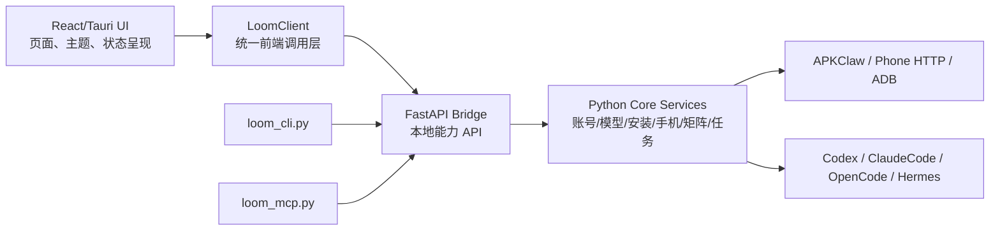

# LOOM 前后端分离执行文档

更新时间：2026-07-02

## 执行原则

不要重写整个项目。用渐进式方式把业务逻辑从 UI 里抽出来，先建立统一调用层，再逐页迁移。

推荐结构：



## 当前可利用基础

项目已经有可承接分离的基础：

- 前端：`openclaw_new_launcher/src/services/api.ts`
- 后端入口：`openclaw_new_launcher/python/bridge.py`
- FastAPI routes：`openclaw_new_launcher/python/api/routes_*.py`
- CLI：`openclaw_new_launcher/python/loom_cli.py`
- MCP：`openclaw_new_launcher/python/loom_mcp.py`
- 手机矩阵核心：`openclaw_new_launcher/python/core/phone_matrix.py`
- 账号模型核心：`openclaw_new_launcher/python/core/newapi_account_manager.py`、`wire_config.py`
- 现有 contract tests：`openclaw_new_launcher/python/tests/test_routes_*.py`

这说明第一阶段重点不是“新起一个后端”，而是把前端调用和后端能力契约整理干净。

## 阶段 0：基线盘点

目标：知道 UI 里哪些地方还在直接做业务。

执行：

1. 搜索前端里的 `fetch(`、`invoke(`、`localStorage`、`sessionStorage`、`models`、`account`、`phone`、`matrix`。
2. 列出页面到接口的映射：
   - `LicensePage.tsx`
   - `ModelsPage.tsx`
   - `AgentInstallerPage.tsx`
   - `AgentAccessPage.tsx`
   - `MatrixWorkbenchPage.tsx`
   - `PhoneDemoPage.tsx`
   - `CreativeMediaPage.tsx`
   - `SettingsPage.tsx`
   - `DiagnosticsPage.tsx`
3. 标注每个页面是否存在：
   - 直接拼 API 路径
   - 直接解析业务错误
   - 直接决定模型默认值
   - 直接读写敏感信息
   - 复制其他页面的状态映射

输出：一张迁移清单，先做账号/模型/组件安装/矩阵这四块。

## 阶段 1：建立统一前端调用层

目标：前端只通过统一 client 调用后端。

建议文件：

- `openclaw_new_launcher/src/services/loomClient.ts`
- `openclaw_new_launcher/src/services/loomContracts.ts`
- `openclaw_new_launcher/src/services/loomErrors.ts`
- `openclaw_new_launcher/src/services/loomMock.ts`

职责：

- `loomClient.ts`：封装 GET/POST、超时、错误转换、本地 base URL。
- `loomContracts.ts`：定义 Account、Model、Component、Phone、Matrix、Task、Media、Diagnostics DTO。
- `loomErrors.ts`：把后端错误转换成 UI 可读状态。
- `loomMock.ts`：给前端 contract 和无后端预览用。

约束：

- 页面不得直接使用裸 `fetch`。
- 页面不得自己拼 `http://127.0.0.1:xxxxx/api/...`。
- 页面不得自己判断 `qwen3.7-plus`、`gpt-image-2` 等业务默认模型。

## 阶段 2：后端契约归一

目标：FastAPI routes 返回稳定格式，CLI/MCP/UI 能复用。

建议检查和补齐：

- `python/api/routes_account.py`
- `python/api/routes_wire.py`
- `python/api/routes_components.py`
- `python/api/routes_phone.py`
- `python/api/routes_matrix.py`
- `python/api/routes_media.py`
- `python/api/routes_diagnostics.py`
- `python/api/routes_cli.py`

返回格式建议：

```json
{
  "ok": true,
  "data": {},
  "code": "ok",
  "message": "",
  "traceId": "optional"
}
```

错误格式建议：

```json
{
  "ok": false,
  "code": "model_permission_denied",
  "message": "当前账号没有该模型权限，已切换到可用默认模型。",
  "action": "select_available_model",
  "detail": {}
}
```

注意：如果现有 contract tests 已经固定了字段，不要强行改旧字段；可以在旧字段外兼容新增统一外壳。

## 阶段 3：优先迁移四个高价值页面

### 1. 模型账号页

目标：

- 登录态由后端判断并持久化。
- 订阅页 URL 由后端返回。
- 模型列表、默认模型、无权限兜底由后端统一计算。
- UI 只展示“已登录、订阅、模型选择、同步、退出”。

验收：

- 注册过账号验证码登录不再提示“已注册”。
- 重新打开 LOOM 后保持登录态。
- 不再默认展示用户无权限的模型。
- 打开订阅页失败时有明确错误和外部打开兜底。

### 2. Agent 安装与配置页

目标：

- Codex / ClaudeCode / OpenCode / Hermes 安装状态由后端统一检测。
- 一键配置模型走后端接口。
- Hermes 源码冲突、依赖缺失、路径异常由后端诊断。

验收：

- UI 不直接判断安装路径细节。
- `loom_cli.py agents model-status` 与 UI 展示一致。
- 修复建议能被复制给用户或一键执行安全修复。

### 3. 手机矩阵工作台

目标：

- UI 是“电子员工工作台”：设备、任务、进度、日志、线索、异常集中呈现。
- 任务发布、watch、cancel、retry 由后端 matrix API 承担。
- 高风险外发动作必须走确认边界。

验收：

- 单手机和多手机共用同一任务模型。
- 任务 ID、来源、参数摘要、耗时、结果进入 Task Ledger。
- UI 可以看起来忙，但不能用假数据掩盖真实失败。

### 4. 创作与媒体页

目标：

- 生图、生视频默认模型由后端返回。
- 提示词模板由后端或配置中心管理。
- 素材导入、视频/图片分发给手机矩阵通过统一 media/matrix API。

验收：

- 配色与安装、账号页统一。
- 提示词简洁，不堆长段说明。
- 模型不可用时自动显示可用替代方案。

## 阶段 4：CLI/MCP 与 UI 同源

目标：Codex/ClaudeCode 不需要理解 UI，只需要调用 CLI/MCP。

要求：

- `loom_cli.py` 不直接复制 UI 逻辑。
- `loom_mcp.py` tools 与 CLI 能力描述一致。
- `commands` 或等价 discover 接口能列出能力、权限、示例、风险边界。
- 手机矩阵任务可以被 CLI/MCP 提交、查询、取消、重试。
- Task Ledger 记录来源：`ui`、`cli`、`mcp`、`scheduler`。

## 阶段 5：测试与验证

最小验证命令：

```powershell
cd D:\Axiangmu\AUSTART
git diff --check
cd D:\Axiangmu\AUSTART\openclaw_new_launcher
python -m py_compile python\bridge.py python\loom_cli.py python\loom_mcp.py
python -m pytest python\tests\test_routes_account.py python\tests\test_routes_wire.py python\tests\test_routes_components.py python\tests\test_routes_phone.py python\tests\test_routes_matrix.py python\tests\test_loom_cli_contract.py python\tests\test_loom_mcp_contract.py
npm run build
```

按改动范围追加：

```powershell
python -m pytest python\tests\test_account_ui_contract.py python\tests\test_models_page_contract.py python\tests\test_agent_installer_page_contract.py python\tests\test_agent_access_ui_contract.py python\tests\test_matrix_control_plane.py python\tests\test_creative_media_contract.py
```

如果真机不可用：

- 必须用 mock/contract 测试覆盖 phone/matrix 参数、超时、失败、重试、确认边界。
- 最终报告明确“真机未验证”的影响范围。

## 阶段 6：发布前检查

必须检查：

- 日志、缓存、账号、token、私钥、真实手机号、真实客户数据没有进入源码和发布包。
- `.gradle`、`.kotlin`、`build`、`dist`、临时截图、运行日志不污染提交。
- 前端 mock 数据不能伪装成真实成功。
- 白标配置和业务配置分开。
- 在线包、离线包分别列出依赖、排除规则、可验证脚本。

## 建议迭代顺序

1. 新增 `LoomClient` 和 contracts，不改页面行为。
2. 迁移模型账号页。
3. 迁移 Agent 安装配置页。
4. 迁移手机矩阵工作台。
5. 迁移创作媒体页。
6. 对齐 CLI/MCP 能力发现。
7. 补 contract tests 和发布检查。

每步都要小提交思维：能解释、能回滚、能验证。

## 完成报告格式

新会话完成后输出：

- 已迁移页面
- 新增/修改 API
- UI 仍直接调用后端的剩余点
- CLI/MCP 是否同源
- 测试命令和结果
- 真机/账号/服务器阻塞
- 下一步建议
