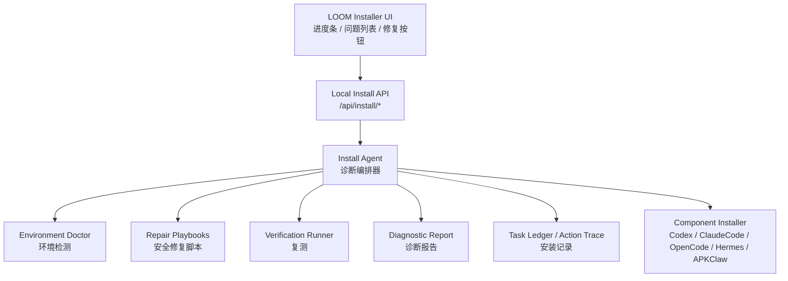

# LOOM Install Agent / 环境医生架构文档

更新时间：2026-07-02

## 一句话目标

让任何 Windows 用户在环境混乱的情况下，也能通过 LOOM / 麓鸣完成一键检测、自动修复大部分安装问题，并把无法自动解决的问题生成清晰报告。

## 模块定位

这个模块不是普通安装器，也不是“AI 随便修电脑”。它应该是 LOOM 的安装诊断专员：

- 负责安装前预检。
- 负责识别用户电脑环境问题。
- 负责执行安全白名单修复。
- 负责复测并继续安装。
- 负责生成可发给客服、代理商、Codex 的诊断报告。

推荐名称：

- 麓鸣安装诊断专员
- Install Agent
- 环境医生
- 一键检测与修复

## 为什么必须做

LOOM 要交付给不同 Windows 用户，真实环境一定会乱：

- Windows 版本不同。
- 用户名和路径可能是中文。
- WebView2 缺失或损坏。
- Python / Node / Git / ADB 状态不同。
- 端口被占用。
- 杀软或 SmartScreen 拦截。
- Hermes venv 损坏。
- Codex / ClaudeCode / OpenCode 配置不一致。
- 手机无障碍被杀、ADB 未授权。
- 网络代理导致订阅页、模型同步、安装包下载失败。

如果没有 Install Agent，每个问题都会变成售后远程排查。这个模块的价值就是把售后经验固化成安装器能力。

## 核心原则

### 1. 规则和 playbook 优先，LLM 只做解释和归因

不要做：

```text
AI 看日志 -> 自己想 PowerShell 命令 -> 直接改用户电脑
```

要做：

```text
规则/LLM 识别问题 -> 匹配安全修复 playbook -> 用户确认 -> 执行固定脚本 -> 复测 -> 报告
```

### 2. 所有修复动作必须白名单化

每个修复动作必须有：

- 名称
- 风险级别
- 前置检测
- 执行动作
- 回滚方式或恢复建议
- 验证方式
- 是否需要管理员权限
- 是否需要用户确认

### 3. 安装过程必须可解释

用户不应该只看到“失败”。要看到：

- 哪一步失败。
- 为什么失败。
- 是否能自动修。
- 修复会做什么。
- 修完怎么验证。
- 如果不能修，下一步找谁或怎么处理。

## 总体架构



## 用户流程

```text
1. 打开 LOOM 安装器
2. 点击“检测并安装”
3. Install Agent 进行环境预检
4. 展示问题分级
5. 用户确认可修复项
6. 执行修复 playbook
7. 复测
8. 继续安装组件
9. 安装完成或生成阻塞报告
```

## 问题分级

| 等级 | 含义 | 示例 | 动作 |
|---|---|---|---|
| OK | 正常 | WebView2 已安装 | 继续 |
| WARN | 可继续但建议修复 | 端口默认值被占用，可换端口 | 自动处理或提示 |
| FIXABLE | 可自动修复 | Hermes venv 损坏 | 用户确认后修复 |
| NEEDS_USER | 需要用户操作 | 手机 ADB 授权弹窗 | 引导用户操作 |
| NEEDS_ADMIN | 需要管理员权限 | 写系统 PATH、安装驱动 | 请求确认 |
| BLOCKED | 阻塞安装 | 安装包缺失、无网络且无离线包 | 生成报告 |

## 第一版诊断项清单

### 系统基础

- Windows 版本。
- CPU 架构。
- 当前用户权限。
- 用户名/路径是否包含中文或特殊字符。
- 可写目录检查。
- 临时目录检查。
- 磁盘剩余空间。

### 运行依赖

- WebView2 是否存在。
- Python 是否存在。
- Python venv 是否可用。
- Node/npm 是否存在。
- Git 是否存在。
- PowerShell 执行策略是否阻塞脚本。
- Visual C++ Runtime 是否缺失。

### LOOM 组件

- LOOM 主程序文件是否完整。
- release manifest 是否完整。
- Codex 是否安装。
- ClaudeCode 是否安装。
- OpenCode 是否安装。
- Hermes 是否安装。
- Hermes 是否存在源码冲突标记。
- APKClaw / 手机 Agent APK 是否存在。

### 网络与端口

- 订阅页 URL 是否可访问。
- 中转站 API 是否可访问。
- 模型列表是否可同步。
- 下载源是否可访问。
- 默认端口是否被占用。
- 代理环境变量是否异常。

### 手机与 ADB

- ADB 是否存在。
- ADB server 是否正常。
- 设备是否连接。
- 设备是否授权。
- 无障碍是否开启。
- HTTP 快速通道是否在线。
- HTTP 不在线时 ADB 兜底是否可用。

### 安全与发布

- SmartScreen / 杀软拦截迹象。
- 安装包是否签名。
- 是否从临时目录或微信缓存目录运行。
- 是否有真实 token、私钥、账号配置混入发布包。

## 第一版修复 Playbook

| Playbook | 风险 | 是否确认 | 动作 |
|---|---|---|---|
| 安装/修复 WebView2 | 中 | 是 | 调用官方安装包或离线包 |
| 重建 Hermes venv | 中 | 是 | 删除损坏 venv 并重建，不删用户配置 |
| 清理 Git 冲突标记阻塞 | 高 | 是 | 只检测并报告，默认不自动改源码 |
| 切换被占用端口 | 低 | 否 | 自动选择可用端口并写本机配置 |
| 修复 npm 缓存/依赖 | 中 | 是 | 清理项目级缓存后重装依赖 |
| ADB server 重启 | 中 | 是 | adb kill-server / start-server |
| ADB 授权引导 | 低 | 否 | 展示手机侧操作步骤 |
| 无障碍修复引导 | 中 | 是 | 通过 ADB 打开设置页或提示手动开启 |
| 代理网络诊断 | 低 | 否 | 检测代理变量和订阅页连通性 |
| 重新同步模型 | 低 | 否 | 调后端 account/model sync |

高风险动作，例如改系统 PATH、安装驱动、杀软白名单、清理目录、删除 venv，必须展示具体动作并让用户确认。

## UI 设计要求

安装页应该是“进度 + 问题 + 修复 + 复测”的工作台。

### 页面结构

```text
顶部：当前阶段 + 总进度
中部左侧：检测项列表
中部右侧：当前问题解释 + 修复动作
底部：日志摘要 + 复制诊断报告 + 继续安装
```

### 示例文案

```text
正在检测电脑环境
[=========     ] 64%

已发现 3 个问题：
✅ WebView2 正常
⚠️ Hermes 环境损坏，可自动修复
⚠️ ADB 未授权，需要在手机上点击允许
❌ 端口 8001 被占用，已为你切换到 8013
```

### 文案原则

- 说人话。
- 先说结果，再说原因。
- 给下一步，不要只报错。
- 不展示一整屏日志，默认展示摘要。
- 日志可以展开，但要有复制按钮。

## API 设计草案

```text
GET  /api/install/status
POST /api/install/preflight
POST /api/install/repair-plan
POST /api/install/repair
POST /api/install/verify
GET  /api/install/report
POST /api/install/continue
```

### 示例返回

```json
{
  "ok": true,
  "stage": "preflight",
  "progress": 64,
  "issues": [
    {
      "id": "hermes_venv_broken",
      "level": "FIXABLE",
      "title": "Hermes 环境损坏",
      "message": "检测到 Python 虚拟环境无法启动。",
      "repair": "rebuild_hermes_venv",
      "requiresConfirmation": true,
      "requiresAdmin": false
    }
  ]
}
```

## CLI / MCP 能力

Install Agent 要能被 Codex / ClaudeCode 调用。

### CLI 草案

```text
loom install status
loom install preflight --json
loom install repair-plan --json
loom install repair hermes_venv_broken --confirm
loom install verify --json
loom install report --format markdown
```

### MCP tools 草案

- `install_status`
- `install_preflight`
- `install_repair_plan`
- `install_apply_repair`
- `install_verify`
- `install_report`

MCP 默认只读。执行修复必须显式确认。

## Task Ledger / Action Trace

所有诊断和修复都要记录：

- install session id
- 检测项
- 问题等级
- 修复 playbook
- 是否确认
- 执行耗时
- 执行结果
- 失败原因
- 复测结果
- 脱敏日志摘要

这样后续可以沉淀：

- 哪些电脑最常出问题。
- 哪些修复最有效。
- 哪些安装失败需要产品层面解决。
- 哪些问题要加入离线包。

## 安全边界

禁止：

- LLM 自由生成并执行系统命令。
- 自动删除用户目录。
- 自动修改杀软设置。
- 自动上传完整日志和截图。
- 把 token、私钥、账号、手机号、客户数据写进报告。
- 无确认安装驱动或改系统级配置。

允许：

- 执行白名单修复脚本。
- 展示用户确认弹窗。
- 生成脱敏报告。
- 给出手动修复步骤。
- 把失败摘要交给 Codex 继续分析。

## 和其他模块的关系

```text
Install Agent
  -> Component Installer：安装 Codex / ClaudeCode / OpenCode / Hermes
  -> Phone Dual Channel：检测 HTTP 快速通道和 ADB 兜底
  -> Model Account：检测订阅页、模型同步、账号状态
  -> Task Ledger：记录诊断和修复
  -> Council Review：对复杂失败做多角色复盘
```

## 分阶段实现

### Phase 1：MVP

目标：能检测、修复、复测、报告。

范围：

- WebView2
- Hermes venv
- 端口占用
- Python/Node/npm/Git
- ADB 基础状态
- 订阅页连通性
- 日志摘要

完成标准：

- UI 有进度条和问题列表。
- CLI 能输出 preflight JSON。
- 至少 5 个检测项有 contract tests。
- 至少 2 个修复 playbook 可跑 mock 测试。
- 能生成 markdown 诊断报告。

### Phase 2：组件安装闭环

目标：接管 Codex / ClaudeCode / OpenCode / Hermes / APKClaw 安装诊断。

范围：

- 一键安装组件。
- 一键配置模型。
- 失败自动重试。
- 用户确认后修复。
- 组件状态统一展示。

### Phase 3：智能复盘和经验沉淀

目标：把安装问题沉淀成经验。

范围：

- Task Ledger 聚合。
- 常见问题排行。
- 建议新增 playbook。
- Council Review 复盘复杂失败。
- 代理商售后报告模板。

## 验证计划

### 单元 / Contract

- 检测项返回结构稳定。
- 修复 playbook 有风险等级。
- 高风险修复必须要求确认。
- token 和敏感信息被脱敏。
- 端口占用能被 mock。
- Hermes venv 损坏能被 mock。

### 手动走查

准备几类测试电脑或模拟环境：

1. 全新 Windows。
2. 中文用户名。
3. 缺 WebView2。
4. 端口占用。
5. Hermes venv 损坏。
6. ADB 未授权。
7. 网络代理异常。
8. 杀软拦截安装包。

## 可复制 Goal

```text
/goal 在 D:\Axiangmu\AUSTART 内为 LOOM / 麓鸣设计并实现第一版 Install Agent / 环境医生 MVP。目标是让 Windows 用户在环境混乱时也能一键检测、自动修复大部分安装问题、复测并继续安装，无法自动解决时生成脱敏诊断报告。

先读取：
1. D:\Axiangmu\AUSTART\docs\LOOM_INSTALL_AGENT_ENVIRONMENT_DOCTOR_ARCHITECTURE.md
2. D:\Axiangmu\AUSTART\docs\OPENCLAW_SUPER_INSTALLER_ARCHITECTURE.md
3. D:\Axiangmu\AUSTART\docs\OPENCLAW_SUPER_INSTALLER_IMPLEMENTATION_PLAN.md
4. D:\Axiangmu\AUSTART\docs\LOOM_PHONE_DUAL_CHANNEL_ADB_ARCHITECTURE.md
5. D:\Axiangmu\AUSTART\openclaw_new_launcher\python\core\component_installer.py
6. D:\Axiangmu\AUSTART\openclaw_new_launcher\python\api\routes_components.py
7. D:\Axiangmu\AUSTART\openclaw_new_launcher\python\tests

目标结果：
1. 增加 Install Agent 的后端诊断结构，至少覆盖 WebView2、Hermes venv、端口占用、Python/Node/npm/Git、ADB 基础状态、订阅页连通性。
2. 增加安全 repair playbook 结构，每个修复项必须有风险等级、是否需要确认、验证方式。
3. UI 安装页展示检测进度、问题等级、可修复项、复测结果和诊断报告入口。
4. CLI/MCP 至少能查询 install status/preflight/report；执行修复必须显式确认。
5. 所有日志和报告必须脱敏，不得包含 token、私钥、真实账号、手机号、cookie。

验证：
1. git diff --check
2. python -m py_compile openclaw_new_launcher/python/bridge.py openclaw_new_launcher/python/loom_cli.py openclaw_new_launcher/python/loom_mcp.py
3. python -m pytest openclaw_new_launcher/python/tests/test_component_installer.py openclaw_new_launcher/python/tests/test_routes_components.py
4. 为新增 Install Agent 增加对应 contract tests 并运行。
5. 在 openclaw_new_launcher 下运行 npm run build。

约束：
1. 主线只认 openclaw_new_launcher，不做旧 UI 大重构。
2. 不允许 LLM 自由生成并执行系统命令；只能执行白名单 playbook。
3. 高风险动作必须用户确认。
4. 不破坏 Codex / ClaudeCode / OpenCode / Hermes / APKClaw 已有安装路径和签名链路。
5. 不提交运行日志、缓存、真实账号、token、私钥、用户本地配置。

完成条件：
1. Install Agent MVP 可通过 UI/CLI 查询环境预检。
2. 至少 5 类问题可检测，至少 2 类问题可安全修复或 mock 修复。
3. 修复后会复测并进入下一步安装。
4. 可生成脱敏 markdown 诊断报告。
5. 测试和构建通过，或明确说明缺少的真实环境条件。

暂停条件：
1. 需要真实用户电脑权限、管理员权限、杀软设置、驱动安装、生产账号或真实密钥时暂停确认。
2. 需要删除用户文件、修改系统级配置、上传日志或截图时暂停确认。
3. 发现发布包或源码中混入敏感信息时暂停并先清理。
```
