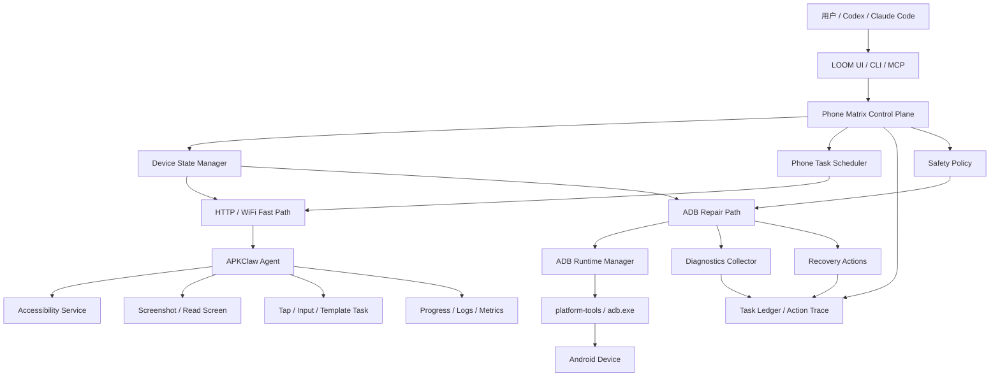
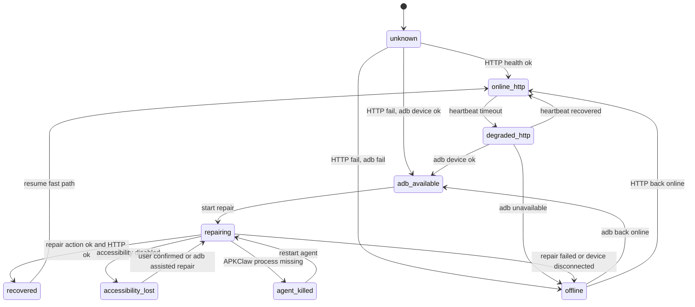

# LOOM Phone Dual Channel ADB Architecture

日期：2026-07-02

适用范围：

```text
D:\Axiangmu\AUSTART\openclaw_new_launcher
D:\Axiangmu\AUSTART\apkclaw\Hermes-Agent-phone-codex-template-parameter-extraction
```

本文档定义 LOOM / 麓鸣手机矩阵的双通道控制架构：HTTP/WiFi 作为快速执行通道，ADB 作为诊断与修复兜底通道。目标不是让 Codex 直接操作裸 adb，而是让 Codex、Claude Code、MCP、CLI 都通过 LOOM 暴露的安全工具来管理手机矩阵。

## 1. 一句话结论

LOOM 应该内置 ADB 能力，但 ADB 只作为“维修通道”和“设备运维底座”存在。

正常任务走 HTTP/WiFi：

- 截图
- 读屏
- 点击
- 输入
- 文件分发
- 视频上传
- 任务提交
- 日志回传

异常恢复走 ADB：

- 检测设备是否在线
- 拉起 APKClaw
- 重启前台服务
- 采集 logcat / dumpsys
- 检查无障碍状态
- 引导或尝试修复权限
- 安装或升级 APK
- 恢复 HTTP 通道

Codex 不直接运行任意 adb shell。Codex 只能调用 LOOM 封装好的白名单能力。

## 2. 设计目标

### 2.1 速度

平时所有高频手机动作优先走 HTTP/WiFi。HTTP 通道应该是矩阵任务的主干，因为它延迟低、吞吐高、容易做任务队列和实时状态回传。

### 2.2 可恢复

手机 Agent 被系统杀掉、无障碍掉线、HTTP 服务失联时，LOOM 不应该立刻让用户人工救火。系统要进入 repair 状态，并尝试通过 ADB 诊断和恢复。

### 2.3 可观测

每台手机必须有清晰状态：

- 正常执行
- 心跳异常
- ADB 可达
- 无障碍异常
- APKClaw 被杀
- 修复中
- 已恢复
- 离线

每一次诊断和修复都要写入 Task Ledger / Action Trace，方便 Codex 后续判断哪台手机经常出问题。

### 2.4 安全

ADB 能力必须被收口。不能把任意 adb shell 暴露给普通任务、MCP 工具或外部 Agent。高风险动作必须白名单化、可审计、可确认。

## 3. 非目标

本阶段不做这些事：

- 不直接开放裸 adb shell 给 Codex 或用户。
- 不绕过 Android 系统安全确认。
- 不承诺所有 ROM 都能自动重开无障碍。
- 不把 ADB 做成批量骚扰或规避平台规则的工具。
- 不改 phone、MCP、wire 已有协议字段名。
- 不把真实账号、token、手机号、客户数据写入源码或发布包。

## 4. 总体架构



## 5. 分层说明

### 5.1 Phone Matrix Control Plane

职责：

- 管理多台手机。
- 保存设备状态。
- 分发任务。
- 选择 HTTP 或 ADB 通道。
- 对外暴露统一 CLI / MCP 工具。
- 把任务和修复过程写入 Ledger。

建议位置：

```text
openclaw_new_launcher/python/core/phone_matrix.py
openclaw_new_launcher/python/core/phone_device_state.py
openclaw_new_launcher/python/core/phone_task_scheduler.py
```

### 5.2 HTTP / WiFi Fast Path

职责：

- 正常执行手机自动化任务。
- 获取截图、读屏、UI 树摘要。
- 执行点击、输入、模板任务。
- 上传图片、视频、文件。
- 返回任务进度和结果。

设计原则：

- HTTP 是默认路径。
- HTTP 心跳稳定时，不主动启用 ADB。
- HTTP 失败后先诊断，不马上重试风暴。
- 每台设备要有并发限制，避免一个手机被多个任务同时抢。

建议接口：

```text
GET  /health
GET  /screen
GET  /read-screen
POST /action
POST /task
GET  /task/{id}
GET  /metrics
GET  /logs/recent
POST /files/push
```

### 5.3 ADB Runtime Manager

职责：

- 查找可用 adb。
- 优先使用 LOOM 自带 platform-tools。
- 不污染系统 PATH。
- 记录 adb 路径、版本、来源、SHA256。
- 列出设备。
- 统一执行白名单 ADB 动作。
- 处理超时、编码、退出码和错误摘要。

建议位置：

```text
openclaw_new_launcher/python/core/adb_runtime.py
openclaw_new_launcher/python/core/adb_manifest.py
```

运行时查找顺序：

```text
1. LOOM bundled runtime:
   openclaw_new_launcher/runtime/platform-tools/adb.exe

2. User configured path:
   settings.adb.path

3. Android SDK default paths:
   %LOCALAPPDATA%\Android\Sdk\platform-tools\adb.exe
   %ANDROID_HOME%\platform-tools\adb.exe
   %ANDROID_SDK_ROOT%\platform-tools\adb.exe

4. PATH fallback:
   adb.exe
```

注意：

- 只有找不到自带 adb 时才用系统 adb。
- 不要把 adb 路径写进系统 PATH。
- 不要要求用户安装完整 Android Studio。
- 离线包可预置 platform-tools，但必须保留来源和校验信息。

### 5.4 ADB Repair Path

职责：

- 当 HTTP 心跳失败时诊断设备。
- 尝试恢复 APKClaw。
- 收集故障证据。
- 把结果回写到设备状态机。

只允许暴露白名单动作：

```text
adb_check
collect_diagnostics
restart_agent
repair_accessibility
grant_permissions
install_update
recover_http_channel
```

不允许暴露：

```text
raw_adb_shell
raw_adb_push
raw_adb_pull
raw_adb_install
raw_adb_forward
```

如果开发调试确实需要 raw adb，只能放在本地 debug-only 配置里，并且默认关闭，不对 MCP / CLI 普通入口开放。

## 6. 设备状态机



状态定义：

| 状态 | 含义 | 系统动作 |
| --- | --- | --- |
| `unknown` | 启动后尚未确认设备状态 | 同时检查 HTTP 和 ADB |
| `online_http` | HTTP 正常，默认执行通道可用 | 任务走 HTTP |
| `degraded_http` | HTTP 心跳异常或响应慢 | 降速重试，准备 ADB 诊断 |
| `adb_available` | ADB 可达，HTTP 不稳定或不可达 | 允许 repair 动作 |
| `accessibility_lost` | 无障碍不可用 | 提示人工确认或尝试授权引导 |
| `agent_killed` | APKClaw 进程或服务不在 | 尝试 restart_agent |
| `repairing` | 正在修复 | 锁定该设备，避免任务抢占 |
| `recovered` | 修复成功 | 回到 HTTP 快路径 |
| `offline` | HTTP 和 ADB 都不可用 | 标记人工介入 |

## 7. Repair Playbook

### 7.1 HTTP 心跳断开

触发条件：

```text
HTTP /health 超时
连续 N 次任务提交失败
WebSocket 断开超过阈值
```

处理流程：

```text
1. device.state = degraded_http
2. 停止给该设备派发新任务
3. adb_check
4. 如果 ADB 可用，进入 adb_available
5. collect_diagnostics
6. restart_agent
7. recover_http_channel
8. HTTP 恢复后进入 recovered -> online_http
9. HTTP 仍失败则进入 offline 或 agent_killed
```

### 7.2 APKClaw 被杀

检测方式：

```text
adb shell pidof <package>
adb shell dumpsys activity services
adb shell dumpsys package <package>
```

修复动作：

```text
adb shell monkey -p <package> 1
adb shell am start -n <package>/<activity>
adb shell am start-foreground-service ...
```

注意：

- 具体 activity / service 名称必须从 APKClaw manifest 中读取，不要硬编码猜测。
- 国产 ROM 对前台服务和自启动限制不同，失败时要给出人工操作提示。

### 7.3 无障碍掉线

检测方式：

```text
adb shell settings get secure enabled_accessibility_services
adb shell dumpsys accessibility
```

修复策略：

```text
1. 检测服务是否启用
2. 如果未启用，优先打开系统无障碍设置页，引导用户确认
3. 如果设备和 ROM 允许，再尝试受控的 adb assisted repair
4. 修复后重新读 dumpsys accessibility
5. 失败则标记 requires_user_action
```

注意：

- 不承诺所有手机都能无交互开启无障碍。
- 对外话术要写成“检测并引导修复”，不要写成“自动绕过权限”。

### 7.4 视频和文件分发失败

HTTP 快路径优先：

```text
POST /files/push
POST /task publish_video
```

HTTP 失败后 ADB 兜底：

```text
adb push <file> /sdcard/LOOM/inbox/
adb shell am broadcast ...
```

注意：

- 大文件传输要做 hash 校验。
- 文件名要脱敏。
- 不把真实客户素材写入源码目录。

## 8. CLI 设计

建议命令：

```bash
loom phone list
loom phone status --device <id>
loom phone doctor --device <id>
loom phone repair --device <id>
loom phone adb-check --device <id>
loom phone collect-logs --device <id>
loom phone restart-agent --device <id>
loom phone recover-http --device <id>
loom phone install-apk --device <id> --apk <path>
```

矩阵命令：

```bash
loom matrix status
loom matrix doctor
loom matrix repair --group <group>
loom matrix run-template --template <name> --group <group>
loom matrix distribute-file --file <path> --group <group>
```

输出格式：

```json
{
  "ok": true,
  "device_id": "phone_001",
  "state_before": "degraded_http",
  "state_after": "online_http",
  "action": "recover_http_channel",
  "duration_ms": 2840,
  "ledger_id": "ledger_20260702_001",
  "requires_user_action": false,
  "warnings": []
}
```

失败格式：

```json
{
  "ok": false,
  "device_id": "phone_001",
  "state_before": "adb_available",
  "state_after": "accessibility_lost",
  "action": "repair_accessibility",
  "error_code": "ACCESSIBILITY_REQUIRES_USER_CONFIRMATION",
  "error_summary": "无障碍服务未启用，需要用户在手机上确认。",
  "requires_user_action": true,
  "next_steps": [
    "打开手机无障碍设置",
    "启用 APKClaw 服务",
    "回到 LOOM 点击重新检测"
  ]
}
```

## 9. MCP 工具设计

建议工具名：

```text
loom.phone.list
loom.phone.status
loom.phone.screenshot
loom.phone.read_screen
loom.phone.run_task
loom.phone.task_status
loom.phone.doctor
loom.phone.repair
loom.phone.collect_diagnostics
loom.phone.restart_agent
loom.phone.recover_http_channel
loom.matrix.status
loom.matrix.run_template
loom.matrix.distribute_file
```

MCP 工具返回值必须结构化，至少包含：

```text
ok
device_id
action
state_before
state_after
duration_ms
ledger_id
requires_user_action
error_code
error_summary
next_steps
```

危险动作要求：

| 动作 | 风险 | 策略 |
| --- | --- | --- |
| 安装 APK | 中 | 需要明确 apk 路径和版本 |
| 批量 repair | 中 | 需要确认 group 范围 |
| 文件分发 | 中 | 记录 hash 和目标设备 |
| 外发消息 / 评论 / 私信 | 高 | 必须人工确认或明确模板授权 |
| raw adb shell | 高 | 默认禁止 |

## 10. Task Ledger / Action Trace

每个手机任务和修复动作都要落账。

建议字段：

```json
{
  "ledger_id": "ledger_20260702_001",
  "source": "mcp",
  "source_agent": "codex",
  "device_id": "phone_001",
  "group_id": "matrix_a",
  "channel": "adb",
  "action": "restart_agent",
  "reason": "http_heartbeat_lost",
  "state_before": "degraded_http",
  "state_after": "online_http",
  "params_summary": {
    "package": "com.apk.claw",
    "timeout_ms": 15000
  },
  "started_at": "2026-07-02T01:00:00+08:00",
  "duration_ms": 2840,
  "result": "success",
  "error_code": null,
  "error_summary": null,
  "requires_user_action": false
}
```

用途：

- Codex 判断设备健康趋势。
- UI 展示“这台电子员工刚刚被修复”。
- 模板优化器识别稳定流程。
- 发布前审计是否有敏感信息进入日志。

## 11. UI 形态建议

手机矩阵页面应该像“电子员工工作台”，不是设备列表表格。

建议布局：

```text
左侧：矩阵分组 / 任务模板 / 素材库
中间：手机员工卡片网格
右侧：任务编排 / 当前设备详情 / 修复建议
底部：实时事件流 / Ledger 摘要
```

每台手机卡片展示：

- 设备名
- 在线状态
- 当前任务
- 当前画面缩略图
- HTTP 延迟
- ADB 可用性
- 无障碍状态
- 最近一次失败原因
- 当前进度
- 修复按钮

视觉状态：

| 状态 | 表现 |
| --- | --- |
| 正常执行 | 稳定绿色/青色进度 |
| 等待任务 | 低对比空闲态 |
| HTTP 降级 | 黄色提示 |
| ADB 修复中 | 蓝色维修态 |
| 需要人工确认 | 橙色强提示 |
| 离线 | 灰色不可用 |

交互原则：

- 一眼看到哪台手机在干活。
- 一眼看到哪台手机坏了。
- 一键查看为什么坏。
- 一键触发安全修复。
- 批量动作必须先确认范围。

## 12. 打包策略

### 12.1 在线包

在线安装包建议流程：

```text
1. 检测本机 adb
2. 没有则下载 Android SDK Platform-Tools
3. 校验 SHA256
4. 解压到 LOOM runtime 目录
5. 写入 adb manifest
6. 运行 adb version
7. 显示安装结果
```

### 12.2 离线包

离线包可以包含：

```text
runtime/platform-tools/adb.exe
runtime/platform-tools/AdbWinApi.dll
runtime/platform-tools/AdbWinUsbApi.dll
runtime/platform-tools/source.txt
runtime/platform-tools/sha256.txt
runtime/platform-tools/version.json
```

要求：

- 保留官方目录结构。
- 保留来源说明。
- 保留版本和 SHA256。
- 不魔改二进制。
- 不改名成奇怪名字。
- 发布 manifest 明确包含 platform-tools。

## 13. 安全与合规边界

必须做到：

- ADB 动作白名单。
- 高风险动作确认。
- 所有 repair 记录 Ledger。
- 不保存真实私钥、token、账号密码。
- 不把用户本地配置打进包。
- 不把手机日志无筛选上传到公网。
- 不把自动获客做成无确认批量骚扰。

禁止做到：

- 静默绕过手机系统权限。
- 无确认批量外发消息。
- 隐藏来源或伪装设备行为。
- 让外部 Agent 执行任意 adb shell。
- 在日志里打印完整 token、手机号、客户隐私。

## 14. 测试方案

### 14.1 无真机 Mock 测试

必须覆盖：

- adb 路径查找。
- adb version 解析。
- adb devices 解析。
- HTTP 心跳失败后进入 degraded_http。
- ADB 可用后进入 adb_available。
- restart_agent 成功后进入 recovered。
- recover_http_channel 成功后回 online_http。
- 无障碍失败返回 requires_user_action。
- 超时、退出码、stderr 能被结构化返回。

### 14.2 真机测试

最小闭环：

```text
1. 手机连接 LOOM
2. HTTP /health 正常
3. 提交一次截图或读屏任务
4. 人工停止 APKClaw 或模拟 HTTP 断开
5. loom phone doctor --device <id>
6. loom phone repair --device <id>
7. APKClaw 被拉起
8. HTTP 恢复
9. 再提交一次截图或读屏任务
10. Ledger 能看到完整修复记录
```

### 14.3 发布检查

必须跑：

```bash
git diff --check
python -m py_compile openclaw_new_launcher/python/**/*.py
python -m pytest openclaw_new_launcher/python/tests
npm run build
```

如果项目实际脚本不同，以 package.json 和现有 CI 脚本为准。

## 15. 分阶段落地

### Phase 1：只读诊断

目标：

- 能找到 adb。
- 能列设备。
- 能读取 adb version。
- 能跑 phone doctor。
- 不做任何修复动作。

交付：

```text
loom phone adb-check
loom phone doctor
MCP: loom.phone.doctor
```

### Phase 2：安全修复

目标：

- 能重启 APKClaw。
- 能采集日志。
- 能恢复 HTTP 通道。
- 能把修复写入 Ledger。

交付：

```text
loom phone restart-agent
loom phone recover-http
loom phone collect-logs
MCP: loom.phone.repair
```

### Phase 3：矩阵化

目标：

- 多设备状态机。
- 批量 doctor。
- 批量 repair 需要确认。
- UI 显示设备健康态。

交付：

```text
loom matrix status
loom matrix doctor
loom matrix repair --group <group>
```

### Phase 4：电子员工工作台

目标：

- 每台手机作为电子员工卡片。
- 动态任务流。
- 模板任务。
- 文件 / 视频素材分发。
- Codex 通过 MCP / CLI 发布任务并监测进度。

交付：

```text
Phone Matrix UI
Task Template UI
Material Distribution UI
Ledger Timeline UI
```

## 16. 给实现会话的 Goal

```text
目标：为 LOOM / 麓鸣实现手机矩阵双通道控制架构：HTTP/WiFi 作为快速执行通道，ADB 作为诊断与修复兜底通道。

主线目录：
D:\Axiangmu\AUSTART\openclaw_new_launcher

参考文档：
D:\Axiangmu\AUSTART\docs\LOOM_PHONE_DUAL_CHANNEL_ADB_ARCHITECTURE.md
D:\Axiangmu\AUSTART\docs\APKCLAW_SPEED_ARCHITECTURE_AND_GOAL.md

要求：
1. 先读取现有 phone / matrix / MCP / CLI 代码，确认当前手机控制链路。
2. 新增 ADB Runtime Manager，检测 LOOM 自带 adb、用户配置 adb、Android SDK adb、PATH adb。
3. 新增 Phone Repair Layer，只暴露白名单动作：adb_check、collect_diagnostics、restart_agent、repair_accessibility、grant_permissions、install_update、recover_http_channel。
4. 增加设备状态机：unknown、online_http、degraded_http、adb_available、accessibility_lost、agent_killed、repairing、recovered、offline。
5. HTTP 正常时优先走 HTTP；HTTP 心跳失败后进入 ADB 诊断；修复成功后回到 HTTP。
6. CLI 增加 loom phone doctor / repair / adb-check / collect-logs / restart-agent / recover-http。
7. MCP 暴露同等结构化工具，返回 ok、device_id、action、state_before、state_after、duration_ms、ledger_id、requires_user_action、error_code、error_summary、next_steps。
8. 所有 ADB 修复动作写入 Task Ledger / Action Trace。
9. 不开放裸 adb shell，不破坏现有 phone/MCP/wire 协议字段，不保存真实 token、账号、手机号、客户数据。
10. 没有真机时写 mock/contract test，覆盖状态机、命令构造、超时、stderr、requires_user_action。

验证：
1. git diff --check
2. python -m py_compile 相关 Python 文件
3. python -m pytest openclaw_new_launcher/python/tests
4. npm run build 或项目实际构建命令

输出：
1. 修改文件清单
2. CLI 示例
3. MCP tools 列表
4. 真机或 Mock 测试结果
5. 可自动修复和必须人工确认的场景清单
```

## 17. 最终验收标准

完成后应满足：

- 用户不需要手动安装 Android Studio。
- LOOM 可以检测和使用 adb。
- HTTP 快路径正常时，ADB 不干预。
- HTTP 失败时，LOOM 能自动进入诊断。
- APKClaw 被杀时，LOOM 能尝试拉起。
- 无障碍掉线时，LOOM 能检测并给出清晰修复路径。
- Codex / Claude Code 通过 MCP 或 CLI 能安全调用 repair 能力。
- 每次修复都有 Ledger 记录。
- 所有高风险动作都有确认边界。
- 发布包不会混入用户隐私、缓存、真实日志或密钥。
