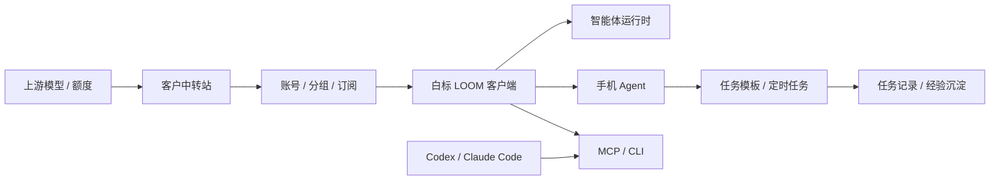

# LOOM / 麓鸣产品预期与白标交付说明

本文档用于对外介绍 LOOM / 麓鸣的最终产品形态、可交付能力、白标换壳链路、代理合作模式和验收边界。

它不是技术实现文档，也不是销售夸张稿。它的目标是让客户、代理、交付人员和二开团队清楚知道：

- 这套产品最终是什么；
- 能给终端客户解决什么问题；
- 可以承诺交付到什么程度；
- 哪些能力可以定制、换壳和二次销售；
- 哪些边界不能乱承诺。

## 1. 一句话定位

LOOM / 麓鸣是一套可白标定制的多智能体安装器和本地自动化能力控制台。

它把“中转站账号、模型额度、智能体安装、本地手机控制、桌面 RPA、CLI/MCP 自动化能力、任务记录和经验沉淀”整合成一条可交付链路，让代理或客户可以拥有一套自己的 AI 自动化工具入口。

对终端用户来说，它是一个桌面软件。

对代理商来说，它是一套可以换品牌、接中转站、接模型、交付给客户、持续续费的 AI 工具产品。

对技术交付方来说，它是一套可复制、可配置、可回滚的白标交付底座。

## 2. 最终产品形态

最终形态不是“OpenClaw 启动器”，也不是单一 AI 工具。

LOOM 的目标形态是：

```text
白标安装器
  + 中转站账号体系
  + 模型同步与额度管理
  + 多智能体安装与配置
  + 手机 Agent 自动化
  + 桌面 RPA 自动化
  + 生图 / 生视频任务
  + CLI / MCP 能力开放
  + 任务模板库
  + 定时任务
  + 经验引擎
  + 发布更新和回滚
```

用户打开软件后，应能完成这些核心动作：

1. 登录自己的中转站账号。
2. 自动同步可用模型和额度。
3. 安装或检测 Codex、Claude Code、opencode、OpenClaw、Hermes 等智能体。
4. 连接手机 Agent，执行截图、读屏、任务提交和自动化模板。
5. 通过任务模板和定时任务执行固定流程。
6. 让 Codex、Claude Code 或其他 Agent 通过 MCP / CLI 调用 LOOM 的能力。
7. 查看任务记录、失败原因和优化建议。

## 3. 对外可承诺能力

### 3.1 安装器与账号能力

可承诺：

- 提供 Windows 桌面安装器。
- 支持在线包和完整离线包两种交付形态。
- 支持中转站账号登录。
- 登录后同步模型列表、模型权限和额度状态。
- 支持默认模型配置。
- 支持旧授权码或离线授权作为兜底路径。
- 支持发布清单、版本更新、下载校验和回滚。

交付口径：

> 用户不需要手动配置复杂 API Key。登录账号后，系统会根据账号权限同步模型和能力配置。

边界：

- 不承诺绕过中转站规则。
- 不承诺绕过 Windows 安全机制。
- 不承诺不经授权直接使用任何第三方模型。

### 3.2 多智能体安装能力

可承诺：

- 支持 Codex、Claude Code、opencode、OpenClaw、Hermes 等运行时的安装、检测、启动和配置。
- 支持每个运行时的状态显示。
- 支持安装失败后的重试、诊断和回滚。
- 支持后续通过 manifest 扩展新的运行时。

交付口径：

> 它不是简单下载器，而是一个智能体运行环境管理器。用户可以在一个入口里完成检测、安装、配置和启动。

边界：

- 某些第三方智能体可能需要用户自己的账号、登录态或官方授权。
- 如果第三方运行时更新导致配置变化，需要跟随适配。

### 3.3 手机 Agent 自动化

可承诺：

- 支持手机设备保存和检测。
- 支持手机截图、读屏、任务提交、结果读取。
- 支持手机任务模板。
- 支持定时任务。
- 支持任务失败提示、重试和日志记录。
- 支持多设备矩阵管理的扩展方向。

典型场景：

- 闲鱼自动化。
- 店铺日常巡检。
- 内容发布前检查。
- 固定 App 流程自动化。
- 客户线索状态记录。

交付口径：

> 手机 Agent 用来把重复、规则明确、需要人工反复点击的流程沉淀成模板，并在授权范围内定时执行。

边界：

- 不承诺绕过平台风控。
- 不承诺突破 App 权限限制。
- 不承诺验证码、登录、支付、私信批量外发等高风险动作自动完成。
- 外发消息、评论、报价、承诺类动作必须有人工确认或明确模板授权。

### 3.4 自动化获客能力

可承诺的是“合规获客辅助”，不是“无脑群发工具”。

可承诺：

- 支持线索任务模板。
- 支持任务定时执行。
- 支持线索记录、状态标记和跟进阶段。
- 支持执行日志、失败原因和复盘建议。
- 支持通过 MCP / CLI 让 Agent 调用手机任务。
- 支持把稳定流程沉淀成模板。

推荐表达：

> LOOM 可以帮助客户把获客流程中重复、机械、可授权的部分自动化，例如打开指定 App、检查发布内容、记录线索、执行固定模板、生成复盘报告。

不要承诺：

- 保证成交。
- 保证涨粉。
- 保证绕过平台限制。
- 保证无限多账号同时跑。
- 保证批量私信不会受限。
- 保证任何平台规则之外的效果。

### 3.5 CLI / MCP 能力开放

可承诺：

- 提供 CLI 给开发者或 Agent 调用。
- 提供 MCP Server 给 Codex、Claude Code 或其他支持 MCP 的 Agent 使用。
- 支持能力发现、状态查询、手机读取、任务提交、任务日志查询。
- 高风险动作需要确认。
- 所有调用进入任务记录或审计日志。

交付口径：

> LOOM 不只是给人点按钮，也能成为 Agent 的本地能力底座。Codex 可以通过 MCP 调用 LOOM，完成手机控制、定时任务、模板执行和任务记录。

边界：

- MCP 只开放白名单能力。
- 高风险动作必须经过确认或策略授权。
- 不允许外部 Agent 绕过授权、签名和安全边界。

### 3.6 经验引擎

经验引擎不是聊天记忆。

可承诺：

- 记录每次任务的目标、来源、执行步骤、耗时、结果和失败原因。
- 记录手机 Agent、桌面 RPA、媒体任务、CLI/MCP 调用的动作轨迹。
- 对重复成功的任务生成模板建议。
- 对失败任务生成复盘建议。
- 对获客任务保留线索状态和跟进记录。

交付口径：

> 系统会把每一次自动化执行沉淀成任务经验，逐步把“让 Agent 临场思考”变成“走稳定模板”，从而减少等待、减少失败和减少重复配置。

边界：

- 不记录不必要的私人聊天。
- 不保存明文密钥。
- 不把客户隐私数据写入安装包或源码。

## 4. 白标换壳能力

LOOM 必须支持白标交付。

白标不是复制一份源码乱改，而是用同一套内核，加载不同品牌配置。

可定制内容：

| 类别 | 可定制项 |
| --- | --- |
| 品牌身份 | 产品名、中文名、英文名、Logo、图标、窗口标题 |
| 视觉风格 | 主色、辅色、登录页样式、启动图、安装器图标 |
| 中转站 | API Base URL、登录地址、注册地址、订阅页、模型同步接口 |
| 模型策略 | 默认文本模型、手机模型、可选模型范围 |
| 模块开关 | 智能体安装、手机控制、桌面 RPA、生图、生视频、诊断 |
| 发布通道 | 在线包地址、离线包地址、manifest 地址、更新频道 |
| 文档客服 | 文档站、客服入口、问题反馈地址 |
| 商业信息 | 发布者名称、授权协议、隐私政策、服务条款 |

白标交付必须做到：

- 每个客户独立品牌配置。
- 每个客户独立 manifest。
- 每个客户独立下载目录。
- 每个客户独立版本号。
- 每个客户可单独回滚。
- 不把客户密钥写进源码。
- 不把用户本地状态打进包。

## 5. 中转站交付链路

这套商业链路的核心是：上游模型能力通过中转站统一管理，再由 LOOM 白标客户端分发给代理和终端用户。

### 5.1 角色关系

| 角色 | 负责什么 |
| --- | --- |
| 上游方 | 提供模型资源、渠道价格、技术底座、白标包和维护 |
| 中转站运营方 | 搭建 NewAPI / 中转站，管理用户、额度、分组、模型 |
| 代理商 | 销售白标软件、服务客户、维护客户关系 |
| 终端客户 | 使用账号登录软件，安装智能体，执行自动化任务 |

### 5.2 标准交付链路



### 5.3 你可以教给代理的内容

第一阶段：搭中转站。

- 选择服务器。
- 部署 NewAPI 或等价中转站。
- 配置域名和 HTTPS。
- 配置上游模型。
- 配置用户分组。
- 配置充值、兑换码或订阅。
- 配置模型可见范围。

第二阶段：接上游。

- 获取上游模型渠道。
- 配置上游 Key。
- 配置模型映射。
- 配置倍率、额度、价格。
- 测试 `/v1/models` 和聊天接口。
- 建立模型可用性监控。

第三阶段：换壳客户端。

- 提供品牌名、Logo、图标、颜色。
- 提供中转站域名。
- 确认默认模型。
- 确认开放模块。
- 构建在线包和离线包。
- 配置发布 manifest。
- 做安装和登录验收。

第四阶段：代理销售。

- 代理拿到自己的白标软件。
- 代理给客户开中转站账号。
- 客户下载安装包。
- 客户登录账号并同步模型。
- 客户使用智能体安装和手机自动化能力。
- 代理按账号、套餐、服务费或定制费收费。

## 6. 标准交付物

每次白标交付至少包含：

1. 白标客户端在线安装器。
2. 白标客户端完整离线包。
3. release manifest。
4. SHA256 校验文件。
5. 中转站配置说明。
6. 账号开通和模型同步说明。
7. 手机 Agent 配置说明。
8. MCP / CLI 调用说明。
9. 白标信息表。
10. 回滚包或回滚 manifest。
11. 发布说明。
12. 验收报告。

可选交付物：

- 客户专属文档站。
- 客户专属官网落地页。
- 客户专属订阅页。
- 客户专属模型套餐。
- 客户专属任务模板库。
- 客户专属安装视频。
- 代理培训文档。

## 7. 终端客户使用流程

理想使用流程：

1. 客户下载安装器。
2. 打开软件。
3. 登录代理提供的账号。
4. 同步模型和额度。
5. 检测本机环境。
6. 安装或检查智能体运行时。
7. 连接手机 Agent。
8. 选择任务模板。
9. 设置定时任务。
10. 查看执行记录和失败原因。
11. 根据建议优化模板。

用户应该感受到：

- 不需要理解复杂 API。
- 不需要手动改配置文件。
- 不需要知道底层模型 Key。
- 不需要关心运行时路径。
- 出错时知道下一步该做什么。

## 8. 代理销售可以怎么介绍

推荐介绍：

> 这是一套可以换成你自己品牌的 AI 自动化桌面系统。客户登录你的中转站账号后，就能同步你提供的模型额度，并在桌面端安装智能体、连接手机 Agent、运行自动化任务模板。你可以把它作为自己的 AI 工具产品销售，也可以围绕手机自动化、智能体安装、任务模板和模型套餐做持续服务。

更短版本：

> 它是一套可白标的 AI 自动化工具入口：你搭中转站、接模型、开账号，我们给你换壳客户端和交付链路，你可以用自己的品牌销售给客户。

面向老板的版本：

> 这套东西把模型中转、账号体系、桌面客户端、手机自动化和智能体工具打通了。代理不只是卖 API，而是卖一个带入口、带工具、带服务的完整产品。

面向技术客户的版本：

> LOOM 提供本地 Bridge、CLI 和 MCP 能力。外部 Agent 可以调用手机、桌面、媒体和任务模板能力，所有调用都有日志、审计和任务记录。

## 9. 可商业化套餐设计

建议代理销售不要只卖软件，可以拆成几个层级。

### 9.1 基础版

适合个人用户和轻量客户。

- 白标客户端。
- 中转站账号登录。
- 模型同步。
- 智能体安装。
- 基础手机控制。
- 基础任务模板。

### 9.2 专业版

适合工作室和小团队。

- 多设备管理。
- 定时任务。
- 任务日志。
- 更多任务模板。
- MCP / CLI 能力。
- 线索记录。
- 基础培训。

### 9.3 代理版

适合想转售的人。

- 独立品牌。
- 独立中转站。
- 独立下载页。
- 独立文档。
- 独立订阅页。
- 代理后台或账号管理方案。
- 白标包更新服务。

### 9.4 定制版

适合有明确行业流程的客户。

- 定制 UI。
- 定制任务模板。
- 定制手机流程。
- 定制模型策略。
- 定制文档和培训。
- 定制发布通道。

## 10. 必须控制的承诺边界

为了长期能交付，以下话不能乱说。

不要承诺：

- 保证平台不封号。
- 保证自动成交。
- 保证无限群发。
- 保证绕过风控。
- 保证所有 App 都能自动化。
- 保证所有验证码都能处理。
- 保证所有 Windows 电脑都完全不提示安全风险。
- 保证第三方智能体永远兼容。
- 保证上游模型永远稳定。

可以承诺：

- 提供可配置、可回滚的白标客户端。
- 提供中转站接入和模型同步能力。
- 提供手机 Agent 自动化底座。
- 提供任务模板和定时任务能力。
- 提供 MCP / CLI 给 Agent 调用。
- 提供发布包校验和交付验收。
- 提供文档、培训和运维建议。

## 11. 安全和合规口径

Windows 安全提示不能通过“关闭风险”解决。

正确做法：

- 正规代码签名。
- 固定发布域名。
- HTTPS 下载。
- 稳定证书。
- SHA256 校验。
- 发布包不带用户数据。
- 误报时提交 Microsoft Defender 分析。
- 不静默执行不明脚本。

手机自动化也必须有边界：

- 用户授权后才能连接设备。
- 高风险动作必须确认。
- 外发内容必须可审计。
- 日志不能保存明文密钥。
- 任务模板不能用于骚扰、欺诈或绕规则。

## 12. 验收标准

白标交付前至少完成以下验收。

### 12.1 品牌验收

- 产品名正确。
- Logo 正确。
- 图标正确。
- 窗口标题正确。
- 安装包名称正确。
- 页面无旧品牌残留。

### 12.2 中转站验收

- 登录成功。
- 注册或订阅入口可访问。
- 模型列表可同步。
- 默认模型可保存。
- 退出登录可清理托管配置。
- 中转站不可用时有明确提示。

### 12.3 安装器验收

- 在线包可下载。
- 离线包可启动。
- manifest 校验通过。
- SHA256 校验通过。
- 回滚路径存在。
- 包内无用户账号、token、缓存和审计日志。

### 12.4 手机能力验收

- 可保存设备。
- 可检测连接。
- 可截图。
- 可读屏。
- 可提交一个简单任务。
- 可查看任务结果。
- 签名失败时可重新配对。

### 12.5 MCP / CLI 验收

- CLI 可查询状态。
- CLI 可调用手机基础能力。
- MCP 工具可被 Agent 发现。
- 高风险动作被拒绝或要求确认。
- 调用记录进入任务日志。

### 12.6 体验验收

- 首屏打开不卡死。
- 主要按钮可点击。
- 错误提示可理解。
- 路径、端口、token 默认不暴露。
- 页面文案克制，不堆长说明。

## 13. 交付后的服务模式

推荐把交付拆成持续服务，而不是一次性卖断。

可持续服务包括：

- 中转站维护。
- 模型上游维护。
- 白标包更新。
- Windows 签名和发布维护。
- 任务模板更新。
- 手机 Agent 适配。
- 文档和培训。
- 代理售前材料。
- 问题诊断和远程支持。

这样代理卖出去的不只是安装包，而是持续可运营的产品。

## 14. 最终对外承诺总结

可以用这一段作为对外介绍的正式口径：

> LOOM / 麓鸣是一套可白标定制的 AI 自动化桌面系统。它支持中转站账号登录、模型同步、多智能体安装、手机 Agent 自动化、任务模板、定时任务、CLI/MCP 能力开放和任务经验沉淀。我们可以为代理或客户配置独立品牌、独立中转站、独立下载通道和独立模型套餐，帮助客户把模型资源变成可销售、可交付、可持续运营的桌面工具产品。系统会保留安全确认、日志审计和回滚机制，适合用于合规自动化、团队工具交付、代理销售和行业流程定制。

## 15. 一句话销售钩子

短句：

> 不是卖 API，是交付一套可以换成你品牌的 AI 自动化产品。

更商业一点：

> 你负责客户和渠道，我们负责中转站、模型接入、白标客户端和自动化能力底座。

更技术一点：

> 它把模型中转、智能体运行时、手机自动化、MCP/CLI 和任务经验沉淀打成一套可交付系统。
