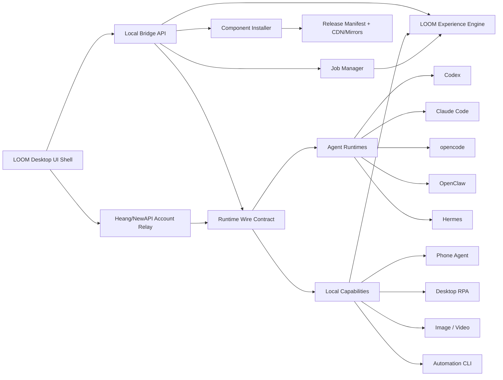

# LOOM Xinflo-Style Architecture Source

> This document is the source architecture brief for migrating LOOM / 麓鸣 toward a Xinflo-style multi-agent installer and local automation console.
>
> It extracts transferable architecture patterns from Xinflo. It does not authorize copying Xinflo branding, assets, proprietary code, or closed-source implementation details.

## 1. Product Positioning

LOOM / 麓鸣 is not an OpenClaw-only launcher.

The target product is:

- a multi-agent installer;
- a local runtime console;
- a model/account wiring layer;
- a control surface for phone automation, desktop RPA, media generation, and CLI automation.

OpenClaw, Codex, Claude Code, opencode, and Hermes are managed runtimes or installable agents. They are important, but they are not the whole product.

## 1.1 Architecture Constitution

This section is mandatory. Future agents must treat it as the framework constraint for all migration work.

### Non-Negotiable Product Boundary

LOOM / 麓鸣 must remain one product with this identity:

```text
LOOM = multi-agent installer + local runtime console + automation capability hub
```

It must not drift into:

- an OpenClaw-only launcher;
- a pure UI redesign with no runtime contract;
- a random feature dashboard;
- a clone of Xinflo branding or source;
- a developer-only settings panel full of paths, ports, API keys, and Base URLs.

### Fixed Layer Model

All source changes must fit this layer model:

```text
UI Shell
  -> API Client
  -> Local Bridge
  -> Domain Services
  -> Runtime Adapters
  -> External Engines / Devices
```

Allowed responsibilities:

| Layer | May Do | Must Not Do |
| --- | --- | --- |
| UI Shell | render state, collect intent, show progress, show safe errors | write files, spawn processes, store raw secrets, call engine binaries directly |
| API Client | call local bridge routes, normalize response shapes | contain product decisions, mutate global state secretly, bypass bridge |
| Local Bridge | expose stable local API, own process/config/job operations | leak raw stack traces to UI, mix UI copy with backend logic |
| Domain Services | install components, sync models, manage jobs, verify health | know React routes, hardcode visual behavior |
| Runtime Adapters | map LOOM wire into OpenClaw/Codex/phone/RPA/media native configs | change global product navigation or account policy |
| External Engines | run as managed tools | become the product identity |

If a change does not fit one layer cleanly, pause and document the decision instead of inventing a new hidden path.

### Single Source Of Truth

The following source-of-truth rules are fixed:

| Truth | Owner |
| --- | --- |
| Account/session/model entitlement | Heang/NewAPI account relay |
| Current local runtime status | Local Bridge |
| Long-running operation state | Job Manager |
| Component versions and download URLs | Release manifest |
| Runtime model/API configuration | Wire contract |
| Visible navigation and module availability | Feature registry |
| Brand identity and theme tokens | Theme/brand config |

Do not duplicate these truths in page-local state except as cached display state.

### Data Flow Contract

Normal flows must follow these paths:

```text
Login:
UI -> /api/account/* -> Account Manager -> NewAPI/Heang -> session snapshot

Model sync:
UI -> /api/account/sync or /api/wire/sync -> Wire Service -> Runtime Adapters

Install:
UI -> /api/components/install -> Job Manager -> Component Installer -> Manifest/Cache -> Health Check

Phone action:
UI -> /api/phone/* -> Phone Service -> signed phone request -> device response

RPA action:
UI -> /api/desktop-agent/* -> Desktop Agent Service -> process/endpoint/status

Media generation:
UI -> /api/media/* -> Job Manager -> Media Gateway -> persisted job result
```

Forbidden flows:

```text
UI -> filesystem
UI -> direct process spawn
UI -> raw OpenClaw/Codex config files
UI -> raw API key persistence
Page component -> unrelated page component state
Runtime adapter -> UI route/navigation mutation
```

### UI Framework Constraint

The UI must use one stable product frame:

```text
left rail
  launcher
  account
  agents/install
  phone
  desktop RPA
  media
  logs
  settings

main panel
  header/status
  list-detail or focused tool area
  primary action
  compact diagnostics
```

Rules:

- one product identity: LOOM / 麓鸣;
- no global OpenClaw-only wording;
- no route-specific account block;
- no nested card-heavy dashboard;
- no poetic or motivational placeholder copy;
- no random new module unless it maps to an existing capability or is explicitly approved;
- unfinished modules must be hidden or locked, not half-exposed.

### Capability Exposure Constraint

For the current demo period, only these capabilities may be treated as primary:

1. one-click installer;
2. phone control;
3. account/model sync;
4. diagnostics/logs.

Desktop RPA, image/video, CLI, and other capabilities may remain available only if they already have a stable API and clear UI state. Otherwise they must be locked, hidden, or marked as not yet open.

### Compatibility Constraint

Do not break existing compatibility surfaces without explicit approval and tests:

- phone signature headers and saved-device schema;
- old authorization-code fallback;
- existing NewAPI account routes;
- OpenClaw managed config fields;
- build/package scripts used by release SOP;
- public release manifest schema;
- CLI command names already referenced by docs or skills.

### Change Control Rule

Before any structural change, a future agent must write down:

```text
What layer is changing?
What source of truth is affected?
What public contract could break?
What test proves it still works?
What rollback path exists?
```

If these five questions cannot be answered, the agent must not perform the structural change.

## 2. Reference Evidence From Xinflo

Confirmed local package shape from `D:\XINLIU\心流`:

```text
D:\XINLIU\心流\xinflo.exe
D:\XINLIU\心流\uninstall.exe
D:\XINLIU\心流\resources\app-config.json
D:\XINLIU\心流\resources\pi-bridge\main.mjs
D:\XINLIU\心流\resources\runtime\node\...
D:\XINLIU\心流\resources\skills\agent-installer\...
```

Confirmed architecture traits:

- Desktop shell owns account UI, visitor mode, agent list, install/start/config controls, and status chips.
- Local bridge listens on localhost and owns environment detection, config writes, process lifecycle, and runtime instance control.
- Relay service owns managed account, model defaults, quota, and managed token behavior.
- Installer assets are described by manifests and downloaded from hosted package URLs.
- Built-in installer skill documents OS detection, manifests, model configuration, health checks, and common install failures.

Important confirmed bridge routes:

```text
GET  /health
GET  /bootstrap/status
POST /bootstrap/install
POST /bootstrap/offline-kit
GET  /instances
POST /instances
DELETE /instances/:id
GET  /instances/:id/events
POST /instances/:id/prompt
POST /instances/:id/model
POST /instances/:id/abort
GET  /instances/:id/messages
GET  /instances/:id/last-assistant-text
POST /config/wire
```

Important config pattern:

- UI sends one `wire` object to the bridge.
- Bridge adapts that object into native config for each downstream runtime.
- Provider details, raw keys, config paths, and environment variables are hidden from the normal UI.

## 3. What LOOM Should Copy As A Pattern

Copy the architecture pattern:

```text
Desktop UI
  -> local bridge
  -> account/model relay
  -> runtime wire contract
  -> component installer
  -> managed agent/runtime adapters
```

Do not copy the brand, UI assets, executable code, closed-source bridge code, or exact product identity.

The useful idea is the division of responsibility:

| Layer | Responsibility |
| --- | --- |
| Desktop UI shell | user intent, account display, install/start buttons, route state |
| Local bridge | status snapshots, process lifecycle, config writes, long job state |
| Account relay | login, quota, scoped token, model list, model defaults |
| Wire contract | one account/model state translated into local runtime configs |
| Component installer | manifests, download, checksum, install, health check, rollback |
| Runtime adapters | OpenClaw, Codex, Claude Code, opencode, Hermes, phone, RPA, media |

## 4. Target LOOM Architecture



### 4.1 UI Shell

The UI should be a calm control console.

Keep:

- one left rail;
- account entry in the lower-left;
- a focused installer page;
- a phone control page for demo and near-term delivery;
- diagnostics/logs behind disclosure or a dedicated page.

Avoid:

- raw file paths in normal views;
- repeated slogans;
- OpenClaw-only naming in global navigation;
- huge hero panels after onboarding;
- pages full of explanatory paragraphs.

### 4.2 Local Bridge API

The bridge should own local truth:

- runtime status;
- process start/stop;
- component install/repair/rollback;
- long job state;
- local config writes;
- phone/RPA/media/CLI adapters;
- safe diagnostics.

Recommended route groups:

```text
GET  /api/runtime/status
POST /api/runtime/start
POST /api/runtime/stop

GET  /api/account/current
POST /api/account/login
POST /api/account/email-code/send
POST /api/account/email-code/login
POST /api/account/sync
POST /api/account/logout

GET  /api/components/status
POST /api/components/install
POST /api/components/repair
POST /api/components/rollback
POST /api/components/uninstall

GET  /api/jobs/list
GET  /api/jobs/:job_id

GET  /api/wire/current
POST /api/wire/sync
POST /api/wire/verify
POST /api/wire/rollback
```

### 4.3 Job Manager

All slow operations must become jobs:

- agent install;
- component repair;
- image generation;
- video generation;
- model sync;
- phone task execution;
- RPA start/stop when it may block.

Minimum job fields:

```json
{
  "id": "job_xxx",
  "type": "component.install",
  "status": "running",
  "progress": 42,
  "phase": "downloading",
  "message": "Downloading OpenClaw engine",
  "createdAt": "2026-06-28T00:00:00+08:00",
  "updatedAt": "2026-06-28T00:00:10+08:00"
}
```

The UI must not lose job state when switching modules.

### 4.4 Account And Model Relay

LOOM should use Heang/NewAPI as the account/model authority.

Target flow:

```text
visitor mode
  -> email/password or email-code login
  -> launcher session token
  -> scoped model token
  -> classified model list
  -> default model selection
  -> wire sync
  -> bridge writes runtime configs
```

Default model policy:

- launcher / primary text model: `qwen3.7-plus`;
- phone agent model: `agnes-2.0-flash`;
- image/video models: show and configure explicitly; avoid silently switching unstable video provider paths.

Failure policy:

- login failure keeps visitor mode usable;
- token creation failure shows a retry/manual fallback;
- model list failure keeps the last valid snapshot;
- one target sync failure does not log out the account or erase other successful configs.

### 4.5 LOOM Experience Engine

LOOM should not copy a chat-memory product pattern. The target is a task-experience engine.

The experience engine records:

- task goals, source agent, selected mode, duration, result, and failure reason;
- action traces from phone, RPA, media, runtime, CLI, and MCP calls;
- stable successful paths that can become user-approved templates;
- lead/customer task records for compliant acquisition workflows;
- optimizer reports that show success rate, slow steps, recurring failures, and suggested improvements.

Routing policy:

```text
first try deterministic direct action
  -> if repeated workflow exists, use a template
  -> if screen or business context is uncertain, use an agent loop
  -> after completion, write task ledger and optimizer report
```

The experience engine may automatically optimize safe execution parameters such as wait time, polling interval, retry policy, cached screenshots, and provider/model choice.

It must not silently change business copy, batch outreach behavior, pricing, login/payment actions, destructive actions, or any platform-sensitive automation scope. Those changes require explicit user confirmation.

## 5. Runtime Wire Contract

The wire contract is the single object that turns account state into local runtime configuration.

Example shape only. Do not hardcode real tokens in source, logs, docs, or packages.

```json
{
  "schemaVersion": 1,
  "managedBy": "heang_account",
  "accountId": "u_123",
  "provider": "heang",
  "baseUrl": "https://api-cn.heang.top/v1",
  "apiKey": "<scoped-model-token>",
  "tokenMasked": "sk-...abcd",
  "models": {
    "text": "qwen3.7-plus",
    "phone": "agnes-2.0-flash",
    "image": "agnes-image",
    "video": "agnes-video-v2.0"
  },
  "targets": {
    "openclaw": true,
    "phone": true,
    "desktopRpa": true,
    "imageGateway": true,
    "videoGateway": false,
    "codex": false
  },
  "updatedAt": "2026-06-28T00:00:00+08:00"
}
```

Mapping rules:

- OpenClaw: write managed model profile only; preserve user custom profiles.
- Phone Agent: sync token, model, and signature/bridge settings; expose one visible "sync to phone" action.
- Desktop RPA: sync base URL, API key, model, endpoint; start/stop via bridge.
- Media gateway: configure image safely; video requires explicit confirmation until stable.
- Developer agents: if managed, write their native config instead of asking users to copy env vars.

## 6. Component Installer

The installer pipeline must be manifest-driven:

```text
launcher
  -> release manifest
  -> platform/arch package
  -> mirror URL list
  -> checksum verification
  -> temp install/extract
  -> atomic swap
  -> health check
  -> state snapshot
  -> rollback path
```

Required component state machine:

```text
not_installed
  -> resolving_manifest
  -> downloading
  -> verifying
  -> extracting
  -> configuring
  -> health_checking
  -> ready
```

Error states:

```text
download_failed
verify_failed
extract_failed
config_failed
health_failed
rollback_available
```

Package lanes:

| Lane | Purpose |
| --- | --- |
| Online portable package | small package, downloads heavy runtimes from manifest and cache |
| Full offline package | includes bridge, engine, runtimes, templates, skills, desktop RPA, phone assets |

Minimum release manifest fields:

```json
{
  "schemaVersion": 1,
  "product": "LOOM",
  "channel": "stable",
  "version": "2.2.0",
  "publishedAt": "2026-06-28T00:00:00+08:00",
  "minLauncherVersion": "2.1.15",
  "components": []
}
```

Minimum component fields:

```json
{
  "id": "openclaw-engine",
  "version": "2026.6.1",
  "platform": "windows",
  "arch": "x64",
  "type": "zip",
  "size": 123456789,
  "sha256": "<hex>",
  "urls": [
    "https://cdn.heang.top/loom/...",
    "https://github.com/.../..."
  ],
  "installPath": "LOOMFiles/engine",
  "entry": "bin/openclaw.exe",
  "healthCheck": {
    "kind": "command",
    "command": "openclaw --version",
    "timeoutMs": 10000
  },
  "rollback": {
    "keepPrevious": true,
    "backupName": "openclaw-engine.previous"
  }
}
```

## 7. Capability Boundaries

Near-term demo priority:

1. one-click agent/component install;
2. phone control;
3. account login and model sync;
4. diagnostics/logs.

Other modules may exist but should be locked or hidden until they have working runtime proof.

Suggested status:

| Area | Status for demo | Rule |
| --- | --- | --- |
| Installer | open | must be polished and testable |
| Phone control | open | must keep protocol compatibility |
| Account/model sync | open | must avoid raw API plumbing in normal UI |
| Desktop RPA | partial | show only if start/stop and sync are stable |
| Image/video | partial | job persistence before full exposure |
| Docs/publish/Feishu/random integrations | hidden or locked | do not clutter demo |

## 8. UI Direction

The UI should follow the clarity of Xinflo's list/detail installer, but use LOOM's own identity.

Design rules:

- use short titles, status labels, and action buttons;
- use one primary action per panel;
- use icons for common actions;
- hide paths, tokens, ports, and implementation details by default;
- use progress and logs for long operations;
- keep account independent from route switching;
- preserve long-running job state across route switches;
- avoid poetic slogans and generic hype.

Example information hierarchy:

```text
Left rail:
  Launcher
  Account
  Agents
  Phone
  RPA
  Media
  Logs
  Settings

Main:
  Header: current section + status
  Left: component/runtime list
  Right: selected component detail
  Bottom/side: compact logs and retry action
```

## 9. Do Not Copy

Do not:

- copy Xinflo visual assets, icons, brand names, or wording;
- modify or redistribute third-party binaries in a way that violates licenses;
- expose real tokens, passwords, private keys, or server secrets;
- make the UI depend on raw Base URL/API key fields for the normal user flow;
- remove existing protocol compatibility fields without tests;
- publish packages or change production server state without explicit user approval.

## 10. Implementation Priority

P0: one-click installer closure

- status endpoint;
- install endpoint;
- dry-run mode;
- job persistence;
- install log panel;
- retry action;
- manifest validation;
- rollback state;
- component health checks;
- contract tests.

P1: account and wire sync

- login state;
- model selection;
- scoped token;
- wire current/verify/rollback;
- OpenClaw and phone model sync;
- old authorization-code fallback.

P2: phone control polish

- preserve current signature protocol;
- sync `agnes-2.0-flash` to phone;
- clear error states;
- avoid repeated screenshot polling storms;
- keep demo actions stable.

P3: desktop RPA and media jobs

- RPA URL/API key/model sync;
- start/stop optimistic UI with reconciliation;
- image/video generation as persisted jobs;
- route-switch persistence.

P4: packaging and release

- online portable package;
- full offline package;
- no localhost/dev server links;
- secret scan;
- smoke tests;
- GitHub/Gitee release only after explicit release approval.

## 11. Acceptance Tests

Minimum repo checks before claiming a migration slice is done:

```powershell
git diff --check
python -m py_compile openclaw_new_launcher/python/api/routes_components.py openclaw_new_launcher/python/api/routes_jobs.py openclaw_new_launcher/python/core/component_catalog.py openclaw_new_launcher/python/core/component_installer.py openclaw_new_launcher/python/core/release_manifest.py openclaw_new_launcher/python/services/jobs.py
npm run build
```

Installer-specific checks:

- component status endpoint returns stable JSON;
- install dry-run returns a job id;
- job endpoint shows progress/log state;
- failure produces retryable structured error;
- rollback metadata exists when replacing a component;
- package URLs are not localhost/dev links;
- hash mismatch blocks install.

UI checks:

- left rail uses LOOM/麓鸣 identity;
- OpenClaw-only global wording is removed;
- installer page is list/detail, not scattered config pages;
- locked modules are visibly unavailable but not noisy;
- account block does not reload or disappear on route switch;
- long job state survives module switching.

Account/wire checks:

- visitor mode remains usable;
- login and logout work without exposing raw tokens;
- model list can be refreshed;
- defaults are visible and selectable;
- wire sync writes only `managedBy=heang_account` configs;
- last-good snapshot is preserved after sync failure.

Phone checks:

- existing `X-LUMI-*` or equivalent signature compatibility is not broken;
- one-click sync can send model/token config to the saved phone;
- offline or locked phone returns a clear state, not a raw stack trace.

## 12. Migration Rule For Future Codex Sessions

Before editing source, a future Codex session must:

1. read this document;
2. inspect current git status and recent diffs;
3. identify whether another agent is actively modifying the same files;
4. protect existing user/agent changes;
5. choose one delivery slice;
6. verify with runtime evidence before expanding scope.

If the repo is dirty or another migration process is active, prefer adding tests/docs or reviewing the current slice instead of rewriting the whole UI.
