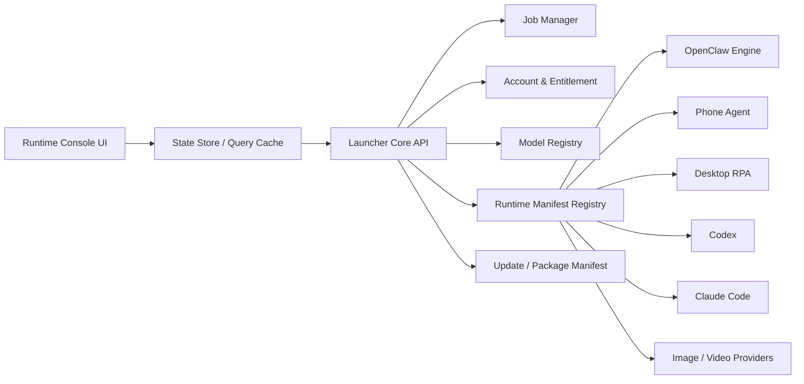

# OpenClaw Runtime Console Migration Architecture

Updated: 2026-06-27

## 1. Purpose

OpenClaw should stop being only a launcher around one bundled runtime. The next major version should become an AI automation runtime console:

- The launcher owns account, model, task, status, update, and runtime orchestration.
- OpenClaw becomes one managed engine, not the center of the product.
- Phone Agent, Desktop RPA, image/video services, Codex, Claude Code, and custom engines become pluggable runtime units.
- UI must feel immediate: navigation renders first, slow work runs as background jobs, and every long operation exposes progress.

This document maps the current assets, the reference design extracted from Xinflo, and the target migration path.

## 2. Current Asset Inventory

### 2.1 Main Launcher

Path: `D:\Axiangmu\AUSTART\openclaw_ui_integration`

Current role:

- Tauri 2 + React + TypeScript launcher.
- Python Bridge backend under `python/`.
- Redesign UI under `src/redesign/`.
- Bundled resources in `src-tauri/tauri.conf.json` include Python, scripts, OpenClaw workspace, redist, and agents.
- Version currently reads `2.1.19` in `package.json` and `src-tauri/tauri.conf.json`.

Important files:

- `src/redesign/App.tsx`: route composition and lazy pages.
- `src/redesign/components/Shell.tsx`: global shell, sidebar, account state.
- `src/redesign/pages/PhonePage.tsx`: largest UI page and highest-risk slow path.
- `src/redesign/api/client.ts`: bridge and phone request primitives, Lumi signature queue.
- `src/redesign/api/adapters.ts`: page snapshot adapters.
- `python/bridge.py`: bridge entry and route registration.
- `python/api/*`: FastAPI routes.
- `python/services/*`: process, desktop, media, scheduler, jobs.
- `scripts/*`: phone CLI, desktop CLI, package scripts, smoke scripts.

### 2.2 Legacy / Parallel Launcher

Path: `D:\Axiangmu\AUSTART\openclaw_new_launcher`

Current role:

- Older or parallel launcher surface.
- Shares many scripts and package concepts with `openclaw_ui_integration`.
- Contains Mac packaging scripts.

Migration decision:

- Treat as historical reference and packaging fallback.
- Do not keep as a second product shell long-term.
- Extract scripts that are still useful into the new runtime/packaging pipeline.

### 2.3 Desktop RPA

Path: `D:\Axiangmu\AUSTART\sightflow-desktop-agent-main\sightflow-desktop-agent-main`

Current role:

- Electron desktop agent.
- Uses VLM/RPA dependencies such as `@ai-sdk/openai`, `robotjs`, `active-win`, `jimp`, `pixelmatch`, `node-window-manager`.
- Exposes desktop control, screenshot, switch, reply, and provider configuration behavior.

Migration decision:

- Keep as `desktop-rpa` runtime unit.
- Manage it through a manifest and a health adapter.
- Do not let the launcher UI know its internal Electron layout.

### 2.4 Phone Agent / APKClaw

Paths:

- `D:\Axiangmu\AUSTART\apkclaw`
- `D:\Axiangmu\AUSTART\iosclaw`
- `D:\Axiangmu\AUSTART\openclaw_ui_integration\scripts\openclaw-phone-*.mjs`
- `D:\Axiangmu\AUSTART\openclaw_ui_integration\python\services\phone_scheduler.py`

Current role:

- Android and iOS device control surface.
- Phone page handles status, screenshot, Lumi secure pairing, profile, screen tree, media, recording, and automation tasks.
- Task scheduler and automation templates are already started.

Migration decision:

- Keep as `phone-agent` runtime unit.
- Split status, screenshot, deep diagnostics, media, and scheduler into separate state slices.
- The first screen should never wait for full device profile, screen tree, video list, or recording status.

### 2.5 Account / License / NewAPI

Paths:

- `D:\Axiangmu\AUSTART\openclaw_ui_integration\python\core\newapi_account_manager.py`
- `D:\Axiangmu\AUSTART\openclaw_ui_integration\python\api\routes_account.py`
- `D:\Axiangmu\AUSTART\openclaw_ui_integration\python\core\license_manager.py`
- `D:\Axiangmu\AUSTART\license_server`
- `D:\Axiangmu\AUSTART\server`

Current role:

- Legacy license code path.
- NewAPI account login and model sync path.
- Server-side license/admin bridge code.

Migration decision:

- Keep both account login and authorization code as compatibility paths.
- New runtime console should use account login as primary path.
- License code becomes fallback/legacy entitlement adapter.
- Model sync should be owned by Launcher Core, then written into OpenClaw, phone, desktop, image, and video configs through runtime adapters.

### 2.6 Docs / Release / CI

Paths:

- `D:\Axiangmu\AUSTART\docs`
- `D:\Axiangmu\AUSTART\scripts`
- `D:\Axiangmu\AUSTART\.github`
- `D:\Axiangmu\AUSTART\release`

Current role:

- VitePress docs, release SOP, smoke tests, packaging scripts, GitHub/Gitee release work.

Migration decision:

- Keep docs and release SOP.
- Add manifest-driven release verification.
- Split online package manifest from offline package manifest.

## 3. Reference Product Findings: Xinflo

Reference path: `D:\XINLIU\心流`

Useful structure:

- `resources/app-config.json`
- `resources/pi-bridge/main.mjs`
- `resources/runtime/node/*`
- `resources/skills/agent-installer/SKILL.md`
- `resources/skills/agent-installer/manifests/*.json`
- `resources/skills/agent-installer/scripts/detect-env.mjs`
- `resources/skills/agent-installer/scripts/install-agent.mjs`
- `resources/skills/agent-installer/scripts/write-config.mjs`
- `resources/skills/agent-installer/scripts/health-check.mjs`

What to learn:

- Agent capabilities are declared in manifests, not hard-coded into pages.
- Installer, config writer, and health check are separate pipeline steps.
- Download sources include mirror URL, official URL, platform, architecture, version, and SHA256.
- Managed account token is treated as product capability, not as user-facing API-key plumbing.
- UI is concise: a small sidebar, a focused list/detail layout, clear status chips, short text, and advanced settings folded away.

What not to copy:

- Do not turn OpenClaw into only a third-party agent installer.
- Do not bundle every platform runtime into the same package if the online package can fetch by manifest.
- Do not directly copy bundled bridge output or UI code.

## 4. Target Architecture



### 4.1 UI Layer

Responsibilities:

- Render fast.
- Subscribe to cached state.
- Start jobs.
- Show progress and errors.
- Never perform heavy orchestration inside page components.

Non-responsibilities:

- No direct multi-endpoint snapshot storms.
- No manual runtime install logic inside pages.
- No long polling without state ownership.

Target navigation:

- Runtime Center
- Agents
- Phone
- Desktop RPA
- Tasks
- Models & Account
- Logs
- Settings

Copy rule:

- One title.
- One status.
- One next action.
- One error cause.
- No poetic slogans, no repeated explanatory paragraphs.

### 4.2 Launcher Core

Responsibilities:

- Own account session and model sync.
- Own runtime registry.
- Own jobs and progress.
- Own cached state snapshots.
- Own lifecycle: start, stop, health, install, configure.
- Expose one lightweight `/state` endpoint and scoped endpoints for commands.

Initial implementation:

- Continue using Python Bridge for stability.
- Refactor it into lazy-loaded services and clear route groups.
- Add a state manager and job manager before replacing the bridge technology.

Future implementation:

- Consider Rust, Go, or Node for the long-term Core only after boundaries are stable.
- Do not rewrite the core before the manifest and job contracts are proven.

### 4.3 Runtime Manifest Registry

Each runtime should have a manifest:

```json
{
  "id": "openclaw",
  "name": "OpenClaw",
  "kind": "agent-engine",
  "version": "2026.6.1",
  "platforms": ["windows-x64", "macos-arm64", "macos-x64"],
  "install": {
    "mode": "download-or-bundled",
    "sources": []
  },
  "commands": {
    "start": {},
    "stop": {},
    "health": {},
    "configure": {}
  },
  "config": {
    "modelProfile": true,
    "accountManaged": true
  },
  "healthChecks": []
}
```

Target manifests:

- `openclaw`
- `phone-agent-android`
- `phone-agent-ios`
- `desktop-rpa`
- `codex`
- `claude-code`
- `image-provider`
- `video-provider`
- `dingtalk-connector`
- `feishu-connector`
- `wechat-connector`

### 4.4 Job Model

Every long operation should return a job:

- start core
- stop core
- install runtime
- sync model
- pair phone
- refresh phone diagnostics
- run phone automation
- start desktop RPA
- generate image
- generate video
- update package

Job state:

- `queued`
- `running`
- `waiting`
- `success`
- `failed`
- `cancelled`

UI behavior:

- Button changes state immediately.
- Progress is shown from job events.
- Page can be left and revisited without losing task state.

## 5. Old To New Mapping

| Current Area | Current Path | Target Module | Migration Action |
| --- | --- | --- | --- |
| Redesign Shell | `openclaw_ui_integration/src/redesign/components/Shell.tsx` | Runtime Console Shell | Remove route-triggered account refresh; add cached global account state |
| Dashboard | `src/redesign/pages/DashboardPage.tsx` | Runtime Center | Replace hero/status cards with compact runtime summary |
| Phone Page | `src/redesign/pages/PhonePage.tsx` | Phone Runtime Panel | Split into basic status, screen, diagnostics, media, scheduler |
| Desktop Page | `src/redesign/pages/DesktopPage.tsx` | Desktop RPA Runtime Panel | Move start/stop/status to job and runtime manifest adapter |
| Service Page | `src/redesign/pages/ServicePage.tsx` | Core Service Panel / Logs | Split service status and logs; logs lazy-load |
| Settings Page | `src/redesign/pages/SettingsPage.tsx` | Settings + Advanced | Remove noisy runtime paths; keep account, model, update, advanced |
| Studio Page | `src/redesign/pages/StudioPage.tsx` | Media Jobs | Make image/video persistent jobs with resumable progress |
| Python Bridge | `python/bridge.py` | Launcher Core API | Lazy-load services; expose `/state`, `/jobs`, `/runtimes` |
| Process Service | `python/services/process.py` | OpenClaw Runtime Adapter | Keep start/stop; move config sync out of blocking path |
| Desktop Service | `python/services/desktop_agent.py` | Desktop RPA Adapter | Cache health; do not probe health on every status render |
| Phone Scripts | `scripts/openclaw-phone-*.mjs` | Phone CLI Adapter | Keep as command backend; wrap in jobs |
| Packaging Scripts | `scripts/*package*`, `release/*` | Release Pipeline | Add manifest-driven sources, SHA256, online/offline split |
| License Server | `license_server/*` | Legacy Entitlement Adapter | Keep as fallback, not primary UX |
| NewAPI Bridge | `server/openclaw_newapi_bridge.py`, account routes | Account Adapter | Make Heang account login primary |
| Docs | `docs/*` | Product Docs | Add migration docs, runtime manifest docs, copy guide |
| Xinflo app-config | `D:\XINLIU\心流\resources\app-config.json` | Download Manifest Pattern | Recreate with Heang/OpenClaw sources, not copy |
| Xinflo agent-installer | `resources/skills/agent-installer` | Runtime Installer Pattern | Recreate as OpenClaw runtime installer |

## 6. Performance Migration Plan

### Phase 0: Instrumentation

Add timing logs before refactor:

- page mount time
- route switch time
- bridge request duration
- phone request duration
- desktop health duration
- startup timeline
- job duration

Output:

- `data/.openclaw/launcher/perf-events.jsonl`
- Optional hidden performance panel in dev builds.

### Phase 1: Immediate UI Smoothness

Changes:

- Replace route fallback with skeleton screen.
- Add light page transition.
- Remove `route` dependency from Shell account refresh.
- Keep stale state visible during refresh.
- Preload common pages after idle.

Expected result:

- Navigation feels instant.
- Account refresh no longer runs on every route change.

### Phase 2: Phone Page Split

Changes:

- Initial phone page loads only selected device, status, and cached screenshot.
- Move full profile, app list, screen tree, videos, and recording status behind on-demand panels.
- Do not run secure pairing probe on every refresh.
- Use cache first, refresh in background.

Expected result:

- Phone page opens quickly.
- Deep diagnostics no longer blocks first screen.

### Phase 3: Desktop RPA Responsiveness

Changes:

- `status` should return cached status quickly.
- `health` becomes separate or cached.
- Start/stop returns job state immediately.
- UI polls job or subscribes to job progress.

Expected result:

- Start/stop feels immediate.
- No fixed 1.2s / 3.5s guess-refresh pattern.

### Phase 4: Launcher Core State

Changes:

- Add `/api/state` for lightweight global state.
- Add `/api/jobs/*`.
- Add `/api/runtimes/*`.
- Move install/config/health logic behind runtime adapters.

Expected result:

- Pages become thin views over state.
- Runtime management becomes consistent.

### Phase 5: Manifest Runtime System

Changes:

- Add `resources/runtime-manifests/*.json`.
- Add installer pipeline: detect, install, configure, health-check.
- Add mirror manifest for online package.
- Add SHA256 verification.

Expected result:

- Online package becomes reliable.
- Mac and Windows share runtime metadata.
- Future engines can be added without page rewrites.

## 7. UI Migration Direction

Use the Xinflo style as a product reference:

- dark compact sidebar
- light or quiet work surface
- list/detail layout
- clear status chips
- short copy
- advanced settings folded

But adapt the information architecture:

- Xinflo is mainly an agent installer.
- OpenClaw should be a runtime console.

Target first screen:

- Core service status
- Current account/model
- OpenClaw engine status
- Phone Agent status
- Desktop RPA status
- Recent jobs
- Primary action: Start All / Stop All

Target copy examples:

| Avoid | Use |
| --- | --- |
| 满舱清梦压星河 | Runtime Center |
| 手机控制台，只作控制星桥 | Phone |
| 授权内测 | Account |
| 桥接星河内置航道 | Connected |
| 生成任务入口 | Media Jobs |

## 8. Package And Update Strategy

### Offline Package

Contains:

- launcher UI
- Launcher Core
- Python runtime or embedded bridge runtime
- OpenClaw engine if size permits
- required templates
- Desktop RPA optional if full offline package
- Android APK if full offline package

### Online Package

Contains:

- launcher UI
- minimal Launcher Core
- runtime manifest
- bootstrap downloader
- cache directory

Fetches:

- OpenClaw engine
- Desktop RPA
- Android APK
- Node runtime
- optional connectors

Requirements:

- multiple mirror URLs
- SHA256 for every artifact
- cache reuse
- resume download if practical
- clear failure text

## 9. Risks

### 9.1 Scope Explosion

Risk:

- Turning every feature into a runtime at once can stall delivery.

Control:

- Start with OpenClaw, Phone Agent, Desktop RPA, and Account/Model only.

### 9.2 Bridge Rewrite Too Early

Risk:

- Rewriting Python Bridge before boundaries are stable can break working features.

Control:

- Keep Python Bridge in Phase 1-4.
- Only replace internals after `/state`, `/jobs`, and `/runtimes` contracts are stable.

### 9.3 Copy And UI Drift

Risk:

- New pages may keep adding inconsistent labels.

Control:

- Create one terminology file.
- Page copy must use approved terms only.

### 9.4 Online Package Reliability

Risk:

- Public proxy or single CDN failure breaks first install.

Control:

- Manifest supports multiple URLs.
- Use own OSS/CDN as primary.
- Keep official source as fallback.

### 9.5 Engine Coupling

Risk:

- OpenClaw remains implicitly required by every page.

Control:

- Runtime adapters must define capabilities.
- UI should show unavailable capability instead of assuming OpenClaw exists.

## 10. Recommended Next Work

### Workstream A: Smooth Current Launcher

Duration: 0.5-1 day

- Shell account state decoupling.
- Route skeleton and page transition.
- Stale state while refreshing.
- First terminology cleanup.

### Workstream B: Phone And Desktop Split

Duration: 1-2 days

- Phone basic snapshot vs diagnostics snapshot.
- Desktop health cache and job-like start/stop.
- Logs lazy-load.

### Workstream C: Launcher Core v1

Duration: 3-5 days

- `/api/state`
- `/api/jobs`
- `/api/runtimes`
- runtime adapter interfaces
- account/model sync owned by Core

### Workstream D: Runtime Manifests

Duration: 3-5 days

- `openclaw.json`
- `desktop-rpa.json`
- `phone-agent-android.json`
- `codex.json`
- installer/config/health scripts
- mirror manifest and SHA256 verification

### Workstream E: New Runtime Console UI

Duration: 4-7 days

- Xinflo-inspired list/detail layout.
- Runtime Center first screen.
- Agents page.
- Models & Account page.
- Phone and Desktop panels.
- Copy dictionary enforced.

## 11. Decision

Choose migration, not rewrite and not copy.

The current project has valuable working assets: NewAPI login, license fallback, phone control, desktop RPA, media jobs, release scripts, and docs. The Xinflo reference provides a clean product pattern: manifest-driven runtimes, installer/config/health pipeline, managed account flow, and concise UI.

The correct path is to migrate OpenClaw into a runtime-console architecture:

- Preserve working assets.
- Extract orchestration into Launcher Core.
- Convert engines into manifests and adapters.
- Make UI fast and quiet.
- Make OpenClaw one engine among several, not the product's nervous system.
