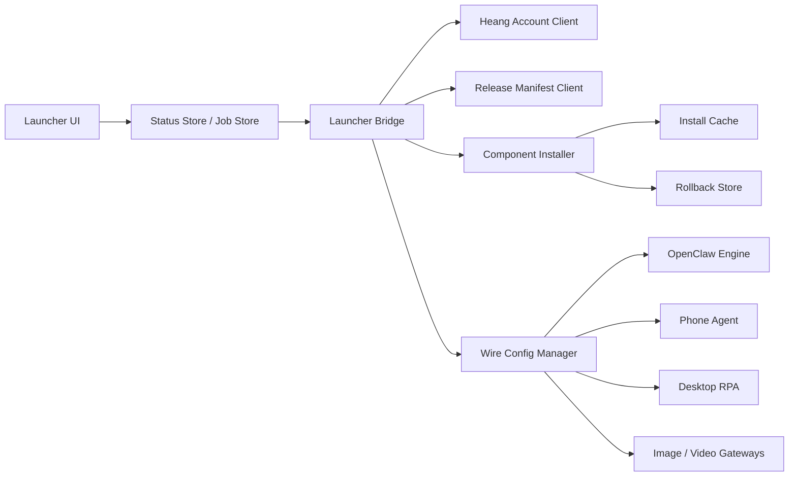

# OpenClaw Super Installer Architecture

Updated: 2026-06-28

## 1. Goal

Build the next OpenClaw/LumiClaw launcher as a complete installer and runtime console, inspired by Xinflo's clean agent installer shape but stronger in stability, rollback, account sync, package delivery, and automation-specific runtime control.

The product target:

- First launch is useful in visitor mode.
- Login with the Heang/NewAPI account turns on managed model sync.
- The launcher installs and repairs OpenClaw, Phone Agent, Desktop RPA, and media components through a manifest.
- OpenClaw becomes one managed engine, not the whole product architecture.
- The UI hides paths, API keys, Base URL fields, and runtime internals by default.
- Online and offline packages are both first-class release lanes.

## 2. Reference Pattern: Xinflo

Reference package: `D:\XINLIU\心流`

Useful confirmed patterns:

| Layer | Xinflo Pattern | OpenClaw Direction |
| --- | --- | --- |
| Desktop shell | simple agent list, account modal, visitor browsing | runtime console with concise modules |
| Local bridge | `127.0.0.1:31420`, routes for health/bootstrap/instances/config wire | one Launcher Bridge owns all config writes and status snapshots |
| Relay | `apiBaseUrl` + `relayBaseUrl`, managed token hidden from user | `api-cn.heang.top` account, quota, models, scoped API token |
| Installer assets | manifest-like app config with URLs, official URLs, sha256 | signed release manifest with mirrors, hashes, rollback |
| Wire config | provider/model/baseUrl/apiKey pushed into local runtime | one `heang_account` wire applied to OpenClaw, phone, RPA, media |

What to improve beyond Xinflo:

- Signed release manifest, not only sha256 per package.
- Multi-source URLs: Heang CDN/OSS, GitHub, Gitee, cached local mirror.
- Component-level rollback and repair.
- Long-running install/generation/task jobs survive route switches.
- Phone Agent and Desktop RPA get first-class model sync.
- Video provider sync is explicit and verified, not silently switched.

## 3. Product Shape



### 3.1 Launcher UI

Responsibilities:

- Render cached status immediately.
- Start jobs and subscribe to job progress.
- Show component states and next actions.
- Keep account block independent from route changes.
- Keep advanced paths and raw provider settings behind diagnostics.

Non-responsibilities:

- No direct multi-endpoint request storms on page mount.
- No config-file writes from React pages.
- No model sync logic inside individual pages.
- No blocking route navigation on bridge calls.

### 3.2 Launcher Bridge

Responsibilities:

- Own process lifecycle for local components.
- Own account/session persistence.
- Own manifest fetch/cache/verification.
- Own component install/repair/rollback.
- Own wire sync to OpenClaw, phone, RPA, image, and video.
- Expose one fast status snapshot for the UI.

Target route groups:

```text
GET  /api/runtime/status
POST /api/runtime/start
POST /api/runtime/stop

GET  /api/account/current
POST /api/account/email-code/send
POST /api/account/email-code/login
POST /api/account/login
POST /api/account/sync
POST /api/account/logout

GET  /api/components/status
POST /api/components/install
POST /api/components/repair
POST /api/components/rollback

GET  /api/wire/current
POST /api/wire/sync
POST /api/wire/verify
POST /api/wire/rollback

GET  /api/jobs
GET  /api/jobs/:id
POST /api/jobs/:id/cancel
```

## 4. Visitor Mode

Visitor mode is not a fake account. It is a local-first mode.

Allowed:

- browse launcher modules
- install and repair local components
- inspect environment
- use custom/manual provider if configured
- view docs and diagnostics
- start local bridge where credentials are not required

Requires login:

- managed Heang token
- quota/balance display
- model list from account
- one-click model sync to OpenClaw/phone/RPA/media
- cloud entitlement checks if used

UI copy:

```text
访客模式
可安装组件和检测环境。登录后可同步模型与额度。
```

## 5. Heang Account And Model Sync

Primary account path:

```text
email code or password login
  -> launcherToken
  -> scoped model token
  -> account snapshot
  -> model list and defaults
  -> wire config
```

Recommended default model policy:

| Target | Default |
| --- | --- |
| OpenClaw main model | `qwen3.7-plus` |
| Phone Agent | `agnes-2.0-flash` |
| Desktop RPA | account default text model unless user overrides |
| Image | configure from account, keep visible model selector |
| Video | detect and display; only auto-switch after task API is verified |

Account session must keep:

- account id/email/name
- plan/quota snapshot
- launcher token
- scoped model token, stored securely where possible
- model list snapshot
- last successful sync result

Logout clears only `managedBy = heang_account` configs and preserves manual/custom configs.

## 6. Wire Contract

The bridge applies one wire object to all managed runtimes.

```json
{
  "schemaVersion": 1,
  "managedBy": "heang_account",
  "provider": "heang",
  "baseUrl": "https://api-cn.heang.top/v1",
  "tokenMasked": "sk-...abcd",
  "models": {
    "text": "qwen3.7-plus",
    "phone": "agnes-2.0-flash",
    "image": "agnes-image",
    "video": "agnes-video-v2.0"
  },
  "targets": {
    "openclaw": true,
    "phone": true,
    "desktopRpa": true,
    "imageGateway": true,
    "videoGateway": false
  }
}
```

Target writes:

| Target | Write Behavior |
| --- | --- |
| OpenClaw | auth/model profile, default model, model snapshot |
| Phone Agent | API token, phone model, device sync result |
| Desktop RPA | base URL, API key, model, endpoint health |
| Image Gateway | provider config and selected image model |
| Video Gateway | detected models; only enable after task contract verification |

Each target gets its own success/failure result. A phone sync failure must not roll back OpenClaw model sync.

## 7. Package Lanes

### 7.1 Online Portable Package

Goal: small package, fast distribution, downloads heavy components on demand.

Contains:

- launcher shell
- bridge bootstrap
- manifest client
- installer state machine
- cached last-known manifest
- minimal repair/diagnostic tools

Downloads:

- OpenClaw engine
- Python/Node runtime if not included
- Phone Agent assets
- Desktop RPA component
- templates and skills
- media gateway tools

### 7.2 Full Offline Package

Goal: one zip can run without network dependency after extraction.

Contains:

- launcher shell
- bridge
- OpenClaw engine
- Python/Node runtime
- Phone Agent assets
- Desktop RPA component
- templates, prompts, skills
- manifest snapshot
- offline self-test

## 8. Release Manifest

Manifest is the source of truth for component installation.

Required top-level fields:

```json
{
  "schemaVersion": 1,
  "product": "OpenClaw",
  "channel": "stable",
  "version": "2.2.0",
  "publishedAt": "2026-06-28T00:00:00+08:00",
  "minLauncherVersion": "2.1.15",
  "signature": {
    "algorithm": "ed25519",
    "value": "base64-signature"
  },
  "components": []
}
```

Component fields:

```json
{
  "id": "desktop-rpa",
  "name": "Desktop RPA",
  "version": "1.0.0",
  "platform": "windows",
  "arch": "x64",
  "type": "zip",
  "size": 50000000,
  "sha256": "hex",
  "urls": [],
  "installPath": "OpenClawFiles/desktop-rpa",
  "entry": "Luminode.exe",
  "healthCheck": {
    "kind": "http",
    "url": "http://127.0.0.1:18080/health",
    "timeoutMs": 3000
  },
  "rollback": {
    "keepPrevious": true,
    "backupName": "desktop-rpa.previous"
  }
}
```

## 9. Component State Machine

All installable components use the same states.

```text
not_installed
resolving_manifest
downloading
verifying
extracting
configuring
health_checking
ready
```

Failure states:

```text
download_failed
verify_failed
extract_failed
config_failed
health_failed
rollback_available
```

State persistence:

- write install state atomically
- keep current job id
- keep previous successful component version
- keep last error code/message
- resume or cleanly restart after launcher restart

## 10. UI Direction

Main modules:

```text
启动器
账号
组件
手机控制
桌面 RPA
任务
媒体
日志
设置
```

Status language:

| Situation | Copy |
| --- | --- |
| not logged in | `未登录` |
| visitor mode | `访客模式` |
| core running | `运行中` |
| component missing | `未安装` |
| sync failed | `同步失败：手机离线` |
| install failed | `安装失败：校验未通过` |

Rules:

- One title per page.
- One primary action per state.
- No poetic slogans.
- No raw paths in default UI.
- No hidden localhost/dev server links in production packages.
- Route switch must not lose install, video, image, or automation job progress.

## 11. Release Verification Gates

Every stable package must pass:

- manifest schema validation
- manifest signature validation
- package sha256 validation
- no `localhost` or dev server URL in production config
- no real `sk-` token, password, private key, or local session in package
- online package clean-machine install smoke
- offline package no-network smoke
- first-run bridge health
- account page visitor mode
- login and model sync
- OpenClaw model write
- phone model sync
- Desktop RPA sync/start/stop
- rollback after forced install failure

## 12. Relationship To Existing Docs

This document complements:

- `docs/OPENCLAW_RUNTIME_CONSOLE_MIGRATION_ARCHITECTURE.md`: broader runtime-console migration.
- `docs/LOGIN_AUTH_AND_MODEL_SYNC_DESIGN.md`: current login/model-sync path.
- `docs/CI_CD_RELEASE.md`: existing release procedure.
- `docs/RUNTIME_ADAPTER_DESIGN.md`: runtime unit abstraction.

The new installer should not replace those documents; it should turn them into one shippable package/update system.
