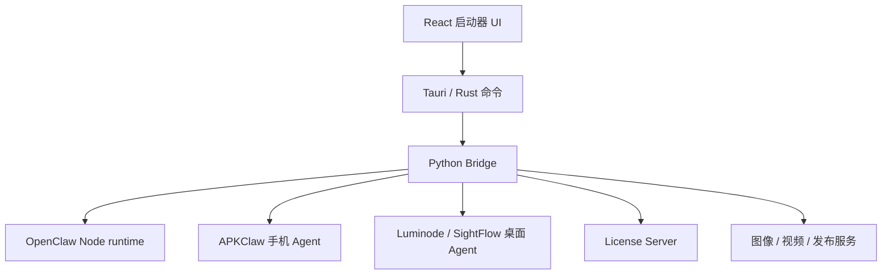
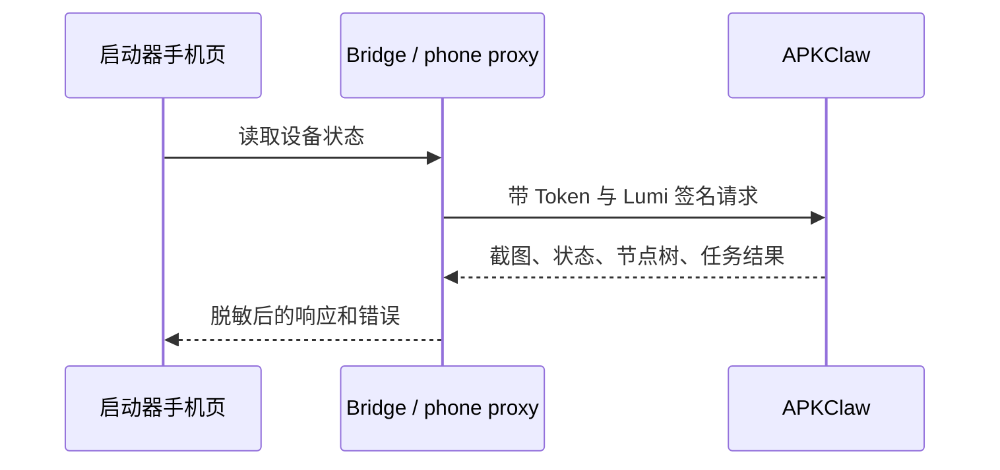
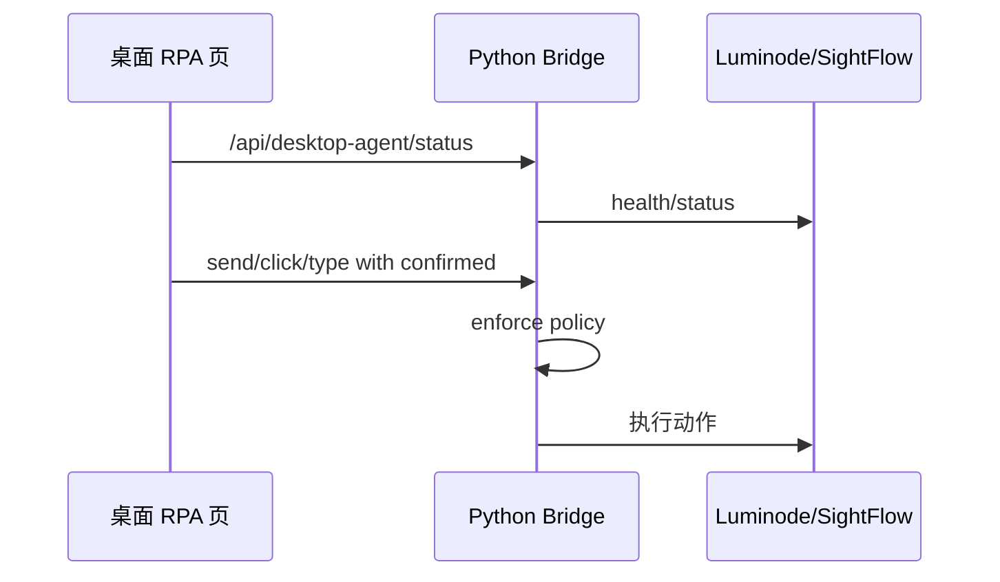

# 架构说明

OpenClaw / Lumi 启动器不是单一前端应用。它是 Tauri 壳、React UI、Rust 后端、Python Bridge、OpenClaw Node runtime、手机 Agent、桌面 Agent 和授权服务器组成的工作台。

## 总体链路

## 主要目录

| 目录 | 作用 |
| --- | --- |
| `openclaw_ui_integration/` | 当前主启动器，React + TypeScript + Vite + Tauri |
| `openclaw_ui_integration/src/redesign/` | 新 UI 页面和组件 |
| `openclaw_ui_integration/src-tauri/` | Tauri/Rust 后端、权限、打包配置 |
| `openclaw_ui_integration/python/` | Python Bridge、API 路由、进程管理、授权、桌面代理 |
| `sightflow-desktop-agent-main/` | 桌面 RPA 组件主线版本 |
| `license_server/` | 授权、会员、发布中继和管理后台 |
| `openclaw-cli/` | Codex Skill 形式的 CLI 调用说明 |
| `docs/site/` | 当前 VitePress 文档站 |

## 启动器 UI

当前侧栏主要页面：

| 页面 | 作用 |
| --- | --- |
| 启动器 | 开机总览、核心服务、常用入口 |
| 服务 / CLI | 启动、日志、终端 |
| 授权内测 | 授权码、成员状态与发卡入口 |
| 平台对接 | 飞书、微信、钉钉、Webhook |
| 图像 / 视频 | 生成任务入口 |
| 手机控制台 | APKClaw 桥接 |
| 桌面 RPA | 自动回复项目 |
| Skills 工作区 | 能力模块管理 |
| 环境检测 | 检测与修复 |
| 统一设置 | 密钥与连接 |

## Rust 层

Rust/Tauri 负责：

1. 桌面窗口和 WebView。
2. 启动和管理 Bridge 进程。
3. 代理受保护请求。
4. 执行本地授权前置校验。
5. 打包资源和权限声明。

授权不是只靠前端按钮隐藏。受保护能力要在后端继续校验。

## Python Bridge

Bridge 是桌面启动器的业务中枢：

| 模块 | 作用 |
| --- | --- |
| `core/paths.py` | 识别开发模式、Tauri 模式、便携包模式路径 |
| `core/license_manager.py` | 在线激活、本地许可证验证、设备绑定 |
| `services/process.py` | OpenClaw 核心进程启动、停止、诊断 |
| `services/desktop_agent.py` | 桌面 Agent 安装、启动、代理和策略 |
| `services/skills.py` | Skills 工作区读取和管理 |
| `api/routes_desktop_agent.py` | `/api/desktop-agent/*` |

## 手机控制链路

## 桌面 RPA 链路

## Runtime Adapter 方向

`docs/RUNTIME_ADAPTER_DESIGN.md` 提出后续将运行时和设备能力层拆开。当前文档将其作为设计方向，未完成能力不写入现有功能说明。

建议方向：

1. RuntimeManifest 描述运行时。
2. ProcessHost 管通用进程生命周期。
3. OpenClawAdapter 放 OpenClaw 专属配置。
4. 手机、桌面、发布能力逐步 MCP 化。
5. 授权门控跟随能力层，而不是跟随运行时名称。

## 架构判断法

遇到需求先问：

| 问题 | 对应位置 |
| --- | --- |
| 只是改界面文案和布局？ | React redesign 页面 |
| 要新增 Bridge API？ | Python `api/` 和 `services/` |
| 要调用系统能力？ | Rust/Tauri 权限与命令 |
| 要控制手机？ | APKClaw 和 phone proxy |
| 要控制桌面？ | desktop agent service 和 Luminode |
| 要新增 Agent 能力？ | CLI / Skill / Runtime context |
| 要收费或放行？ | License Server 和本地授权校验 |
