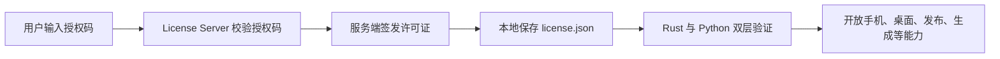

# 授权与模型

授权决定能力层是否可用，模型配置决定任务是否可以执行。排障时建议先区分授权错误和模型网关错误。

## 授权链路



授权码格式通常是：

```text
OC-{EDITION}-XXXX-XXXX-XXXX-XXXX
```

实际权益、过期时间、设备数和功能门控以授权服务器返回的许可证为准。文档只记录已确认的商业权益。

## 模型配置字段

| 字段 | 作用 | 常见错误 |
| --- | --- | --- |
| Base URL | 模型网关地址 | 少 `/v1`、填成网页地址、代理没走到启动器进程 |
| API Key | 请求凭证 | 格式错误、复制了空格、用错平台 |
| Model | 模型名称 | 网关不支持、大小写错误、写了旧模型名 |
| System Prompt | 默认系统提示 | 太长、覆盖了任务指令 |


## OpenAI Codex OAuth 注意事项

OpenAI Codex OAuth 的失败不一定是启动器本身。常见原因：

1. 浏览器登录完成后，本地 `localhost:1455` 回调没有回来。
2. 当前网络路由、国家、地区或代理被 OpenAI 拒绝。
3. 启动器进程没有拿到 `HTTPS_PROXY`、`HTTP_PROXY` 或 `ALL_PROXY`。
4. 手动粘贴的 redirect URL 或 authorization code 不完整。
5. 系统时间不准导致 token exchange 失败。

排查顺序：

```text
1. 确认浏览器能打开 OpenAI 登录页
2. 确认本机 1455 端口没有被占用
3. 确认代理环境变量传给 OpenClaw 进程
4. 用 openclaw onboard 走原生命令引导
5. 再回启动器检查 auth profile 是否保存
```

## 为什么 401 不等于授权失效

`401 AuthenticationError` 通常来自模型服务，不是 OpenClaw 授权服务器。看到 401 时先看：

| 来源 | 看哪里 |
| --- | --- |
| 模型网关 | Base URL、API Key、Model |
| OpenClaw 授权 | 授权内测页、license 诊断 |
| Bridge | Bridge Token、代理标、启动日志 |
| 手机端 | APKClaw Token、Lumi 签名 |

## 敏感信息处理

- 完整 API Key。
- 授权码原文。
- OAuth refresh token。
- Bridge Token。
- Phone Token。
- 客户手机号、微信号、群名。

截图里出现密钥时，应重新截取或完整遮挡。提交前建议放大检查脱敏效果。
