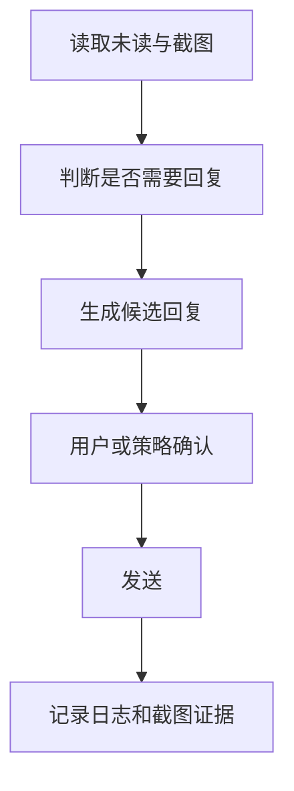

# 桌面 RPA

桌面 RPA 当前围绕 Luminode / SightFlow 桌面组件工作。启动器负责安装或拉起组件，通过 Bridge 调用 `/api/desktop-agent/*`，再执行截图、点击、输入、微信未读和显式回复。


## 能做什么

| 能力 | 当前定位 |
| --- | --- |
| 截图 | 获取桌面当前画面，用于观察和留证 |
| 点击 | 需要策略允许和显式确认 |
| 输入 | 需要策略允许和显式确认 |
| 微信未读 | 读取未读状态，先观察再回复 |
| 微信发送 | 必须带确认，默认不启用自动发送 |
| 健康检查 | 检查组件是否启动、API 是否可访问 |

## 为什么要“下载并安装桌面组件”

在线瘦包默认不带完整 Luminode 桌面组件。启动器里的安装按钮应该做这些事：

1. 从 manifest 镜像选择可用下载源。
2. 下载桌面组件包。
3. 校验 sha256。
4. 解压到 `OpenClawFiles/agents/luminode-desktop`。
5. 写入组件版本和安装状态。
6. 触发一次 health check。

v2.1.8 的在线包已把 `luminode-desktop.tar.gz` 放入 runtime layers Release。完整离线包则直接带上桌面组件，适合客户机不方便联网时验收。

## 同步桌面 RPA 配置

统一设置里可以保留“同步桌面 RPA URL 和 API Key”的入口。这个按钮应该只做配置同步，不启动真实写动作：

1. 读取当前 Bridge 和桌面组件配置。
2. 写入桌面 RPA 调用所需的 URL、Token 或 API Key。
3. 脱敏展示同步结果。
4. 立即执行一次 `health`。
5. 失败时提示具体缺少 URL、Key、组件还是权限。

这类按钮适合放在“桌面 RPA”或“统一设置”的配置区，不应放到首页占用启动路径。

## 安全策略

桌面控制建议先完成观察，再执行会改变系统状态的动作。推荐默认策略：

| 动作 | 默认 | 原因 |
| --- | --- | --- |
| 截图 | 允许 | 只读观察 |
| 未读读取 | 允许或提示 | 只读，但可能含隐私 |
| 点击 | 禁止，需确认 | 可能改变系统状态 |
| 输入 | 禁止，需确认 | 可能写入敏感内容 |
| 微信发送 | 禁止，需确认 | 对外发送，必须留痕 |

<div class="danger-line">桌面 RPA 写操作应具备策略开关、显式确认和日志记录。</div>

## CLI 入口

```powershell
cd D:\Axiangmu\AUSTART\openclaw_ui_integration
npm run desktop:agent -- status --json
npm run desktop:agent -- health --json
npm run desktop:agent -- start --json
npm run desktop:agent -- screenshot --out ./data/desktop.png --json
npm run desktop:agent -- wechat unread --json
npm run desktop:reply -- observe --json
npm run desktop:reply -- once --text "你好，这是来自 OpenClaw 控制台的确认回复。" --confirmed --json
```

## 自动回复的正确分层



自动回复必须把“生成内容”和“发送动作”拆开。生成可以自动，发送要被策略明确允许。

## 常见问题

| 现象 | 可能原因 | 处理 |
| --- | --- | --- |
| 组件未安装 | 在线包没有桌面层 | 点击安装组件或放入本地 agents 目录 |
| health 失败 | 进程没启动或端口不可达 | 先 start，再看 Bridge 日志 |
| 403 blocked | Bridge policy 拦截 | 打开对应允许项，并带 `--confirmed` |
| 401 | Bridge Token 不匹配 | 通过启动器或 CLI 读取当前 Token，避免直连 sidecar |
| 截图为空 | 组件未取到权限或桌面锁屏 | 解锁桌面，重新 health check |
