# 麓鸣 AI 矩阵获客工作台 2.1.56 新手使用教程

适用版本：2.1.56 商业稳定版

适用对象：第一次接触 AI Agent、手机矩阵和飞书线索同步的用户

完成目标：激活软件，检查环境，接入 Codex，连接手机，建立多设备矩阵，并把确认后的线索沉淀到飞书多维表格。

飞书云文档：[麓鸣 AI 矩阵获客工作台 2.1.56 新手使用教程](https://my.feishu.cn/docx/TxgidHoV6o4rpWxcpWxcMH3onWg)

> 重要安全边界：本教程只演示授权、连接、只读检查、草稿生成和测试表写入。真实发布、评论、私信、加好友、加微和批量触达必须经过人工确认、白名单、频控与日志留痕。

## 0. 开始前准备

请先准备好：

- Windows 10 或 Windows 11 电脑。
- 服务方提供的 2.1.56 安装包和商业授权码。
- 可用的 Codex 或其他受支持 AI Agent。
- 一台或多台安卓手机。
- 电脑和手机可以互相访问的网络，最简单的方式是连接同一个 Wi-Fi。
- 飞书账号，以及可创建或编辑多维表格的权限。
- 一张专用测试表。第一次验证不要直接使用生产客户表。

不要把授权码、密码、API Key、手机连接令牌、飞书验证码或客户隐私数据发到群聊，也不要把它们留在截图里。

## 1. 安装并首次启动

1. 双击服务方交付的 2.1.56 Windows 安装程序。
2. 保留默认安装目录；需要桌面图标时勾选“创建桌面快捷方式”。
3. 点击“安装”，安装结束后点击“完成”。
4. 双击桌面上的“麓鸣AI矩阵获客工作台”。
5. 首次启动如果显示正在准备运行组件，请保持联网并等待自动完成，不要连续重复双击。

成功标准：启动动画结束后进入商业授权页，或者已经激活过的电脑直接进入带左侧导航的工作台。

常见问题：

- Windows 显示未知发布者时，先核对安装包来源和版本，再决定是否继续。
- WebView2 安装失败时，重启电脑后重新运行安装程序。
- 组件下载失败时，检查网络后重新启动；仍失败则联系服务方获取完整离线包。
- 超过 10 分钟没有变化时，关闭程序后再重新打开，不要同时启动多个安装进程。

## 2. 激活商业授权

商业授权决定能否进入工作台；模型账号决定 AI 使用哪个模型。这是两套独立流程。

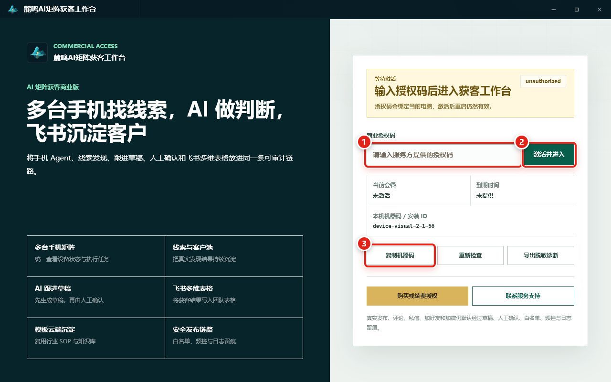

图中编号：

1. 在“商业授权码”输入框粘贴服务方提供的完整授权码。
2. 点击“激活并进入”。
3. 如果提示设备不匹配，点击“复制机器码”，交给服务方重新绑定。

成功标准：授权墙消失，左侧出现“总览、安装、创作、获客、工作台、模型账号、其他”，并且重启软件后仍能进入工作台。

失败处理：

- “等待激活”：重新核对授权码有没有缺字符或多空格。
- “授权已到期”：联系服务方续费。
- “设备不匹配”：复制机器码，不要把授权码截图发给别人。
- “授权服务暂不可用”：检查网络后点击“重新检查”。
- 一直失败：点击“导出脱敏诊断”，把诊断包交给售后。

## 3. 认识首页和新手入口

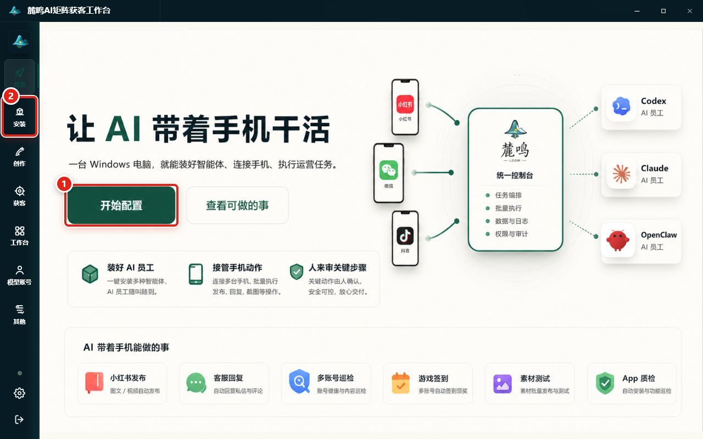

1. “开始配置”进入新手配置总览。
2. 左侧“安装”可直接进入环境检测和智能体安装页。

左侧入口说明：

- 总览：新手配置入口和状态汇总。
- 安装：检测 Python、Node.js、npm、Git，并安装 Codex 等智能体。
- 创作：图片和视频创作能力。
- 获客：真实线索、草稿、飞书和 AI 提示词总览。
- 工作台：多台手机矩阵和任务队列。
- 模型账号：登录中转站并同步模型。
- 其他：当前未开放或高级能力。

手机控制不是左侧常驻入口。进入路径是“总览 → 开始配置 → 连接手机 → 打开手机控制”。

## 4. 检测前置环境并接入 Codex

点击左侧“安装”。页面会检测 Python、Node.js、npm、Git 和 Git Bash 等前置环境。

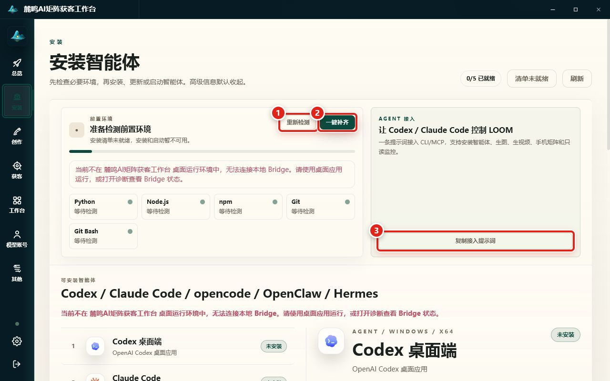

1. 点击“重新检测”重新读取当前电脑环境。
2. 有缺失项时点击“一键补齐”，等待完成后再重新检测。
3. 点击“复制接入提示词”，把提示词粘贴给 Codex，让 Codex 发现 LOOM CLI/MCP。

前置环境成功标准：标题显示“前置环境已就绪”，检查项为绿色，并提示可以继续安装和启动智能体。

Codex 接入成功标准：Codex 明确回复已经找到 LOOM CLI，完成 doctor 检查，并能只读查询 LOOM 状态。

注意：复制提示词只是在 Codex 和 LOOM 之间建立控制通道，不会自动向客户发送消息。

常见问题：

- “清单未就绪”：先点击页面右上角“刷新”。
- 一键补齐后仍缺失：展开检测详情，记录具体缺失项，再进入环境诊断。
- 安装按钮显示处理中时不要重复点击。
- Codex 安装失败时先导出安装日志，再按明确错误修复，不要盲目重试。

## 5. 登录模型账号

点击左侧“模型账号”，优先使用邮箱验证码登录：

1. 选择“验证码登录”。
2. 输入邮箱并点击“发送验证码”。
3. 输入邮箱收到的验证码，点击“验证并登录”。
4. 登录成功后点击“同步模型”。
5. 确认模型数量大于 0，再选择默认文本模型。

成功标准：页面显示“已登录”，模型列表不是空的，并且 Codex 的模型配置状态显示已配置。

没有收到验证码时先检查垃圾邮件；模型列表为空时检查账号是否有文本模型权限。不要把模型 API Key 放进教程、截图或客户表。

## 6. 下载手机端 App

进入路径：“总览 → 开始配置 → 打开手机控制”。

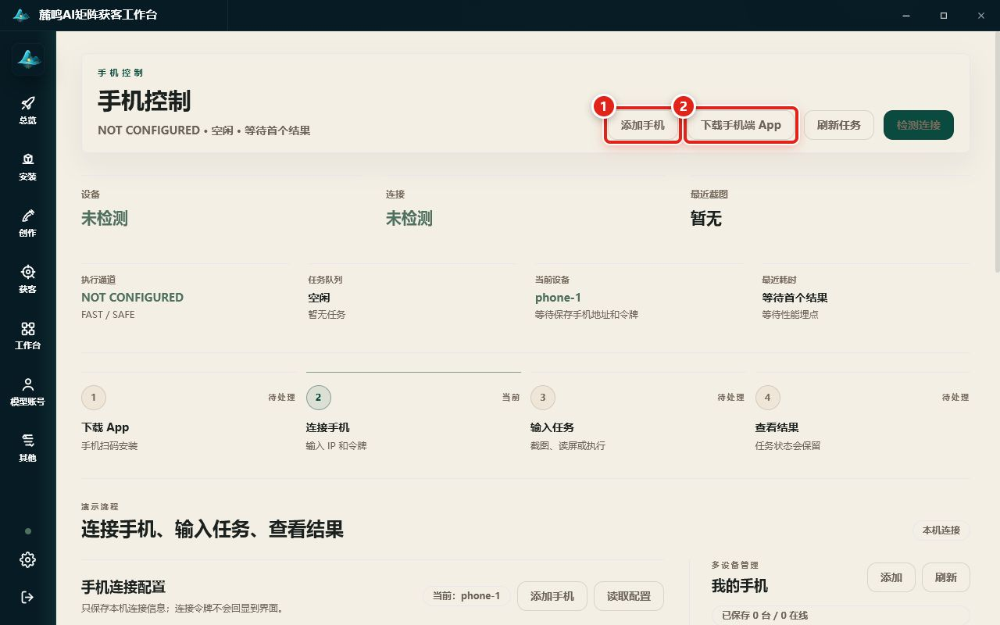

1. “添加手机”用于建立新的手机配置。
2. “下载手机端 App”打开二维码和安装说明。

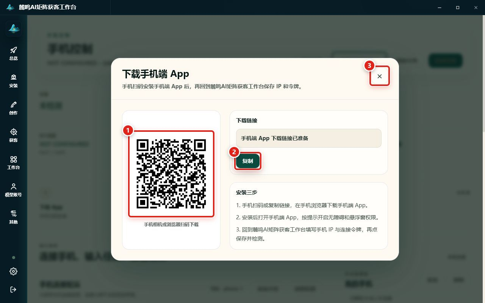

1. 用安卓手机扫描二维码下载 App。
2. 无法扫码时点击“复制”，把下载链接发送到自己的手机浏览器。

手机端安装完成后：

1. 打开手机端 App。
2. 按提示开启无障碍服务和悬浮窗权限。
3. 记录手机端显示的局域网 IP 和连接令牌。
4. 保持手机端 App 运行，第一次测试时不要锁屏。

## 7. 保存并检测第一台手机

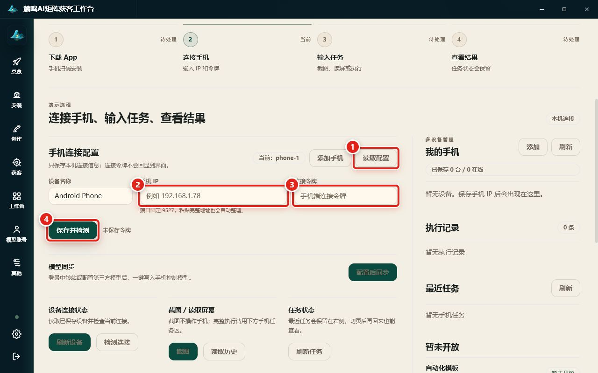

1. “读取配置”用于重新读取本机已保存的设备。
2. 在“手机 IP”中填写手机端显示的地址。端口固定为 9527，粘贴完整地址也会自动整理。
3. 在“连接令牌”中填写该手机自己的令牌。
4. 点击“保存并检测”。

每台手机都应使用独立的设备名称、IP 和令牌。连接令牌保存后不会回显；后续看到“已保存，留空沿用”是正常现象。

成功标准：

- 页面顶部“连接”显示已连接。
- “我的手机”中出现该设备。
- 点击“读取屏幕”后任务完成，并返回页面名称或屏幕摘要。

失败处理：

- 无法连接：确认电脑和手机网络可达，手机 App 正在运行且没有锁屏。
- Invalid Lumi signature：重新复制令牌，并校准电脑与手机时间。
- 无法读取屏幕：检查手机无障碍权限。
- 任务超时：先做“读取屏幕”，再把复杂任务拆成更小步骤。

## 8. 添加多台手机并执行只读矩阵任务

对每台手机重复“添加手机 → 填写独立 IP/令牌 → 保存并检测”。全部连接后点击左侧“工作台”。

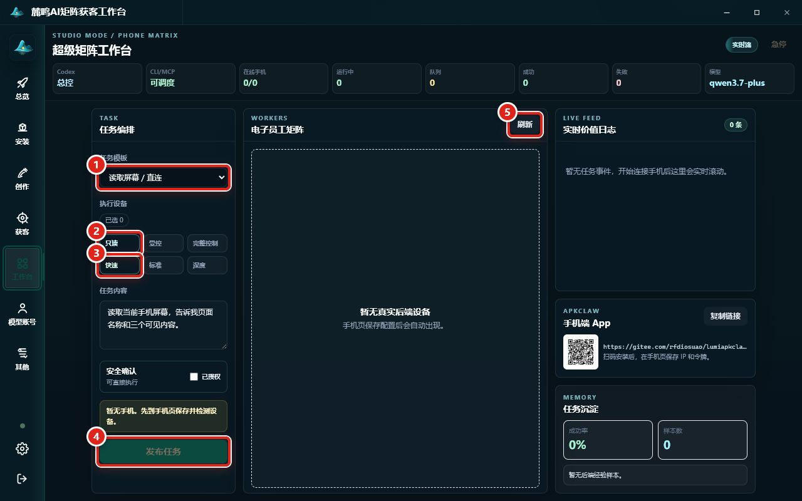

1. 任务模板选择“读取屏幕 / 直连”。
2. 模式选择“只读”。
3. 性能选择“快速”。
4. 选中至少一台在线手机后点击“发布任务”。
5. 点击“刷新”重新读取真实设备与任务状态。

“发布任务”只表示把任务放入手机设备队列，不等于向社交平台发布内容。

第一次建议使用这条任务：

> 读取当前手机屏幕，告诉我页面名称和三个可见内容。不要点击、输入、滑动或发送任何内容。

成功标准：设备从空闲变为运行中，实时日志出现排队、运行和结果事件，完成后返回成功状态。页面上的“急停”在 2.1.56 中可能处于禁用状态，不要把它当作主要安全措施。

## 9. 看懂获客总览

点击左侧“获客”。

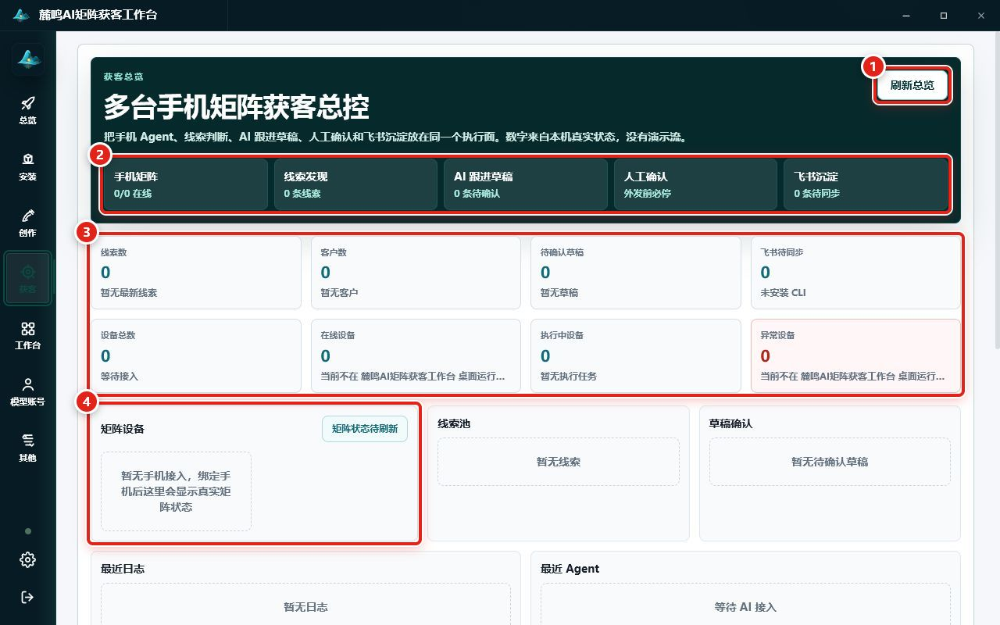

1. “刷新总览”重新读取本机真实状态。
2. 能力链表示：手机矩阵 → 线索发现 → AI 跟进草稿 → 人工确认 → 飞书沉淀。
3. 统计区显示真实线索、客户、草稿、飞书同步和设备数量。
4. 矩阵设备区显示已经接入的真实手机。

第一次使用时所有数字为 0 是正常状态，不是演示数据，也不代表故障。获客页本身没有“自动群发”按钮；获客任务由已经接入的 Codex/Agent 通过 LOOM CLI 或 MCP 执行，结果再回到这里展示。

## 10. 连接飞书多维表格

在获客页向下滚动到“飞书多维表格”。

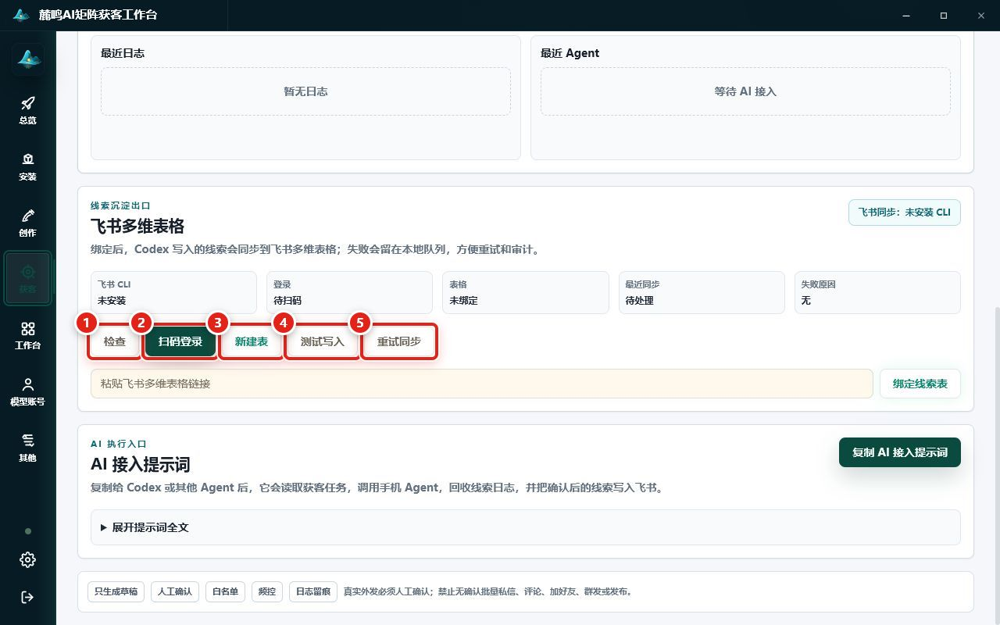

1. 点击“检查”，查看飞书 CLI、登录、表格、最近同步和失败原因。
2. 未登录时点击“扫码登录”。用飞书 App 扫码；二维码不可用时使用“复制登录链接”。
3. 需要新表时点击“新建表”，再在确认框中点击“确认新建”。
4. 登录和绑表后点击“测试写入”。
5. 修复权限、登录或绑定问题后，点击“重试同步”处理本地待同步记录。

如果“飞书 CLI”显示未安装，当前页面没有一键安装按钮，应先联系服务方或让已授权的 Codex 按 LOOM 接入提示词检查环境，不要虚构已经连接成功。

### 绑定已有表格

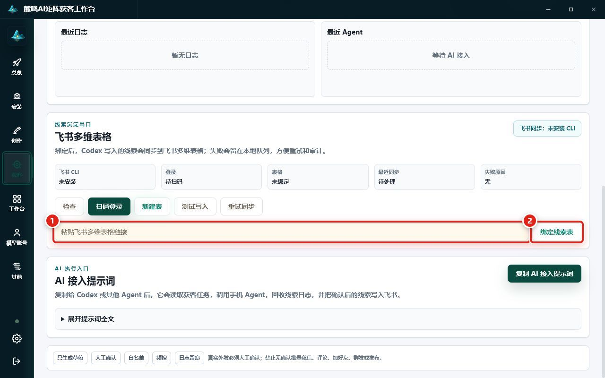

1. 从浏览器地址栏复制完整的飞书多维表格链接，粘贴到输入框。
2. 点击“绑定线索表”。
3. 再点击“检查”，确认表格状态不再是未绑定。

### 测试写入的最终成功标准

不能只看“已提交飞书测试写入”提示。必须同时确认：

- 最近同步显示“已入飞书”。
- 失败原因显示“无”。
- 飞书测试表里真实出现一条测试记录。
- 本地“飞书待同步”没有继续增加。

建议第一次只使用空白测试表，不要直接操作生产客户数据。

## 11. 把获客提示词交给 Codex

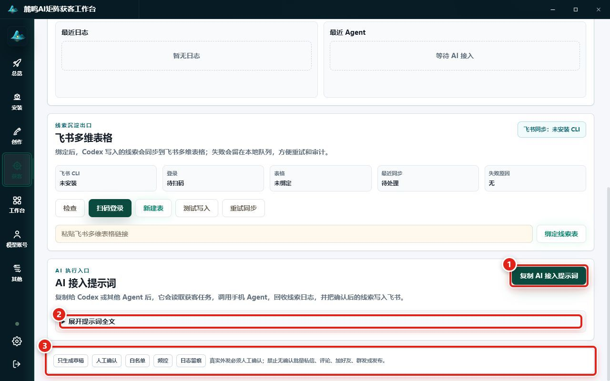

1. 点击“复制 AI 接入提示词”。
2. 复制失败时展开“展开提示词全文”，再手动复制。
3. 确认底部安全规则仍显示只生成草稿、人工确认、白名单、频控和日志留痕。

第一次发给 Codex 时，先使用只读检查：

```text
请先只读检查 LOOM 的获客总览、手机矩阵和飞书状态。
不要调度手机，不要写入飞书，不要发送、评论、私信、加好友或发布。
```

只读检查正常后，再做草稿型测试：

```text
请做一次获客 dry-run，只在本地生成一条测试线索和跟进草稿。
不要触发任何真实发布、评论、私信、加好友、加微或群发。
```

成功标准：获客总览出现测试线索，待确认草稿增加，草稿状态仍是等待人工确认，日志中出现任务准备或结果入库记录。飞书未连接时，记录应留在本地待同步队列，而不是消失。

## 12. 日志、诊断和售后定位

点击左下角齿轮“系统设置”，再点击“数据”。

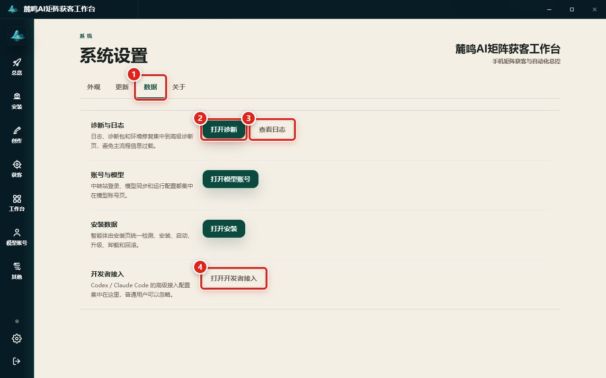

1. “数据”标签集中放置售后工具。
2. “打开诊断”检查运行环境。
3. “查看日志”查看本次运行记录。
4. “打开开发者接入”可再次复制高级 CLI/MCP 接入提示词。

### 环境诊断

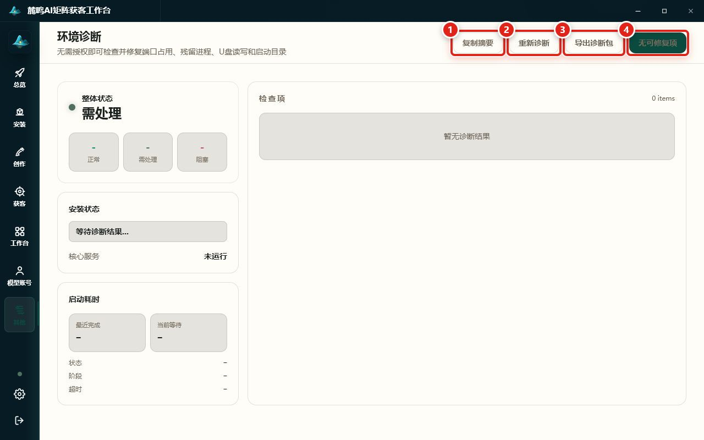

1. “复制摘要”复制脱敏后的检查摘要。
2. “重新诊断”重新读取环境。
3. “导出诊断包”生成售后排错文件。
4. 有可修复项时该按钮会显示“一键修复”；没有可修复项时显示“无可修复项”。

成功标准：整体状态为正常，阻塞数量为 0。执行修复前先保存正在运行的任务；修复完成后必须重新诊断，不能只看成功提示。

### 运行日志

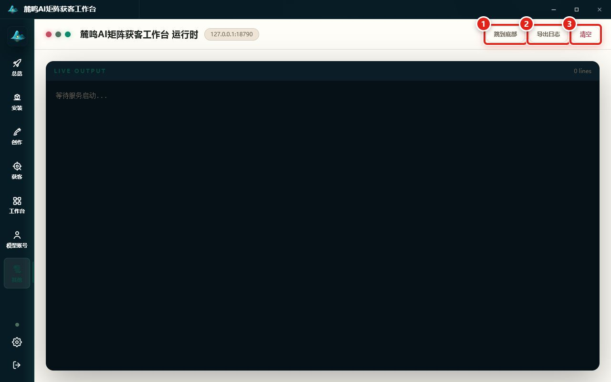

1. “跳到底部”定位最新日志。
2. “导出日志”保存当前日志。
3. 导出成功后才会出现“打开目录”。
4. “清空”会删除当前界面日志，只有确认已经导出后才使用。

把日志或诊断包发给售后前，再检查一次是否混入你自己粘贴的密码、授权码、API Key、手机令牌或客户数据。

## 13. 完成验收清单

逐项确认后，才算完成首次部署：

- [ ] 软件版本为 2.1.56，重启后仍能进入工作台。
- [ ] 商业授权有效，授权码没有出现在截图或日志中。
- [ ] 前置环境已就绪。
- [ ] Codex 已安装并能只读查询 LOOM 状态。
- [ ] 模型账号已登录，模型列表不为空。
- [ ] 至少一台手机显示已连接，读取屏幕任务成功。
- [ ] 多台手机使用各自独立的名称、IP 和令牌。
- [ ] 矩阵第一次任务使用只读模式，没有点击或外发。
- [ ] 获客总览数字来自本机真实状态，没有把 0 当成故障。
- [ ] 飞书账号已登录，测试表已绑定。
- [ ] 测试写入在飞书表中真实可见。
- [ ] AI 只生成待确认草稿，没有自动发送。
- [ ] 诊断包和日志能够导出。

## 14. 必须停止并向负责人确认的情况

遇到以下情况不要自行继续：

- 需要真实平台账号登录、验证码、支付或外部服务密钥。
- 要使用生产客户数据或生产飞书表。
- 要决定平台风控策略、批量触达规则或合规口径。
- 要执行批量私信、批量评论、批量加好友、自动加微或群发。
- 要删除数据、回滚稳定版本或修改服务器授权策略。

这套系统的正确自动化方式是：AI 自动发现和整理线索、生成草稿、写入可审计队列；真实外发动作在人工确认、白名单和频控之后执行。
