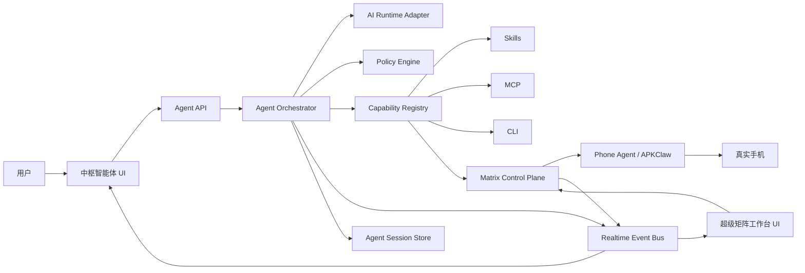

# 麓鸣中枢智能体与超级矩阵工作台生产化设计

日期：2026-07-15  
产品版本基线：LOOM 2.1.81  
状态：待产品负责人审阅  
视觉基线：

- `docs/LOOM_AGENT_CHAT_UI_DEMO.html`
- `docs/LOOM_PHONE_AGENT_UI_DEMO.html`

## 1. 目标

把已经确认的两个 HTML Demo 实现为 LOOM 正式功能：

1. **麓鸣中枢智能体**：用户通过对话描述目标；智能体调用 Skill、MCP、CLI 和 LOOM 内部能力，生成可追踪的计划、工具调用、审批和执行结果。
2. **超级矩阵工作台**：用户查看全部真实手机的实时状态与画面，向设备组下发任务，聚焦单机，切换 AI 控制与人工接管，并处理失败、暂停、重试和急停。

本轮不重做获客和创作。获客、创作只作为未来可被中枢调用的业务能力，不进入本轮页面范围。

## 2. 产品边界

### 2.1 中枢智能体负责

- 保存和恢复对话。
- 理解用户目标并形成执行计划。
- 选择已安装的 AI 运行时和可用工具。
- 调用 LOOM Skill、MCP、CLI、矩阵控制面和媒体等内部能力。
- 在对话中展示真实计划、工具调用、审批、任务附件、证据和最终结果。
- 提供运行级深度调试：调用链、Prompt 快照、状态、耗时和错误。
- 对高风险动作发起审批，不绕过现有安全规则。

### 2.2 超级矩阵工作台负责

- 展示设备组、设备状态、缩略画面、当前任务、进度和异常。
- 向设备组或指定设备下发任务。
- 聚焦一台设备查看高频画面和执行时间线。
- 在 AI 控制和人工接管之间进行有租约保护的切换。
- 执行返回、主页、最近任务、输入、点击、滑动、截图和旋转等人工控制。
- 暂停、继续、取消、重试和急停矩阵任务。

### 2.3 两者的连接方式

- 智能体调用矩阵时，产生真实 `runId`、`campaignId` 和 `deviceTaskId`。
- 对话中的矩阵任务附件只展示摘要和证据，不复制完整工作台。
- “打开工作台”携带 `campaignId`、`deviceId` 和 `runId`，让工作台直接定位对应任务或设备。
- 工作台产生的状态和证据通过事件总线回写智能体运行记录。
- 智能体不直接在前端操作手机；所有写操作必须经过后端编排、策略检查和设备租约。

## 3. 当前基线与差距

### 3.1 可以复用的正式能力

- `MatrixControlPlane` 已提供设备注册、状态、任务下发、监控、取消、失败重试和体验报告。
- `/api/matrix/events/stream` 已提供 SSE 状态流，并有轮询降级和指数退避重连。
- `routes_phone.py` 已提供设备配置、截图缓存、读屏、任务执行、动作解析和事件同步能力。
- 矩阵任务已经支持 `observe`、`safe`、`full` 模式和 `fast`、`standard`、`deep` 执行档位。
- 高风险任务已有 `confirmed`、安全错误和目标错误约束。
- 正式应用已有授权检查、Bridge 鉴权、任务管理器、模型账号、组件安装、CLI 和 MCP 能力。

### 3.2 必须补齐的能力

- 当前没有正式“中枢智能体”页面；隐藏的 `AgentAccessPage` 只是 MCP/CLI 接入说明。
- 当前没有中枢会话、消息、运行、审批和轨迹的持久化服务。
- 当前 `MatrixWorkbenchPage.tsx` 同时承担任务编排、设备列表和实时日志，不能直接承载手机墙和单机控制。
- 当前矩阵前端 API 未暴露取消、重试、单机画面、人工控制和租约。
- 当前截图能力面向已选设备和任务式调用，不适合几十台设备的可见区域调度。
- 当前应用没有带上下文的页面跳转机制。

## 4. 总体架构



核心决策：

- 继续使用 Python FastAPI Bridge 作为本地控制面，不在 Tauri 中新增第二套后端。
- 继续复用 `MatrixControlPlane`，不重写设备调度器。
- 新增独立 Agent 编排域，不把 Agent 会话逻辑塞入矩阵类。
- 第一版使用文件持久化和 JSONL 事件账本，符合当前本地应用的数据方式，不引入数据库依赖。
- 状态和运行事件统一通过带序号的事件信封传输；截图按可见区域单独调度，不塞进矩阵 SSE。

## 5. 前端设计

### 5.1 导航与页面注册

新增一级功能键 `agent`：

```ts
{ key: 'agent', label: '智能体', desc: '对话 / 编排 / 调试', icon: 'AGT', group: 'LOOM', action: { type: 'page' }, requiresLicense: true }
```

保留 `agentAccess` 作为隐藏的开发者接入页。`agent` 与 `agentAccess` 不是同一页面。

`pages.tsx` 增加懒加载的 `AgentWorkbenchPage`。现有 `workbench` 仍映射矩阵页面，但内部拆分为组件目录。

应用不引入 React Router。扩展 Zustand 应用状态：

```ts
type NavigationContext = {
  campaignId?: string;
  deviceId?: string;
  runId?: string;
  source?: 'agent' | 'matrix' | 'external';
};

openFeature(key: string, context?: NavigationContext): void;
consumeNavigationContext(key: string): NavigationContext | null;
```

这样可实现智能体任务附件到工作台的精准跳转，同时保持当前页面切换体系。

### 5.2 中枢智能体页面组件

建议目录：

```text
src/components/agent/
  AgentWorkbenchPage.tsx
  AgentHeader.tsx
  ConversationSidebar.tsx
  ConversationStream.tsx
  AgentComposer.tsx
  AgentDebugger.tsx
  AgentRunAttachment.tsx
  AgentApprovalCard.tsx
  messageBlocks.tsx
  agentViewModel.ts
src/stores/agentStore.ts
```

组件职责：

| 组件 | 职责 |
|---|---|
| `AgentHeader` | 智能体身份、运行时、权限、上下文、配置、调试开关、新对话 |
| `ConversationSidebar` | 新建、搜索、切换、重命名、归档历史会话 |
| `ConversationStream` | 虚拟化呈现用户消息、回复、计划、工具调用、审批、附件和错误 |
| `AgentRunAttachment` | 展示矩阵运行进度、设备证据、暂停按钮和工作台深链 |
| `AgentApprovalCard` | 展示动作、目标、影响范围、过期时间和批准/拒绝操作 |
| `AgentComposer` | 文本、附件、设备/设备组、Skill、MCP/CLI 选择和发送 |
| `AgentDebugger` | 调用链、Prompt 快照、状态；默认收起，运行中可实时更新 |

页面规则：

- 对话是唯一主舞台，调试器不是常驻必读区域。
- 计划、工具调用和矩阵任务都是消息块，不打开第二套浮层工作台。
- 流式消息只能追加或更新自己的 `messageId`，不能重排已经完成的历史消息。
- 切换会话必须取消当前订阅，但不能取消后台运行。
- 新建会话立即创建本地会话记录，首条消息发送失败时仍保留草稿。
- 调试信息必须来自真实事件，不允许使用 UI 模拟数据。

### 5.3 超级矩阵工作台页面组件

建议目录：

```text
src/components/matrix/
  MatrixWorkbenchPage.tsx
  MatrixCommandBar.tsx
  MatrixMetrics.tsx
  DeviceGroupRail.tsx
  PhoneWall.tsx
  PhoneTile.tsx
  DeviceInspector.tsx
  FocusScreen.tsx
  ManualControls.tsx
  DeviceTimeline.tsx
  MatrixTaskDrawer.tsx
  matrixViewModel.ts
  useMatrixStream.ts
  useVisibleScreens.ts
```

组件职责：

| 组件 | 职责 |
|---|---|
| `MatrixCommandBar` | 输入任务、选择作用范围、下发和急停 |
| `MatrixMetrics` | 在线、运行中、待命、异常、任务完成率 |
| `DeviceGroupRail` | 全部设备、业务组、异常组、搜索结果和组级选中 |
| `PhoneWall` | 设备墙、缩放模式、搜索、刷新和可见区域检测 |
| `PhoneTile` | 小手机画面、状态、任务、进度、选中和异常提示 |
| `DeviceInspector` | 选中设备详情、AI/人工模式、聚焦画面、事实和时间线 |
| `ManualControls` | 返回、主页、最近任务、输入、截图、旋转、坐标点击和滑动 |
| `MatrixTaskDrawer` | 高级模板、执行模式、档位、安全确认和任务历史 |

页面规则：

- 手机墙是主区域；任务高级参数放入抽屉，避免继续占据固定左栏。
- 小手机始终对应一台真实设备；点击后右侧聚焦同一设备。
- 三档缩放只改变列宽和信息密度，不改变设备顺序。
- 设备状态统一为 `online_idle`、`running`、`waiting`、`error`、`offline`。
- AI 控制模式下，点击画面只选中设备，不发送点击动作。
- 人工接管成功取得租约后，画面才接收坐标和手势。
- 急停必须二次确认，并明确显示影响的设备数和任务数。

### 5.4 前端状态管理

新增 `agentStore`，矩阵继续使用页面内状态与专用 hooks。不要把实时帧存进全局 Zustand。

`agentStore` 只保存：

- 会话索引和当前会话 ID。
- 当前会话消息索引。
- 活跃运行摘要。
- 调试器开关和选中轨迹节点。
- 未发送草稿。

实时事件由订阅 hook 解析后归并到 store。大文本、完整轨迹和截图按需读取，防止全局状态膨胀。

## 6. Agent 后端设计

### 6.1 新增模块

```text
python/api/routes_agent.py
python/core/agent_orchestrator.py
python/core/agent_sessions.py
python/core/agent_capabilities.py
python/core/agent_policy.py
python/core/agent_runtime.py
python/core/agent_events.py
```

| 模块 | 职责 |
|---|---|
| `AgentSessionRepository` | 会话、消息、运行、审批、事件账本的原子读写 |
| `AgentOrchestrator` | 运行生命周期、上下文构建、工具循环、取消和结果汇总 |
| `AgentRuntimeAdapter` | 对接已安装/已配置的 AI 运行时，统一流式文本和工具调用 |
| `CapabilityRegistry` | 把 Skill、MCP、CLI 和内部 API 暴露为带权限元数据的工具 |
| `AgentPolicyEngine` | 对工具调用做只读、受控、外发、高风险分类和审批判断 |
| `AgentEventBus` | 发布带序号事件，并写入运行账本 |

### 6.2 AI 运行时适配器

中枢智能体不是固定绑定某一家模型。适配器接口：

```py
class AgentRuntimeAdapter(Protocol):
    def status(self) -> dict: ...
    def start(self, request: dict, emit: Callable[[dict], None], cancel: Event) -> dict: ...
```

第一版实现 `LoomCliRuntimeAdapter`：

- 从现有组件目录和模型账号中解析已选择的 Codex、Claude Code、OpenClaw 或其他兼容运行时。
- 通过参数数组启动进程，不拼接 shell 字符串。
- 给运行时注入本次会话上下文、允许的工具描述、MCP 配置和结果 Schema。
- 读取结构化 JSON/JSONL 输出，转换为统一事件。
- 运行时退出、超时或输出格式错误时形成可恢复错误，不把原始密钥写入日志。

后续可以增加直接模型 API 适配器，但不作为首版阻塞项。

### 6.3 能力注册表

每个能力必须声明：

```json
{
  "name": "loom.matrix.dispatch",
  "source": "internal",
  "permission": "control",
  "risk": "conditional",
  "timeoutSec": 120,
  "inputSchema": {},
  "outputSchema": {}
}
```

能力来源：

- `internal`：矩阵状态、任务下发、截图、取消、重试等内部服务。
- `skill`：本机安装的 LOOM Skills。
- `mcp`：已登记的 MCP Server 工具。
- `cli`：允许列表中的 LOOM CLI 子命令。

前端只负责选择能力和显示结果，不直接执行 MCP 或 CLI。

### 6.4 持久化

第一版目录结构：

```text
data/agent/
  sessions-index.json
  sessions/<sessionId>/session.json
  sessions/<sessionId>/messages.jsonl
  sessions/<sessionId>/events.jsonl
  sessions/<sessionId>/runs/<runId>.json
  sessions/<sessionId>/approvals/<approvalId>.json
```

要求：

- JSON 文件使用临时文件加原子替换。
- JSONL 使用单进程锁追加，每条包含 `eventId` 和单调递增 `seq`。
- 索引损坏时可以从会话目录重建。
- 会话删除首版只做归档，不物理删除证据账本。
- Prompt 快照、工具参数和工具结果在落盘前经过 secret/隐私字段清洗。

## 7. API 契约

### 7.1 Agent API

| 方法 | 路径 | 用途 |
|---|---|---|
| `GET` | `/api/agent/bootstrap` | 运行时、权限、能力摘要和默认配置 |
| `GET` | `/api/agent/sessions` | 会话索引、搜索和分页 |
| `POST` | `/api/agent/sessions` | 新建会话 |
| `PATCH` | `/api/agent/sessions/{sessionId}` | 重命名或归档 |
| `GET` | `/api/agent/sessions/{sessionId}` | 会话详情和消息分页 |
| `POST` | `/api/agent/sessions/{sessionId}/messages` | 发送消息并创建运行 |
| `GET` | `/api/agent/runs/{runId}` | 运行摘要 |
| `GET` | `/api/agent/runs/{runId}/trace` | 完整调试轨迹 |
| `POST` | `/api/agent/runs/{runId}/pause` | 请求暂停 |
| `POST` | `/api/agent/runs/{runId}/resume` | 从检查点继续 |
| `POST` | `/api/agent/runs/{runId}/cancel` | 中断运行 |
| `POST` | `/api/agent/approvals/{approvalId}` | 批准或拒绝高风险动作 |
| `GET` | `/api/agent/events/stream?sessionId=...&afterSeq=...` | 鉴权 SSE 事件流 |

发送消息请求：

```json
{
  "clientMessageId": "client-generated-uuid",
  "text": "让招聘组筛选今天的新简历",
  "attachments": [],
  "targets": { "deviceIds": [], "groups": ["招聘一组"] },
  "capabilityHints": ["luming-boss-resume-screening"],
  "runtimeProfileId": "default"
}
```

`clientMessageId` 是幂等键。重复提交不得创建第二次运行。

### 7.2 统一实时事件

```json
{
  "schema": "loom.realtime.event.v1",
  "eventId": "evt_...",
  "seq": 128,
  "timestamp": "2026-07-15T14:30:00+08:00",
  "topic": "agent.run",
  "entityId": "run_...",
  "type": "tool.started",
  "data": {}
}
```

Agent 事件类型至少包括：

- `message.delta`
- `message.completed`
- `plan.updated`
- `tool.started`
- `tool.completed`
- `tool.failed`
- `approval.required`
- `approval.resolved`
- `matrix.attached`
- `run.paused`
- `run.completed`
- `run.failed`
- `run.cancelled`

中枢智能体和新版矩阵页面统一使用带 `X-Bridge-Token` 的 `fetch` 流式读取，不使用无法添加鉴权头的原生 `EventSource`。断线后携带 `afterSeq` 补收事件。现有矩阵 EventSource 路径只在迁移期保留兼容，不作为新版页面的数据入口。

### 7.3 Matrix API 增量

保留现有 API，并在前端 `matrixApi` 中补齐 `cancel` 和 `retry`。新增：

| 方法 | 路径 | 用途 |
|---|---|---|
| `GET` | `/api/matrix/devices/{deviceId}/screen` | 获取单机缓存画面，支持 `knownHash` |
| `GET` | `/api/matrix/devices/{deviceId}/timeline` | 获取设备最近事件 |
| `GET` | `/api/matrix/devices/{deviceId}/lease` | 查询当前写租约和剩余有效时间 |
| `POST` | `/api/matrix/devices/{deviceId}/lease` | 获取或续租人工/Agent 写租约 |
| `DELETE` | `/api/matrix/devices/{deviceId}/lease` | 释放租约 |
| `POST` | `/api/matrix/devices/{deviceId}/control` | 执行人工控制动作 |
| `POST` | `/api/matrix/tasks/{deviceTaskId}/pause` | 暂停设备任务 |
| `POST` | `/api/matrix/tasks/{deviceTaskId}/resume` | 继续设备任务 |

画面响应首版沿用 JSON Base64，与现有截图链兼容：

```json
{
  "schema": "loom.matrix.screen.v1",
  "deviceId": "LUMI-P01",
  "capturedAt": "2026-07-15T14:30:00+08:00",
  "screenHash": "sha256:...",
  "mime": "image/jpeg",
  "width": 1080,
  "height": 2400,
  "image": "base64...",
  "notModified": false
}
```

若 `knownHash` 未变化，返回 `notModified: true` 且不返回 `image`。

人工控制请求使用归一化坐标：

```json
{
  "leaseId": "lease_...",
  "action": "tap",
  "x": 0.52,
  "y": 0.41,
  "clientCommandId": "cmd_..."
}
```

支持动作：`tap`、`swipe`、`input_text`、`back`、`home`、`recent`、`screenshot`、`rotate`。

## 8. 设备租约与并发控制

设备写操作必须串行；不同设备可以并行。

租约结构：

```json
{
  "leaseId": "lease_...",
  "deviceId": "LUMI-P01",
  "holderType": "agent",
  "holderId": "run_...",
  "mode": "control",
  "expiresAt": "2026-07-15T14:30:30+08:00"
}
```

规则：

- 只读状态和截图不需要写租约。
- Agent 在发送第一个写动作前获得租约，默认 TTL 30 秒，每 10 秒续租。
- 用户切换人工接管时，如果 Agent 持有租约，界面展示“暂停 Agent 并接管”；确认后先暂停任务再换租约。
- 人工租约失去续租或页面关闭后自动到期，设备恢复可调度状态。
- 无有效租约的控制请求返回 `409 device_lease_conflict`。
- 急停可以取消目标任务并释放对应 Agent 租约，但不能抢占无关设备。

## 9. 截图与性能策略

不能给 100 台手机同时开启高频完整截图。

首版调度规则：

- 矩阵 SSE 只传状态和事件，不传图片。
- 不在视口内的设备停止截图请求。
- 视口内空闲设备每 4 秒请求一次；运行设备每 1.5 秒请求一次。
- 右侧聚焦设备每 700 毫秒请求一次，画面无变化时只返回 hash 命中。
- 同时请求截图的设备上限为 12，超出部分排队。
- 搜索、切组或缩放后重新计算可见设备。
- 页面隐藏时暂停缩略图和聚焦画面轮询，保留低频状态流。
- 图片对象在替换和组件卸载时释放，避免长期运行内存上涨。

100 台设备下的验收目标：

- 状态变化在 2 秒内出现在 UI。
- 滚动手机墙保持可操作，不因截图解码阻塞主线程。
- 活跃图片请求不超过 12 个。
- 聚焦控制从点击到进入待执行状态不超过 250 毫秒，不要求手机完成动作的网络耗时包含在内。

## 10. 安全与审批

动作等级：

| 等级 | 示例 | 默认行为 |
|---|---|---|
| `read` | 状态、截图、读屏、日志 | 自动执行 |
| `control_safe` | 打开页面、返回、主页、滚动、筛选 | 在授权设备范围内自动执行 |
| `outbound` | 私信、评论、加好友、发布 | 必须审批 |
| `critical` | 支付、删除、账号授权、修改安全设置 | 必须审批并再次确认目标 |

审批记录包含动作摘要、完整目标范围、触发工具、输入摘要、风险原因、操作者、决定和时间。审批通过只授权当前 `toolCallId`，不能变成永久通行证。

不得持久化或返回：

- API Key、手机 Token、Bridge Token、CLI 登录凭证。
- 未经用户要求的私聊全文、通讯录和私人文件正文。
- 可复用的账号 Cookie 或授权码。

## 11. 关键数据模型

### 11.1 AgentSession

```ts
type AgentSession = {
  schema: 'loom.agent.session.v1';
  sessionId: string;
  title: string;
  status: 'active' | 'archived';
  runtimeProfileId: string;
  createdAt: string;
  updatedAt: string;
  lastMessagePreview?: string;
  activeRunId?: string;
};
```

### 11.2 AgentMessage

```ts
type AgentMessage = {
  schema: 'loom.agent.message.v1';
  messageId: string;
  sessionId: string;
  role: 'user' | 'assistant' | 'system' | 'tool';
  status: 'streaming' | 'completed' | 'failed';
  blocks: AgentMessageBlock[];
  createdAt: string;
  completedAt?: string;
};
```

### 11.3 AgentRun

```ts
type AgentRun = {
  schema: 'loom.agent.run.v1';
  runId: string;
  sessionId: string;
  status: 'queued' | 'running' | 'waiting_approval' | 'paused' | 'completed' | 'failed' | 'cancelled';
  checkpoint?: string;
  campaignIds: string[];
  startedAt?: string;
  completedAt?: string;
  error?: { code: string; message: string; recoverable: boolean };
};
```

### 11.4 TraceNode

```ts
type TraceNode = {
  traceId: string;
  parentTraceId?: string;
  runId: string;
  kind: 'runtime' | 'plan' | 'tool' | 'policy' | 'matrix';
  name: string;
  status: 'running' | 'completed' | 'failed';
  startedAt: string;
  durationMs?: number;
  inputSummary?: unknown;
  outputSummary?: unknown;
  error?: { code: string; message: string };
};
```

## 12. 核心数据流

### 12.1 用户让智能体控制矩阵

1. 前端创建用户消息，携带 `clientMessageId`。
2. Agent API 原子保存消息并创建 `AgentRun`。
3. Orchestrator 读取会话上下文、运行时状态、能力注册表和权限。
4. AI 运行时输出计划和结构化工具调用。
5. Policy Engine 校验目标、权限和风险。
6. 安全调用直接执行；高风险调用生成审批卡并暂停该工具节点。
7. 调用矩阵时，`MatrixControlPlane.dispatch` 返回 `campaignId`。
8. Orchestrator 发布 `matrix.attached`，对话显示矩阵任务附件。
9. 矩阵事件持续回写运行轨迹和附件进度。
10. 全部工具完成后，AI 运行时生成最终总结和证据引用。

### 12.2 用户从智能体打开工作台

1. 用户点击任务附件中的“打开工作台”。
2. 前端调用 `openFeature('workbench', { campaignId, deviceId, runId, source: 'agent' })`。
3. 工作台消费上下文，自动选择任务所在设备组和目标设备。
4. 如果目标设备不在线，保留任务筛选并展示明确错误，不静默跳到其他设备。

### 12.3 用户人工接管

1. 用户选择设备，点击“人工接管”。
2. 前端查询当前租约。
3. 若 Agent 正在控制，显示暂停与接管确认。
4. 后端暂停对应设备任务并签发人工租约。
5. 前端启用画面坐标和人工控制按钮。
6. 每个命令携带 `leaseId` 和 `clientCommandId`。
7. 命令结果写入设备时间线和审计账本。
8. 用户退出接管后释放租约；原任务是否继续由用户明确选择。

## 13. 错误与恢复

| 场景 | UI 行为 | 后端行为 |
|---|---|---|
| AI 运行时未安装 | 输入区可编辑但发送前提示选择/安装运行时 | 返回 `agent_runtime_unavailable` |
| 事件流断开 | 显示“正在重连”，保留当前内容 | 通过 `afterSeq` 补发，不重复执行 |
| 工具超时 | 工具块显示失败和重试 | 标记可恢复错误，保存检查点 |
| 部分设备失败 | 任务附件显示成功/失败设备数 | 允许只重试失败设备 |
| 设备离线 | 手机卡变为离线，保留最后画面时间 | 拒绝新写操作并返回 `device_offline` |
| 租约冲突 | 人工控制禁用，显示持有者和到期时间 | 返回 409，不执行动作 |
| 审批过期 | 审批卡变为已过期 | 工具节点取消，不自动继续 |
| 本地写盘失败 | 会话显示“未安全保存”，禁止继续高风险执行 | 运行进入失败，日志只写安全摘要 |

## 14. 实施分期

### 阶段 0：契约冻结

- 冻结 Agent、实时事件、画面、租约和控制请求 Schema。
- 先写 Python 合同测试和 TypeScript 类型。

### 阶段 1：矩阵控制面补齐

- 暴露取消、重试、画面、时间线、租约、控制、暂停和继续接口。
- 在 `MatrixControlPlane` 中统一设备写租约和单机串行队列。

### 阶段 2：超级矩阵工作台

- 拆分现有大组件。
- 实现设备组、手机墙、可见截图调度、单机聚焦、人工接管和任务抽屉。
- 接入真实状态、真实画面和真实控制结果。

### 阶段 3：Agent 会话与运行服务

- 实现文件持久化、事件账本、运行生命周期、运行时适配器和能力注册表。
- 实现策略审批和矩阵能力适配器。

### 阶段 4：中枢智能体页面

- 实现会话历史、对话流、消息块、组合输入框、任务附件和深度调试器。
- 接入鉴权流式事件、断线补收、暂停、继续、中断和审批。

### 阶段 5：双向联调

- 智能体发起矩阵任务。
- 任务附件跳转到工作台。
- 工作台状态回写智能体。
- 人工接管与 Agent 恢复形成完整闭环。

### 阶段 6：性能、安全与发布

- 100 台设备状态和截图压力测试。
- 断网、运行时退出、Bridge 重启、应用重启恢复测试。
- 安全日志和敏感字段扫描。
- Tauri 安装包回归和版本升级回归。

## 15. 测试策略

### 后端

新增测试：

```text
python/tests/test_agent_session_repository.py
python/tests/test_agent_orchestrator.py
python/tests/test_agent_policy.py
python/tests/test_agent_routes.py
python/tests/test_matrix_device_lease.py
python/tests/test_matrix_screen_contract.py
python/tests/test_matrix_manual_control.py
python/tests/test_agent_matrix_integration.py
```

覆盖：幂等发送、事件序号、补收、进程取消、审批、租约冲突、超时、部分失败、重试和重启恢复。

### 前端

- 保留现有 Python 源码/DOM 合同测试风格，检查导航、页面标记、关键控件和 API 路径。
- 把状态归并、事件去重、设备分组、可见截图调度提取成纯函数，用 Node 内置测试运行。
- 增加 Edge/Playwright 端到端冒烟：新对话、流式回复、打开调试器、打开工作台、切组、聚焦设备、接管冲突和急停确认。
- 在 1600×1000、1280×800 和 1100×720 三种桌面尺寸截图检查，不把桌面应用做成移动端页面。

### 发布门槛

- `npm run build` 通过。
- Agent 和 Matrix 新增 Python 测试通过。
- 现有矩阵、手机、授权、账号、安装器合同测试不回归。
- 真实设备至少完成一次：智能体下发任务、工作台定位设备、人工接管、释放租约、Agent 继续。

## 16. 验收标准

### 中枢智能体

- 重启应用后能恢复会话、消息和未结束运行。
- 用户发送一次消息只创建一次运行。
- 文本、计划、工具调用和矩阵附件均来自真实事件。
- 调试器可查看真实调用链、Prompt 快照和运行状态。
- 暂停、继续、中断和审批操作可追踪且不会重复执行工具。
- 可以从矩阵附件精准打开对应工作台任务和设备。
- 未安装运行时、工具失败和部分设备失败都有明确恢复入口。

### 超级矩阵工作台

- 设备组、搜索和三档缩放可用，设备顺序稳定。
- 每个手机卡对应真实设备，显示最后画面时间和真实任务状态。
- 选中设备后右侧显示同一设备的聚焦画面、事实和时间线。
- AI 控制时点击画面不触发手机动作。
- 人工接管后点击、滑动、输入和系统键通过租约保护执行。
- 组级任务、暂停、取消、失败重试和急停作用范围正确。
- 100 台设备下状态和截图请求符合性能上限。

## 17. 明确不做

- 不在首版实现云端多用户协作和跨机器会话同步。
- 不在首版实现 WebRTC/视频级实时投屏；先使用缓存截图和自适应轮询。
- 不让前端直接启动任意 CLI、执行任意 shell 或连接任意 MCP。
- 不把获客、创作页面合并进智能体或矩阵工作台。
- 不把调试轨迹、完整 Prompt 或设备隐私数据上传云端。
- 不为追求 UI 一致性重写现有授权、账号、安装器和更新系统。

## 18. 开发拆分建议

适合 4 条并行开发线，但必须先完成阶段 0 的契约冻结：

1. **矩阵后端线**：设备租约、画面、控制、暂停/继续、取消/重试适配。
2. **矩阵前端线**：手机墙、截图调度、设备聚焦、人工接管 UI。
3. **Agent 后端线**：会话、运行时、编排、能力、策略和事件。
4. **Agent 前端线**：对话、消息块、调试器、审批和工作台深链。

文件所有权必须分开。两个前端线不要同时修改 `src/services/api.ts` 和 `src/features/registry.ts`；由契约负责人先提交公共类型和 API 客户端，再让各线基于它开发。

推荐合并顺序：

1. 公共契约与测试夹具。
2. 矩阵后端。
3. 矩阵前端。
4. Agent 后端。
5. Agent 前端。
6. 双向联调与发布验证。
