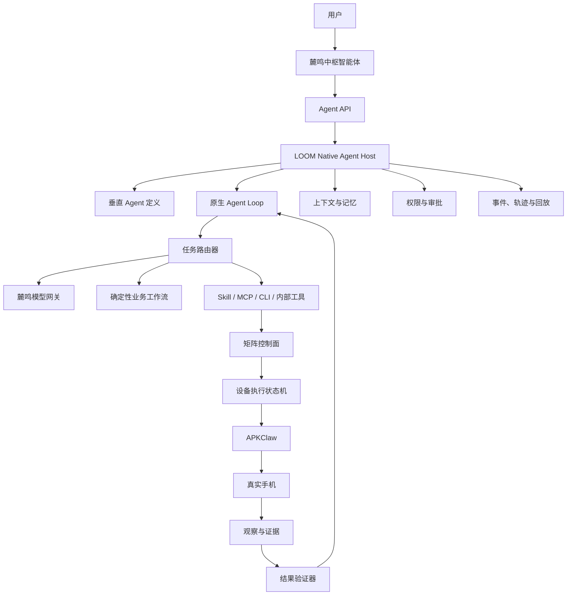

# 麓鸣原生垂直 Agent 总体设计

日期：2026-07-16
产品基线：LOOM 2.1.88
文档状态：实现级设计完成，待产品负责人书面复核
决策人：麓鸣产品负责人

## 1. 文档用途

本文档是麓鸣原生垂直 Agent 的唯一总体设计依据。它记录产品边界、运行协议、数据结构、安全策略、迁移顺序和验收标准。产品负责人完成书面复核后，后续实施计划和代码评审均以本文档为准；任何改变本文边界的实现必须先更新决策记录。

## 2. 已确认的产品边界

麓鸣安装后必须自带可直接使用的原生 Agent：

- 用户登录麓鸣账号后，Agent 自动就绪。
- 用户不需要安装 Codex、Claude Code 或其他第三方 Agent。
- 用户不需要自行填写模型 API Key。
- 模型调用和费用统一由麓鸣账号与云模型服务管理。
- Agent 的提示词、规划、工具循环、上下文、记忆、权限、执行、验证、恢复和调试全部由麓鸣实现。
- 云模型只是麓鸣 Agent 可替换的推理引擎，不拥有 Agent 的业务逻辑和运行生命周期。
- Codex、Claude Code 等外部 Agent 只能作为开发者可选扩展，不能成为中枢智能体的运行条件。
- 原生 Agent 不固定为招聘 Agent、获客 Agent或其他单一业务 Agent；业务垂直能力由统一 Skill 与 Recipe 体系动态装载。

## 3. 现有实现的问题与保留范围

LOOM 2.1.88 已经具备一部分可复用的原生 Agent 基础设施：

- 会话、消息、运行和审批持久化。
- Agent 编排器和工具调用轮次。
- 能力注册表和权限策略。
- 带序号事件流、轨迹和断点数据。
- 超级手机矩阵、设备任务、人工接管和 APKClaw 控制链路。

当前错误集中在推理运行时：`LoomCliRuntimeAdapter` 把已安装的 Codex CLI 或 Claude Code 当作中枢智能体的大脑，导致用户必须选择并安装外部运行时。这一运行时依赖必须被麓鸣原生模型客户端替换。

## 4. 已确认的参考项目分工

### 4.1 Grok Build

作为 Agent Harness 的核心参考，重点借鉴：

- 一等 Agent 定义，将模型、提示词、工具、权限、Skill 和上下文策略封装为完整 Agent。
- Agent、会话、轮次和工具调用的生命周期事件。
- 明确的任务完成契约，而不是把模型停止输出等同于任务成功。
- 持久会话、事件账本、计划、检查点、压缩和恢复。
- `allow / ask / deny` 权限规则及拒绝优先原则。
- MCP 连接、存活检测、超时和输出限制。
- 跨会话记忆的作用域和检索思路。

不直接引入 Grok Build 作为运行时，不复制其编码工具、Git、终端、PTY、TUI、xAI 登录或模型绑定，也不因此重写 LOOM 的 Python 控制面。

参考地址：

- <https://github.com/xai-org/grok-build>
- <https://github.com/xai-org/grok-build/blob/main/crates/codegen/xai-grok-agent/README.md>
- <https://github.com/xai-org/grok-build/blob/main/crates/codegen/xai-grok-pager/docs/user-guide/17-sessions.md>
- <https://github.com/xai-org/grok-build/blob/main/crates/codegen/xai-grok-pager/docs/user-guide/22-permissions-and-safety.md>

### 4.2 Mobile-Agent

作为手机操作闭环参考，重点借鉴：

- 手机界面感知和元素定位。
- 任务规划与进度管理。
- 操作后的重新观察、反思和纠错。
- 长任务记忆和跨应用导航。

参考地址：<https://github.com/X-PLUG/MobileAgent>

### 4.3 Agent TARS

作为多模态 Agent 和交互事件流参考，重点借鉴：

- 结构化事件流驱动 Agent UI。
- 确定性工具与视觉操作混合执行。
- MCP 工具挂载和运行态展示。

参考地址：<https://github.com/bytedance/UI-TARS-desktop>

### 4.4 AndroidWorld

作为手机 Agent 验收体系参考，重点借鉴：

- 可重复执行的标准任务。
- 动态任务参数和多样化场景。
- 基于最终设备状态的成功判定。
- 可恢复、可对比的评测运行。

参考地址：<https://github.com/google-research/android_world>

## 5. 已确认的技术路线

采用“保留现有正确骨架，替换错误推理运行时”的路线：

1. 保留 `AgentService`、会话仓库、事件总线、权限策略、能力注册表和矩阵控制面。
2. 移除中枢智能体对 Codex CLI、Claude Code 等外部 Agent 的强制依赖。
3. 新增麓鸣原生 Agent Host、模型客户端、任务路由器、上下文与记忆引擎、设备执行状态机和结果验证器。
4. 已知业务优先走确定性工作流；只有目标理解、页面变化、异常恢复和结果不确定时调用模型。
5. 模型通过麓鸣云模型网关调用，用户不接触第三方 Agent 安装和 API Key 配置。

## 6. 已确认的总体架构



## 7. 已确认的核心模块边界

| 模块 | 职责 |
|---|---|
| `LoomNativeAgentHost` | 管理 Agent 生命周期、并发、暂停、恢复、取消和资源配额 |
| `LoomModelClient` | 直接调用麓鸣云模型，提供流式文本、结构化输出和工具调用 |
| `LoomAgentRunner` | 运行模型与工具循环，处理完成、异常、重试和最大轮次 |
| `WorkflowRouter` | 在确定性业务工作流、模型规划和异常恢复之间选择路径 |
| `PhoneFleetExecutor` | 把一个中枢计划扇出为多台手机的设备任务 |
| `ObserverVerifier` | 操作后重新观察手机，并用业务成功契约验证真实结果 |
| `ContextMemoryEngine` | 管理会话、业务规则、设备状态、历史经验、压缩和检索 |
| `PolicyEngine` | 管理读取、外发、批量操作、账号修改、审批和急停 |
| `EventTraceEngine` | 记录模型轮次、工具调用、手机动作、证据、错误和耗时 |

## 8. 已确认的多手机执行原则

不能为每台手机常驻一个完整大模型 Agent。采用：

```text
1 个中枢规划器
+ 1 个矩阵任务协调器
+ N 个轻量设备执行状态机
+ 按需调用的观察与纠错模型
```

- 中枢只规划一次公共目标和业务约束。
- 矩阵协调器根据设备、账号、应用和业务组拆分任务。
- 每台手机使用独立状态机、租约、检查点和证据链并行执行。
- 正常步骤由确定性动作执行，不重复调用大模型。
- 只有页面漂移、元素缺失、结果不确定或策略冲突时才调用模型。
- 单台设备失败不能拖垮整个矩阵；失败设备单独重试、降级或转人工。

## 9. 已确认的产品表现

- 中枢智能体固定显示“麓鸣原生智能体”。
- 主界面删除“选择运行时”和安装第三方 Agent 的错误提示。
- 用户只需要登录麓鸣账号并拥有对应授权。
- 普通界面展示目标、计划、执行进度、手机证据和业务结果。
- 调试界面可以查看模型版本、调用次数、耗时、费用、工具输入输出和恢复过程。
- 模型服务异常时，已经进入确定性阶段的设备任务继续运行；需要重新推理的任务进入可恢复等待状态。
- 外部 Agent 仅保留在开发者扩展能力中，不出现在原生 Agent 的必选运行路径。

## 10. 已确认决策记录

| 日期 | 决策 |
|---|---|
| 2026-07-16 | 麓鸣必须自带原生 Agent，用户不安装 Codex/Claude，不填写模型 API Key |
| 2026-07-16 | 采用麓鸣默认云模型和麓鸣账号计费体系 |
| 2026-07-16 | 采用保留现有骨架、替换 CLI 推理运行时的增量路线 |
| 2026-07-16 | Grok Build 作为 Harness 核心参考，Mobile-Agent 作为手机闭环参考 |
| 2026-07-16 | 采用一个中枢规划器加多个轻量设备状态机，不为每台手机常驻完整模型 Agent |
| 2026-07-16 | 原生 Agent 不是招聘专用 Agent；统一手机 Skill 与 Recipe 库是业务能力层，招聘只是其中一个场景 |
| 2026-07-16 | `luming-skills-library-20260716.zip` 作为首个官方内置 Skill Library 基线，不再安装到 Codex Home |
| 2026-07-16 | 采用任务级或活动级授权，授权范围内的常规外发和矩阵操作不逐动作确认 |
| 2026-07-16 | 验证码、二次验证、支付、账号安全变更、平台风控警告和越权动作始终硬停止 |

## 11. 用户提供的 Skills Library 基线

产品负责人提供 `luming-skills-library-20260716.zip` 作为麓鸣业务技能体系输入。

| 字段 | 值 |
|---|---|
| Library schema | `loom.skills.library.v2` |
| Library version | `2026.07.15` |
| 统一触发 Skill | `luming-phone-agent` |
| Skill category | `phone-agent-orchestration` |
| SHA256 | `EA3170A766B96176B2ABC15CD45DF596BCF1CB9BCEE9067515F9F060D5F48465` |

该 Library 用一个统一 Skill 替代以下五个旧触发入口：

- `luming-acquisition-agent`
- `luming-boss-resume-screening`
- `luming-matrix-supervisor-loop`
- `luming-phone-scenario-builder`
- `luming-scenario-skill-writer`

因此，麓鸣原生 Agent 的产品结构不是“为每个行业安装一个独立 Agent”，而是：

```text
LOOM Native Agent Kernel
  -> luming-phone-agent
    -> Skill 状态机
    -> Recipe 注册表
    -> 单机或矩阵执行
    -> 场景观察与 Recipe 学习
    -> 证据验证与事务同步
```

## 12. Skills Library 状态机

`luming-phone-agent` 定义了统一手机任务生命周期：

```text
SELF_CHECK
-> PHONE_DISCOVERY
-> ASK_TASK
-> RECIPE_MATCH
-> PREFLIGHT
-> REUSE_OR_EXPLORE
-> PLAN
-> EXECUTE_VERIFY
-> SYNC_RECIPE
-> REPORT
```

原生 Agent 内核必须把这些状态实现为可持久化、可暂停、可恢复的运行状态，而不是只把 `SKILL.md` 文本拼接进模型提示词。

各状态的产品含义：

| 状态 | 产品职责 |
|---|---|
| `SELF_CHECK` | 检查控制面、服务、Recipe 存储和低风险修复条件 |
| `PHONE_DISCOVERY` | 发现真实健康设备、账号、应用和当前页面 |
| `ASK_TASK` | 把用户自然语言规范化为明确任务目标 |
| `RECIPE_MATCH` | 按应用、版本、入口页、目标和页面指纹匹配已验证 Recipe |
| `PREFLIGHT` | 检查应用、账号、会话、权限、网络、区域和数据前置条件 |
| `REUSE_OR_EXPLORE` | 复用已验证路线，或在预算内安全探索新路线 |
| `PLAN` | 编译带设备范围、证据、恢复点和重试预算的执行计划 |
| `EXECUTE_VERIFY` | 单机或矩阵执行，并在每个关键步骤后验证真实状态 |
| `SYNC_RECIPE` | 只把满足验证门槛的 Recipe 事务化同步到能力库 |
| `REPORT` | 输出结果、证据、阻塞条件和可恢复位置 |

## 13. Recipe 是垂直能力的最小单元

Recipe 不是自由文本提示词，而是受 JSON Schema 约束的可执行、可验证业务路线。每个 Recipe 至少包含：

- 稳定的 `recipeId`、名称和触发别名。
- 应用包名、版本范围和入口页面。
- 标准化目标、单机或矩阵模式、前置条件。
- 带稳定 `stepId` 的执行步骤。
- 每一步是否需要授权、验证状态和最小化证据。
- 安全边界、成功次数、最后成功时间和来源。

Recipe 生命周期固定为：

| 状态 | 含义 |
|---|---|
| `draft` | 尚未完成真实路线验证，不能自动复用 |
| `verified` | 至少一次完整成功且每步证据完整，可以快速复用 |
| `stale` | 应用版本、入口页或页面指纹变化，必须重新验证 |
| `blocked` | 当前前置条件不满足，记录恢复点后暂停 |

Recipe 只有同时满足以下条件才允许进入自动复用：

1. `status == verified`。
2. `verification.successCount >= 1`。
3. 每个步骤都为 `verification == verified` 且存在非空结构化证据。

## 14. 当前内置 Recipe 的真实状态

Skills Library 当前只包含两条内置业务 Recipe：

| Recipe | 当前状态 | 当前用途 |
|---|---|---|
| `acquisition` | `draft` | 授权范围内的需求信号整理和未发送触达草稿 |
| `boss-resume-screening` | `draft` | 授权候选人列表的岗位相关评分和人工复核队列 |

这两条 Recipe 都尚未通过真实路线验证，不能被产品宣称为已完成的自动化能力。后续新增的内容运营、客服、测试、交付、内部运营等场景，也必须通过同一 Recipe 验证与晋级机制进入能力库。

## 15. Skills Library 与原生 Agent 的边界

- Agent Kernel 负责推理、状态、工具循环、并发、策略、记忆和恢复。
- `luming-phone-agent` 负责统一手机任务生命周期和业务模式选择。
- Recipe 负责具体应用中的可重复执行路线和成功证据。
- APKClaw 负责设备侧观察、动作和事件回传。
- Matrix Control Plane 负责任务扇出、设备隔离、租约、重试和急停。
- Skill 文档不能直接拥有系统级权限；所有动作仍经过原生能力注册表和策略引擎。
- Recipe 学习不能直接修改产品代码，也不能绕过 Schema、隐私扫描、证据门槛和事务同步。

## 16. 自动授权与硬停止策略

麓鸣不采用“每个点击都确认”的伪自动化。用户发送任务时，其自然语言目标、已选设备或设备组、业务账号、应用、时间范围和数量上限会被编译为一个 `TaskGrant`。发送任务本身就是一次明确授权；范围完整时不再增加第二次确认。

`TaskGrant` 至少包含：

```json
{
  "schema": "loom.agent.task-grant.v1",
  "grantId": "grant_xxx",
  "sessionId": "session_xxx",
  "runId": "run_xxx",
  "subject": "当前麓鸣账号",
  "deviceIds": ["P01", "P02"],
  "deviceGroups": ["招聘一组"],
  "applications": ["com.hpbr.bosszhipin"],
  "actions": ["read", "score", "message"],
  "limits": {"maxTargets": 100, "maxPerAccountPerHour": 20},
  "validFrom": "2026-07-16T00:00:00Z",
  "validUntil": "2026-07-16T08:00:00Z",
  "contentPolicyId": "policy_xxx",
  "forbiddenActions": ["payment", "credential_change", "permanent_delete"]
}
```

以下动作可以在 `TaskGrant` 明确授权、平台规则允许、内容合规通过、频率和数量未超限时自动执行：

- 打开应用、搜索、筛选、读取、整理、评分、截图取证和导出结构化结果。
- 在指定账号、对象和模板范围内发布内容、评论、发送私信或业务沟通。
- 批量分发到已授权设备组、重试失败设备、切换确定性路线和恢复任务。
- 招聘场景中的岗位相关评分、排序、生成复核队列，以及向符合明确规则的候选人发送沟通。

以下情况始终硬停止并保留恢复点，不能被普通 `TaskGrant` 放行：

- 验证码、短信或设备二次验证、活体或身份验证。
- 支付、购买、充值、提现和任何资金承诺。
- 密码、密钥、手机号、实名信息、管理员或账号安全设置变更。
- 永久删除、注销账号、清空业务数据或不可逆批量操作。
- 平台风险控制、封禁、异常登录或明确的人机校验警告。
- 目标、账号、应用、设备、数量、时间或内容超出授权范围。
- 观察证据不足，无法确定动作对象或成功状态。

招聘场景不得使用民族、性别、宗教、残疾、婚育等受保护或非岗位相关属性进行筛选。模型可以辅助岗位匹配和排序，但最终录用、淘汰等高影响结论必须保留可解释规则和人工复核入口。一次批量复核可以授权整批后续沟通，不要求逐候选人点击。

策略优先级固定为 `deny > hard_stop > task_grant > ask_once > allow_read`。任何 Skill、Recipe、MCP 或 CLI 都不能降低该优先级。急停会立即撤销当前运行的 Grant，并阻止尚未开始的设备步骤。

## 17. 原生模型网关合同

### 17.1 凭据与模型来源

`LoomModelClient` 直接复用现有麓鸣账号链路：

1. 从 `NewApiAccountManager.current()` 读取受保护登录态。
2. 必要时调用 `ensure_launcher_token()` 获取或刷新只属于启动器的模型令牌。
3. 使用会话中的 `gatewayBaseUrl`、`memberToken`、`gatewayDefaultModel` 和 `classifiedModels`。
4. 默认规划模型取账号当前选择的文本模型，不在 Agent 代码里硬编码供应商。
5. 手机观察模型继续读取受管的 `phoneAgent.model`；当前默认值 `qwen3.7-plus` 只是配置回退值，不是 Agent 身份。

模型令牌只在 Python 后端内存和现有受保护会话文件中出现。前端、事件流、错误、轨迹、Skill 和 Recipe 只能看到掩码、模型名、调用编号、耗时和用量，不能看到令牌、Cookie 或完整授权头。

### 17.2 统一请求与响应

第一版通过现有 OpenAI 兼容网关调用 `POST {gatewayBaseUrl}/chat/completions`，请求支持流式输出和原生 `tools`。内部统一请求为：

```json
{
  "model": "账号当前文本模型",
  "messages": [],
  "tools": [],
  "tool_choice": "auto",
  "stream": true,
  "temperature": 0.2,
  "metadata": {
    "runId": "run_xxx",
    "round": 1,
    "idempotencyKey": "run_xxx:1"
  }
}
```

`LoomModelClient` 把供应商差异归一为四类事件：

- `model.text.delta`
- `model.tool_call.delta`
- `model.usage`
- `model.completed` 或 `model.failed`

模型原生工具调用不可用时，客户端可以退化为受 JSON Schema 约束的结构化响应，但未经 Schema 校验的模型文本绝不能直接变成工具动作。重试只发生在工具尚未执行之前；已经产生外部副作用后，不允许用整轮重放代替幂等恢复。

连接超时为 10 秒，首个响应超时为 45 秒，单轮总超时为 120 秒。网络错误最多自动重试两次，并使用带抖动的指数退避。网关返回未授权时只刷新一次令牌；再次失败则把运行置为可恢复等待，不循环刷新。

### 17.3 运行时替换方式

新增 `LoomNativeRuntimeAdapter` 实现现有 `AgentRuntimeAdapter` 协议，内部组合 `LoomModelClient`。这样现有 `AgentOrchestrator` 的会话、检查点、工具循环、暂停、恢复、取消和审批能力可以保留。

`AgentService` 的默认运行时改为 `LoomNativeRuntimeAdapter`。`LoomCliRuntimeAdapter` 仅保留为开发者诊断扩展，不再参与自动发现、不再是用户会话字段的默认值，也不影响原生 Agent 就绪状态。

## 18. 原生 Agent Loop

每个运行必须遵循以下确定性循环：

```text
LOAD_CHECKPOINT
-> BUILD_CONTEXT
-> ROUTE_TASK
-> MODEL_OR_WORKFLOW_DECISION
-> POLICY_CHECK
-> EXECUTE_TOOL_OR_PHONE_STEP
-> OBSERVE
-> VERIFY
-> PERSIST_CHECKPOINT
-> CONTINUE | WAIT | COMPLETE | FAIL
```

关键规则：

1. `WorkflowRouter` 先匹配已验证 Recipe；匹配成功时不要求模型重新发明步骤。
2. 需要模型规划时，只向模型暴露当前运行可用的最小能力集合和脱敏上下文。
3. 每个工具调用必须带稳定 `toolCallId`；每个设备步骤必须带 `campaignId/deviceId/stepId/attempt` 幂等键。
4. 工具执行前写入意图事件，执行后写入结果和证据，再推进检查点。
5. 模型输出“完成”只是一项信号；只有 `ObserverVerifier` 的业务成功契约通过，运行才进入 `completed`。
6. 达到轮次、成本、时间、失败或探索预算时，运行进入带原因和恢复点的 `paused` 或 `failed`，不能伪造成功。
7. 进程重启后，未完成运行从最后持久检查点恢复；不确定是否已经产生副作用的步骤先观察，不盲目重放。

完成契约至少包含目标对象、期望最终状态、证据类型、禁止状态和允许的部分成功条件。矩阵任务的总体结果为每台设备结果的聚合，不用一台成功覆盖其他设备失败。

## 19. Skill、MCP、CLI 和内部能力

麓鸣原生 Agent 自带能力注册表，可以调用内部工具、官方 Skill、受信 MCP 和麓鸣 CLI，但这些都是工具，不是外部大脑。

统一能力描述至少包含：

```json
{
  "name": "matrix.dispatch",
  "source": "internal",
  "description": "向授权设备分发矩阵任务",
  "inputSchema": {},
  "outputSchema": {},
  "permission": "control",
  "risk": "outbound",
  "timeoutMs": 30000,
  "idempotent": true,
  "available": true
}
```

- 内部能力直接调用 Python 服务，不绕行 shell。
- 官方 Skill 负责任务路由、Recipe 和成功合同，不直接获得系统权限。
- MCP 必须显式安装、启用并通过健康检查；每个 Server 有工具白名单、超时、输出上限和敏感字段脱敏。
- 麓鸣 CLI 只作为确定性控制面和开发者接口；调用时仍经过同一授权、审计和幂等规则。
- 用户上传的 Skill 仅可提供声明式元数据、提示片段、Schema 和 Recipe，默认禁止执行包内脚本。
- 官方 ZIP 中的安装、校验和 Recipe 同步脚本作为作者工具和实现参考；产品运行时把必要逻辑实现到受保护的 Python 服务，不从 ZIP 临时执行代码。

## 20. Skill Library 内置、更新与优先级

### 20.1 三层存储

新增独立于 Codex 和 OpenClaw 的 LOOM Agent 数据根：

```text
<install>/resources/skills-library/             # 安装包内置，只读兜底
<data>/.loom/agent/skills/official/             # 云端签名更新，受管只读
<data>/.loom/agent/skills/custom/               # 用户安装，声明式
<data>/.loom/agent/recipes/learned/              # 本机学习并验证的 Recipe
<data>/.loom/agent/state/                        # 索引、更新状态、事务和锁
```

`luming-skills-library-20260716.zip` 的内容进入安装包第一层，安装时不再写入 `<CodexHome>/skills`。首次启动即能发现 `luming-phone-agent`，离线时也能工作。

### 20.2 签名更新

官方更新包使用 Ed25519 签名。签名清单至少包含 `schema`、`libraryId`、`version`、`minLoomVersion`、`publishedAt`、`keyId`、每个文件的相对路径、大小和 SHA256。客户端先校验签名、版本兼容、文件清单、大小和路径，再解压到同根临时目录，完整验证后用原子目录切换生效。

更新失败或新版本启动自检失败时自动回退到上一个签名版本；没有上一个版本时回退到安装包内置版本。普通更新禁止版本倒退，只有带 `emergencyRollback` 声明的官方签名清单可以回滚。内置多个有效公钥标识以支持密钥轮换，私钥永不进入客户端。

ZIP 校验必须拒绝绝对路径、`..` 穿越、重解析点、重复大小写路径、超出清单文件、单文件超过 5 MB、总解压超过 50 MB和异常压缩比。更新和 Recipe 同步都使用独立锁、事务日志和崩溃恢复。

### 20.3 解析优先级

Skill 解析优先级固定为：有效的官方签名更新 > 安装包内置版本 > 用户自定义 Skill。自定义 Skill 不能覆盖官方 Skill ID。

Recipe 解析优先级为：与当前应用版本和页面指纹精确匹配的本机 `verified` Recipe > 当前官方 `verified` Recipe > `draft/stale/blocked` 探索候选。任何 Recipe 进入快速复用前都必须重新经过当前 Schema、策略和能力可用性检查。

旧的五个 Skill 名称只作为迁移别名读取，不再展示为五个独立 Agent。迁移完成后统一解析到 `luming-phone-agent`，但不会删除用户自己的非冲突文件。

## 21. Recipe 编译、验证与学习

`RecipeCompiler` 把 Recipe 编译为设备无关的执行图，再由 `PhoneFleetExecutor` 绑定真实设备、账号和应用状态。编译阶段必须完成：

- Schema 和版本验证。
- 应用包名、版本范围、入口页和页面指纹匹配。
- 参数类型、必填字段、目标数量和设备范围绑定。
- 每步能力、权限、幂等性、前置条件、成功合同和恢复策略解析。
- 循环上限、重试上限、时间预算和外发速率检查。

新路线只能在隔离探索预算内产生 `draft` Recipe。一次真实成功、每步证据完整且隐私扫描通过后，可以晋级为 `verified`；应用或页面指纹变化后自动标记 `stale`。学习流程不得保存 Cookie、令牌、验证码、完整联系人、原始简历、私信正文或无期限截图。用于复用的选择器、页面特征和业务参数必须脱敏和最小化。

Recipe 同步沿用用户 Library 已实现的事务思想：候选、索引、目标文件和结果都有 SHA256；写入前备份，崩溃后根据 journal 恢复；只有源、安装副本和索引全部一致才返回 `synced`，否则返回 `sync_pending` 或 `rejected`。

## 22. 上下文、记忆与本地数据保护

上下文按作用域隔离：

| 作用域 | 内容 | 生命周期 |
|---|---|---|
| 轮次 | 当前模型输入、工具结果、短期观察 | 单轮 |
| 运行 | 计划、TaskGrant、检查点、设备状态、证据摘要 | 到运行归档 |
| 会话 | 用户目标、对话摘要、附件索引 | 到会话删除 |
| 活动 | 业务规则、模板、速率、去重集合、矩阵结果 | 可配置保留 |
| Skill/Recipe | 声明式知识、验证历史、页面指纹 | 版本化保留 |
| 设备 | 能力、应用版本、健康状态，不含账号密码 | 持续刷新 |

现有会话和事件仓库继续作为事实账本。新增 `<data>/.loom/agent/agent.db`，使用 SQLite WAL 存储可检索摘要、Recipe 索引、授权和去重键；全文检索先使用 FTS，向量检索作为后续可选能力，不成为首版依赖。

模型令牌和登录秘密继续使用现有 `protect_secret` 机制保存，并在 Windows 上绑定当前安装或用户。日志、事件和异常统一经过 `redact_sensitive`。截图和页面树默认只保留完成验证所需的最短周期；导出或延长保留必须由产品设置明确开启。删除会话时同步删除其非审计型附件和可检索记忆。

## 23. 多手机并行、恢复与降级

矩阵协调器只分发一次活动计划，每台手机创建独立 `deviceTaskId`、租约、状态机和检查点。并发数由设备健康数、模型预算、ADB/APKClaw 容量和用户配置共同决定，不在模型提示词中硬编码。

单设备状态固定为：

```text
queued -> leased -> preflight -> executing -> observing -> verifying
       -> completed | retry_wait | blocked | failed | cancelled
```

- 同一设备同一时刻只允许一个写任务持有租约，读观察可以按能力策略共享。
- 正常设备不因其他设备失败而重复执行。
- 可恢复错误按步骤重试预算处理；页面漂移先重新观察再重新规划；应用崩溃先回到 Recipe 定义的恢复点。
- 网关离线时，已编译的确定性步骤继续；需要新推理的设备进入 `blocked:model_unavailable`。
- APKClaw 或设备离线时只暂停对应设备，活动总体返回明确的成功、阻塞和失败数量。
- 急停、取消和授权撤销通过控制命令广播，尚未执行的外发步骤必须被抑制。

## 24. API 与界面兼容

现有 `/api/agent/*` 接口、SSE 事件流、会话、消息、运行、轨迹、暂停、恢复、取消和审批路径继续保留，避免重写前端和破坏已存在客户端。数据契约做以下兼容演进：

- `runtimeProfileId` 保留一个版本用于兼容，但服务端统一归一为 `loom-native`。
- `bootstrap.runtimeProfiles` 只返回“麓鸣原生智能体”，不再返回 Codex/Claude 安装状态。
- `SendAgentMessageRequest` 增加可选 `grant` 和 `campaignPolicy`；旧客户端未传时由文本、目标和账号设置生成最小 Grant。
- `AgentRun` 增加 `route`、`skillId`、`recipeId`、`grantId`、`deviceSummary` 和 `modelUsage`。
- 事件增加 `model.*`、`grant.*`、`recipe.*`、`device.*` 和 `verification.*`，保持现有单调序号和断线补拉。

中枢智能体页面的首要状态是“未登录 / 正在就绪 / 可用 / 受限离线 / 阻塞”，不再是“选择运行时”。发送按钮只有在用户文本、目标范围和账号授权满足最小条件时可用；阻塞原因必须给出可执行修复动作，不能只显示“接口不存在”或“读取失败”。

普通模式展示对话、任务计划、矩阵进度、设备结果和证据。调试抽屉展示路由决策、Skill/Recipe 版本、模型名、轮次、工具调用、策略判断、检查点、用量和脱敏错误。所有按钮必须绑定真实命令并有 loading、disabled、成功、失败和重试状态。

## 25. 错误语义、审计与可观测性

错误码按域稳定划分：

- `AGENT_ACCOUNT_*`：未登录、令牌刷新失败、授权失效。
- `AGENT_MODEL_*`：网关、超时、限流、协议和结构化输出失败。
- `AGENT_SKILL_*`：未发现、签名、版本、Schema 和更新失败。
- `AGENT_RECIPE_*`：不匹配、过期、编译、验证和同步失败。
- `AGENT_POLICY_*`：越权、硬停止、频率限制和内容拦截。
- `AGENT_DEVICE_*`：离线、租约、观察、动作和恢复失败。
- `AGENT_VERIFY_*`：证据不足、最终状态不符和部分成功。

每个运行使用 `runId` 贯穿模型、工具、矩阵和设备事件；每个模型请求使用 `modelCallId`；每个设备步骤使用稳定幂等键。审计记录谁在何时授权了什么范围、使用了哪个 Skill/Recipe、向哪些账号执行了什么动作、结果和证据是什么。任何审计视图都不显示原始密钥和验证码。

运行成本按模型输入、输出、缓存、观察调用和设备数量聚合。达到账号、活动或运行预算时先停止新推理和新外发，已在执行的不可中断步骤安全落点后暂停。

## 26. 增量迁移与代码落点

实现顺序必须保持每一步都可测试和可回退：

### 阶段 A：原生模型最小闭环

- 在 `python/core/loom_model_client.py` 实现账号网关、流式事件、工具调用、重试和脱敏。
- 在 `python/core/native_agent_runtime.py` 实现 `LoomNativeRuntimeAdapter`。
- 在 `python/services/agent_service.py` 把默认运行时切到原生 Adapter。
- 保留现有 `/api/agent/*` 和 `AgentOrchestrator`，先完成无 Codex/Claude 环境下的对话、内部只读工具和可恢复错误。

### 阶段 B：LOOM Skill Store

- 在 `python/core/paths.py` 增加 `.loom/agent`、内置、官方、自定义和学习 Recipe 路径。
- 重构 `python/services/skills.py`，加入三层来源、官方 ID 保护、Library manifest 和签名更新。
- 把 ZIP 中的 `luming-phone-agent` 作为受保护安装资源打包，并修改 `scripts/stage-protected-release.mjs`、完整打包脚本和校验脚本。
- 把 Recipe Schema、隐私扫描、事务同步和崩溃恢复移到产品服务测试覆盖范围内。

### 阶段 C：路由、授权与 Recipe 执行

- 新增 `WorkflowRouter`、`TaskGrantService`、`RecipeCompiler` 和 `ObserverVerifier`。
- 扩展 `AgentPolicyEngine` 支持 Grant，而不是逐动作临时批准。
- 把 `luming-phone-agent` 状态机接入现有运行检查点和事件流。
- 接入现有 `MatrixControlPlane`、`PhoneMatrix` 和 APKClaw 能力，不另建第二套设备注册表。

### 阶段 D：产品界面和调试

- 更新中枢智能体页面，移除运行时选择和外部 Agent 安装提示。
- 增加 Skill/Recipe、Grant、设备验证和模型用量的普通视图与调试视图。
- 保留 Codex/Claude 连接能力在开发者扩展页面，与产品原生 Agent 解耦。

### 阶段 E：评测、灰度和发布

- 建立模拟网关、假设备、真实设备和矩阵故障注入测试。
- 对内置 Recipe 逐条完成真实验证，只有晋级 `verified` 的能力才能进入产品宣传。
- 先内部账号灰度，再按签名 Skill 渠道灰度，最后进入完整安装包。

旧 `LoomCliRuntimeAdapter`、旧 runtime profile 字段和旧 Skill 迁移别名至少保留一个发布周期；它们不得再次成为默认路径。阶段 A 通过后即可删除用户界面的外部运行时阻塞，后续阶段在同一原生内核上增量交付。

## 27. 测试与发布验收

以下条件全部通过，才能宣称“麓鸣自带 Agent”：

1. 全新 Windows 环境未安装 Codex、Claude Code 和 OpenClaw Agent，安装麓鸣并登录后，中枢智能体显示可用。
2. 发送普通问题能通过麓鸣账号网关返回流式答案，前端和日志中不存在明文模型令牌。
3. 发送一个内部工具任务能产生模型决策、工具调用、结果验证和完整轨迹，进程重启后可从检查点恢复。
4. `luming-phone-agent` 在离线首次启动时可从安装包发现，不读取 `CODEX_HOME`。
5. 篡改、越权路径、错误签名、版本不兼容和异常压缩包全部被拒绝；更新中断后仍可使用上一个有效版本。
6. 用户发送一个授权完整的矩阵活动后，无逐动作确认地在多台手机并行执行；未授权账号和设备不会执行。
7. 验证码、二次验证、支付、平台风控和账号安全变更均停在正确恢复点，急停能阻止尚未发生的外发。
8. 单台手机离线、页面漂移、应用崩溃、模型超时和 Bridge 重启不会导致其他健康手机重复执行。
9. Recipe 只有在真实成功、证据完整和隐私扫描通过后才能晋级；`draft` Recipe 不能快速复用。
10. 中枢智能体、Skill、矩阵、暂停、恢复、取消、重试、急停和调试相关按钮都通过组件测试和 Playwright 点击验收，不存在无命令按钮。
11. 至少完成单机、5 台和目标硬件规模三档真实设备验收，统计成功率、平均耗时、模型调用数、恢复率和重复外发数。
12. 安装包升级后保留用户会话、配置、自定义 Skill 和本机学习 Recipe；卸载策略不误删用户明确保留的数据。

## 28. 明确不做的事情

- 不把 Grok Build、Codex、Claude Code、OpenClaw 或其他通用 Agent 作为麓鸣原生 Agent 的运行依赖。
- 不为每台手机常驻一个完整大模型 Agent。
- 不让模型自由调用未注册 shell、未授权 MCP 或任意 Skill 脚本。
- 不把 `SKILL.md` 拼进提示词就宣称业务能力已经实现。
- 不把模型停止输出、按钮点击成功或单台设备成功等同于业务目标完成。
- 不在 Recipe、日志、事件或前端保存明文凭据和验证码。
- 不把尚处于 `draft` 的招聘或获客 Recipe 宣称为稳定自动化产品。
- 不在本设计范围内重写已有矩阵控制面、APKClaw 协议或账号计费系统。

## 29. 设计结论

麓鸣原生 Agent 的核心不是再接入一个第三方聊天框，而是在现有 LOOM 控制面上建立自有 Harness：麓鸣账号提供模型，原生 Agent Loop 管理推理和工具，统一 Skill 管理业务生命周期，Recipe 固化已验证路线，Matrix/APKClaw 负责多手机执行，策略和证据决定动作是否允许以及任务是否真的完成。

该设计允许先快速替换当前不可用的 CLI 大脑，再逐层接入 Skill、Recipe 和矩阵闭环；每一步都沿用现有正确资产，并最终形成无需第三方 Agent、可以持续更新和深度调试的麓鸣中枢智能体。
