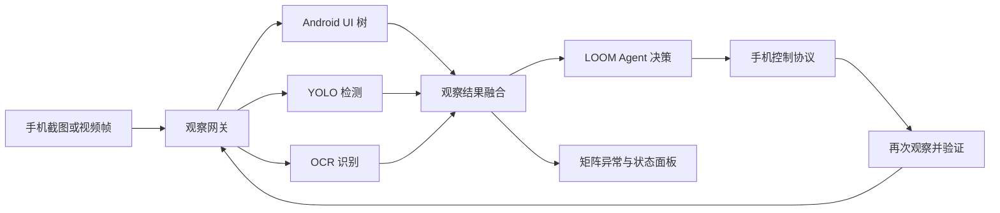

# LOOM 视觉感知引擎路线图

> 状态：未来计划，当前不实施
> 目标：为无 UI 树页面、矩阵巡检和视觉控制提供统一的本地视觉能力。

## 1. 产品定位

LOOM 视觉感知引擎是智能体和手机矩阵共用的底层服务。第一阶段以 YOLO 为核心目标检测器，并结合 Android UI 树、OCR 和视觉大模型形成分级识别链路。

用户不直接操作 YOLO。智能体只接收统一的结构化观察结果，并继续负责理解任务、制定计划、选择设备和判断下一步；手机控制协议继续负责点击、滑动、输入和结果验证。

## 2. 适用场景

- 矩阵巡检：识别黑屏、锁屏、验证码、权限弹窗、登录失效、发布成功和应用崩溃。
- 视觉定位：在 UI 树不可用时定位图片按钮、游戏画布元素和自绘控件。
- 执行验证：点击前确认目标存在，点击后确认页面进入预期状态。
- 多机分析：批量推理多台手机截图，并按 `deviceId` 返回独立结果。
- 未来扩展：游戏兼容性测试、自动化回归和画面异常监测。

## 3. 识别优先级

1. Android UI 树：优先使用稳定的控件 ID、文本和边界。
2. YOLO + OCR：处理自绘页面、图标和文字组合。
3. 视觉大模型：仅在前两级无法判断时兜底。
4. 人工接管：低置信度或高风险动作不得盲目执行。

YOLO 只回答“画面中有什么、在哪里、置信度多少”，不直接决定业务动作。

## 4. 目标架构



初期部署在 LOOM 电脑端，通过独立本地进程提供服务。模型采用 ONNX 格式，默认使用 ONNX Runtime CPU；检测到可用 GPU 后再选择 CUDA、TensorRT 或 OpenVINO。手机 APK 第一阶段不内置模型，避免增加包体、耗电和升级成本。

## 5. 统一接口草案

请求：

```json
{
  "requestId": "obs_01",
  "deviceId": "phone-1",
  "imagePath": "runtime/screenshots/phone-1.png",
  "requestedDetectors": ["screen_state", "common_controls"],
  "deadlineMs": 1500
}
```

响应：

```json
{
  "requestId": "obs_01",
  "deviceId": "phone-1",
  "modelVersion": "loom-vision-1",
  "latencyMs": 86,
  "objects": [
    {
      "label": "save_draft_button",
      "displayName": "保存草稿",
      "confidence": 0.96,
      "box": [712, 1650, 980, 1770],
      "center": [846, 1710]
    }
  ],
  "screenState": "ready",
  "warnings": []
}
```

接口必须保留 `deviceId`、模型版本、推理耗时和置信度，禁止跨设备复用坐标或将低置信度结果包装成成功。

## 6. 分阶段实现

### 阶段 A：只读巡检

- 建立截图样本集、标签规范和版本化模型目录。
- 增加独立视觉服务与健康检查，不接管手机操作。
- 在矩阵中显示明确异常原因，并统计准确率、延迟和误报率。
- 优先识别黑屏、锁屏、验证码、登录页、权限弹窗和成功页。

验收建议：单机 CPU P95 小于 500 ms；关键异常召回率不低于 95%；任何识别失败不得影响现有矩阵任务。

### 阶段 B：控制辅助

- 向 Agent 提供结构化观察工具，例如 `vision.detect` 和 `vision.locate`。
- 仅在 UI 树失效时返回候选坐标。
- 执行前后进行双重观察，验证页面状态变化。
- 通过置信度阈值、动作白名单和审计日志控制风险。

验收建议：视觉定位失败时可自动降级或请求接管；不得发生跨设备误点击；现有手机控制协议保持唯一执行入口。

### 阶段 C：多机批量推理

- 合并短时间窗口内的多设备截图，进行批量推理。
- 增加每设备队列、超时隔离、背压和 GPU 调度。
- 模型服务故障时，矩阵继续使用现有 UI 树和人工控制。

验收建议：20 台设备并发时不阻塞任务派发；每台设备结果独立、可追踪、可重试。

### 阶段 D：专项视觉与游戏测试

- 为特定 App 或游戏训练独立检测头或模型包。
- 增加目标跟踪、画面卡死检测、帧率采样和流程覆盖报告。
- 定位为兼容性测试和自动化回归，不作为当前商业主线。

## 7. 数据与模型治理

- 截图默认保存在本地受控目录，支持自动脱敏和定期清理。
- 训练数据、标签、模型权重和指标必须分别版本化。
- 通用模型与特定 App 模型分离，禁止一次升级影响全部场景。
- 模型发布需包含 SHA256、模型版本、标签表、阈值和回滚包。
- 线上误检应能回流为待标注样本，但不得自动上传客户截图。

## 8. 当前不做

- 不在当前 LOOM 版本中引入 YOLO 运行时和模型文件。
- 不改变现有 Agent、矩阵和手机控制协议。
- 不把视觉检测结果直接转换为高风险操作。
- 不优先建设实时竞技游戏自动操作。
- 不为展示效果牺牲延迟、审计和设备隔离。

## 9. 启动条件

满足以下条件后再进入正式设计和开发：

1. 当前 Agent、矩阵派发、截图回传和更新链路达到稳定基线。
2. 收集到足够的真实误识别案例，能够证明 UI 树和 OCR 的明确缺口。
3. 确定首批 5 至 10 个高价值标签及可量化验收指标。
4. 完成截图隐私、模型分发、GPU 兼容和回滚方案评审。

第一项正式工作应是建立真实样本与基准测试，而不是立即训练模型或修改产品 UI。
